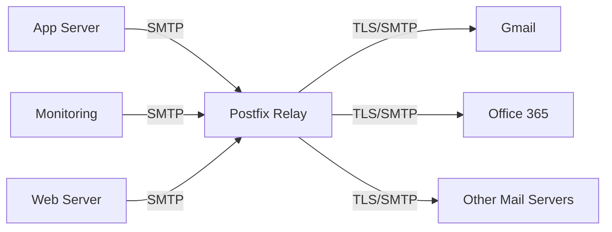

# How to Configure Postfix as an SMTP Relay Server on RHEL

Author: [nawazdhandala](https://www.github.com/nawazdhandala)

Tags: RHEL, Postfix, SMTP Relay, Linux

Description: Set up Postfix as a centralized SMTP relay server on RHEL that accepts mail from internal hosts and delivers it to the internet.

---

## What Is an SMTP Relay?

An SMTP relay is a mail server that accepts messages from authorized internal hosts and forwards them to their final destination on the internet. Instead of every server in your network sending mail directly (and each needing proper DNS, TLS, and reputation), they all funnel through one relay that handles external delivery.

This is the backbone of most enterprise mail architectures. Your application servers, monitoring systems, and internal tools all point to the relay. The relay handles TLS, authentication with external providers, and maintains your sending reputation from a single IP.

## Architecture



## Prerequisites

- RHEL with root or sudo access
- A static IP with proper PTR record
- DNS MX record (if receiving mail) or just A record for sending
- Port 25 open outbound to the internet

## Installing Postfix

```bash
# Install postfix
sudo dnf install -y postfix
```

## Relay Server Configuration

Edit `/etc/postfix/main.cf`:

```bash
# Server identity
myhostname = relay.example.com
mydomain = example.com
myorigin = $mydomain

# Listen on all interfaces
inet_interfaces = all
inet_protocols = ipv4

# This relay does not deliver mail locally
mydestination =

# Networks authorized to relay through this server
mynetworks = 127.0.0.0/8, 10.0.0.0/8, 172.16.0.0/12, 192.168.0.0/16

# Relay restrictions - only allow trusted networks
smtpd_relay_restrictions =
    permit_mynetworks,
    reject_unauth_destination

# Do not relay for unauthenticated external clients
smtpd_recipient_restrictions =
    permit_mynetworks,
    reject_unauth_destination

# Maximum message size (50 MB)
message_size_limit = 52428800

# Queue settings for reliability
maximal_queue_lifetime = 3d
bounce_queue_lifetime = 1d
maximal_backoff_time = 4000s
minimal_backoff_time = 300s

# Banner (do not reveal software version)
smtpd_banner = $myhostname ESMTP
```

The critical setting is `mynetworks`. Only IP ranges listed here can relay mail through this server. Be precise with this - an overly permissive setting creates an open relay.

## Adding TLS for Outbound Delivery

Configure TLS so mail sent to external servers is encrypted:

```bash
# Outbound TLS (opportunistic)
smtp_tls_security_level = may
smtp_tls_CAfile = /etc/pki/tls/certs/ca-bundle.crt
smtp_tls_session_cache_database = btree:${data_directory}/smtp_scache
smtp_tls_loglevel = 1
```

If you also want to accept TLS-encrypted connections from internal hosts:

```bash
# Inbound TLS (optional, for internal connections)
smtpd_tls_security_level = may
smtpd_tls_cert_file = /etc/letsencrypt/live/relay.example.com/fullchain.pem
smtpd_tls_key_file = /etc/letsencrypt/live/relay.example.com/privkey.pem
```

## SASL Authentication for External Hosts

If you want hosts outside your `mynetworks` range to use the relay (like remote offices), add SASL authentication:

```bash
# Install SASL support
sudo dnf install -y cyrus-sasl cyrus-sasl-plain
```

Add to `main.cf`:

```bash
# Enable SASL for external clients
smtpd_sasl_auth_enable = yes
smtpd_sasl_type = cyrus
smtpd_sasl_path = smtpd
smtpd_sasl_security_options = noanonymous

# Update relay restrictions to allow authenticated users
smtpd_relay_restrictions =
    permit_mynetworks,
    permit_sasl_authenticated,
    reject_unauth_destination
```

Start the SASL daemon:

```bash
sudo systemctl enable --now saslauthd
```

## Rate Limiting

Protect the relay from internal hosts that might go haywire:

```bash
# Limit connections per client
smtpd_client_connection_rate_limit = 100
smtpd_client_connection_count_limit = 20
smtpd_client_recipient_rate_limit = 200
anvil_rate_time_unit = 60s
```

## Firewall Configuration

```bash
# Allow SMTP from internal networks
sudo firewall-cmd --permanent --add-service=smtp

# If using submission port for authenticated clients
sudo firewall-cmd --permanent --add-port=587/tcp

sudo firewall-cmd --reload
```

## Starting the Relay

```bash
# Enable and start postfix
sudo systemctl enable --now postfix

# Verify it is listening
sudo ss -tlnp | grep :25
```

## Configuring Internal Hosts

On each internal server, configure it as a null client pointing to the relay:

```bash
# On internal servers, in /etc/postfix/main.cf
relayhost = [relay.example.com]
inet_interfaces = loopback-only
mydestination =
mynetworks = 127.0.0.0/8
```

Or for non-Postfix systems, set the relay in `/etc/ssmtp/ssmtp.conf` or the application's SMTP settings.

## Testing

From an internal host, send a test email:

```bash
# Send test from an internal machine
echo "Relay test from $(hostname)" | mail -s "Relay Test" user@gmail.com
```

On the relay server, check the logs:

```bash
# Watch relay activity
sudo tail -f /var/log/maillog
```

You should see the message arrive from the internal host and get forwarded to the destination.

## Monitoring the Relay

### Queue Health

```bash
# Check queue size
sudo postqueue -p | tail -1

# Quick queue count
sudo postqueue -p | grep -c "^[A-F0-9]"
```

### Delivery Statistics

```bash
# Install pflogsumm for reporting
sudo dnf install -y postfix-perl-scripts

# Generate a daily report
sudo pflogsumm /var/log/maillog
```

### Alert on Queue Buildup

A growing queue means something is wrong. Monitor it:

```bash
# Simple queue check
QUEUE_COUNT=$(sudo postqueue -p 2>/dev/null | grep -c "^[A-F0-9]")
echo "Current queue: $QUEUE_COUNT messages"
```

## Security Hardening

```bash
# Disable VRFY command (prevents address harvesting)
disable_vrfy_command = yes

# Require HELO
smtpd_helo_required = yes

# Limit HELO to valid hostnames
smtpd_helo_restrictions =
    reject_invalid_helo_hostname,
    reject_non_fqdn_helo_hostname
```

## Wrapping Up

A centralized SMTP relay simplifies mail management across your infrastructure. All outgoing mail flows through one point where you control TLS, monitor delivery, and maintain your sending reputation. Keep `mynetworks` tight, monitor the queue, and make sure your PTR record matches your hostname. That covers 90% of relay issues.
