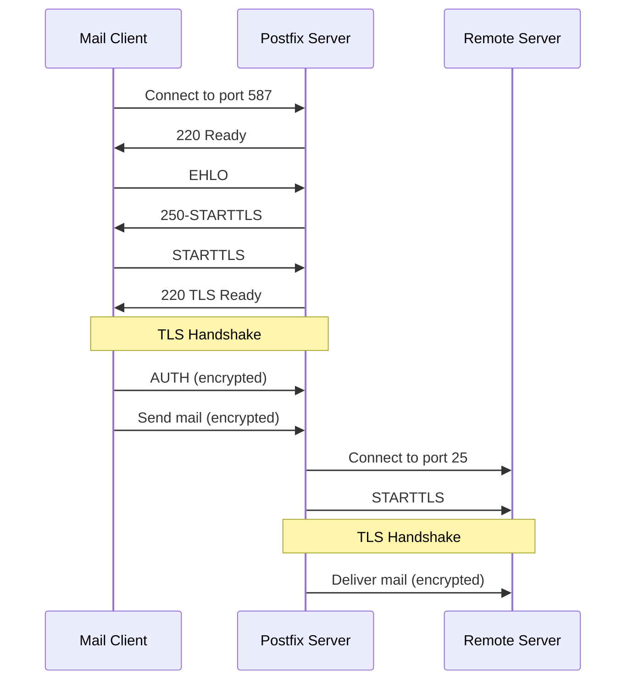

# How to Configure Postfix TLS Encryption for Secure Email on RHEL

Author: [nawazdhandala](https://www.github.com/nawazdhandala)

Tags: RHEL, Postfix, TLS, Email Security, Linux

Description: Set up TLS encryption on Postfix for both inbound and outbound email connections on RHEL to protect mail in transit.

---

## Why TLS Matters for Email

Email was designed in an era when nobody worried about eavesdropping. By default, SMTP sends everything in plain text, including credentials if you use authentication. TLS encryption wraps those connections in a secure layer, preventing anyone between sender and receiver from reading the traffic.

On a modern RHEL mail server, there is no excuse to skip TLS. Let's Encrypt gives you free certificates, and the configuration takes maybe ten minutes.

## Prerequisites

- RHEL with Postfix installed and running
- A valid TLS certificate and private key (from Let's Encrypt or your CA)
- DNS records pointing to your mail server

## Getting a TLS Certificate

If you do not already have a certificate, use certbot with Let's Encrypt:

```bash
# Install certbot
sudo dnf install -y certbot

# Request a certificate for your mail server hostname
sudo certbot certonly --standalone -d mail.example.com
```

The certificate files will be at:
- Certificate: `/etc/letsencrypt/live/mail.example.com/fullchain.pem`
- Private key: `/etc/letsencrypt/live/mail.example.com/privkey.pem`

## Configuring Inbound TLS (Server Side)

These settings control how Postfix handles TLS when other servers connect to it.

Add to `/etc/postfix/main.cf`:

```bash
# Enable TLS for incoming connections
smtpd_tls_security_level = may

# Certificate and key paths
smtpd_tls_cert_file = /etc/letsencrypt/live/mail.example.com/fullchain.pem
smtpd_tls_key_file = /etc/letsencrypt/live/mail.example.com/privkey.pem

# Use strong ciphers
smtpd_tls_mandatory_ciphers = high
smtpd_tls_mandatory_protocols = >=TLSv1.2

# Disable older protocols
smtpd_tls_protocols = >=TLSv1.2

# Enable TLS session caching for performance
smtpd_tls_session_cache_database = btree:${data_directory}/smtpd_scache
smtpd_tls_session_cache_timeout = 3600s

# Log TLS connection details
smtpd_tls_loglevel = 1

# Received header should show TLS info
smtpd_tls_received_header = yes
```

The `security_level = may` means Postfix will offer TLS but not require it. This is the right setting for port 25 because some legitimate servers still cannot do TLS.

## Configuring Outbound TLS (Client Side)

These settings control how Postfix handles TLS when sending mail to other servers:

```bash
# Enable TLS for outgoing connections
smtp_tls_security_level = may

# Use the system CA bundle to verify remote certificates
smtp_tls_CAfile = /etc/pki/tls/certs/ca-bundle.crt

# Enable session caching for outbound connections
smtp_tls_session_cache_database = btree:${data_directory}/smtp_scache

# Log TLS connections
smtp_tls_loglevel = 1

# Prefer strong ciphers
smtp_tls_mandatory_ciphers = high
smtp_tls_mandatory_protocols = >=TLSv1.2
```

## Enforcing TLS on the Submission Port

For the submission port (587), you should require TLS since this is where your users authenticate:

Edit `/etc/postfix/master.cf`:

```bash
submission inet n       -       n       -       -       smtpd
  -o syslog_name=postfix/submission
  -o smtpd_tls_security_level=encrypt
  -o smtpd_sasl_auth_enable=yes
  -o smtpd_tls_auth_only=yes
  -o smtpd_reject_unlisted_recipient=no
  -o smtpd_relay_restrictions=permit_sasl_authenticated,reject
```

The `smtpd_tls_security_level=encrypt` forces all submission port connections to use TLS.

## TLS Connection Flow



## Enabling SMTPS (Port 465)

Some older clients use implicit TLS on port 465 instead of STARTTLS. Enable it in `/etc/postfix/master.cf`:

```bash
smtps     inet  n       -       n       -       -       smtpd
  -o syslog_name=postfix/smtps
  -o smtpd_tls_wrappermode=yes
  -o smtpd_sasl_auth_enable=yes
  -o smtpd_reject_unlisted_recipient=no
  -o smtpd_relay_restrictions=permit_sasl_authenticated,reject
```

Open the port in the firewall:

```bash
# Allow SMTPS through the firewall
sudo firewall-cmd --permanent --add-port=465/tcp
sudo firewall-cmd --reload
```

## Testing TLS Configuration

### Test with openssl

```bash
# Test STARTTLS on port 25
openssl s_client -connect mail.example.com:25 -starttls smtp

# Test STARTTLS on port 587
openssl s_client -connect mail.example.com:587 -starttls smtp

# Test implicit TLS on port 465
openssl s_client -connect mail.example.com:465
```

### Check the Certificate Details

```bash
# View certificate expiration and details
openssl s_client -connect mail.example.com:25 -starttls smtp 2>/dev/null | openssl x509 -noout -dates -subject
```

### Verify from the Logs

```bash
# Check for TLS connections in the mail log
sudo grep "TLS connection established" /var/log/maillog | tail -5
```

You should see entries like:

```bash
postfix/smtpd: Anonymous TLS connection established from remote[1.2.3.4]: TLSv1.3 with cipher TLS_AES_256_GCM_SHA384
```

## Automating Certificate Renewal

Let's Encrypt certificates expire every 90 days. Set up automatic renewal with a post-renewal hook:

```bash
# Create a renewal hook script
sudo vi /etc/letsencrypt/renewal-hooks/post/postfix-reload.sh
```

```bash
#!/bin/bash
# Reload postfix after certificate renewal
systemctl reload postfix
```

```bash
# Make it executable
sudo chmod +x /etc/letsencrypt/renewal-hooks/post/postfix-reload.sh
```

Test the renewal process:

```bash
# Dry run to test renewal
sudo certbot renew --dry-run
```

## Hardening TLS

For stricter security, you can limit which ciphers and protocols are accepted:

```bash
# Only allow strong ciphers
smtpd_tls_exclude_ciphers = aNULL, eNULL, EXPORT, DES, RC4, MD5, PSK, aECDH, EDH-DSS-DES-CBC3-SHA, EDH-RSA-DES-CBC3-SHA

# Prefer server cipher order
tls_preempt_cipherlist = yes
```

## Troubleshooting

**TLS handshake failures:**

Increase the TLS log level temporarily:

```bash
smtpd_tls_loglevel = 3
```

Reload Postfix and check the logs:

```bash
sudo postfix reload
sudo tail -f /var/log/maillog
```

**Certificate chain errors:**

Make sure you are using the full chain certificate, not just the server cert.

**Permission errors on the key file:**

```bash
# Postfix needs to read the key
sudo chmod 640 /etc/letsencrypt/live/mail.example.com/privkey.pem
```

## Wrapping Up

TLS encryption is not optional for a mail server in 2026. With the settings above, your Postfix server will encrypt connections both inbound and outbound, protect user credentials on the submission port, and use modern protocols and ciphers. Set up certificate auto-renewal and you can largely forget about it until something breaks.
