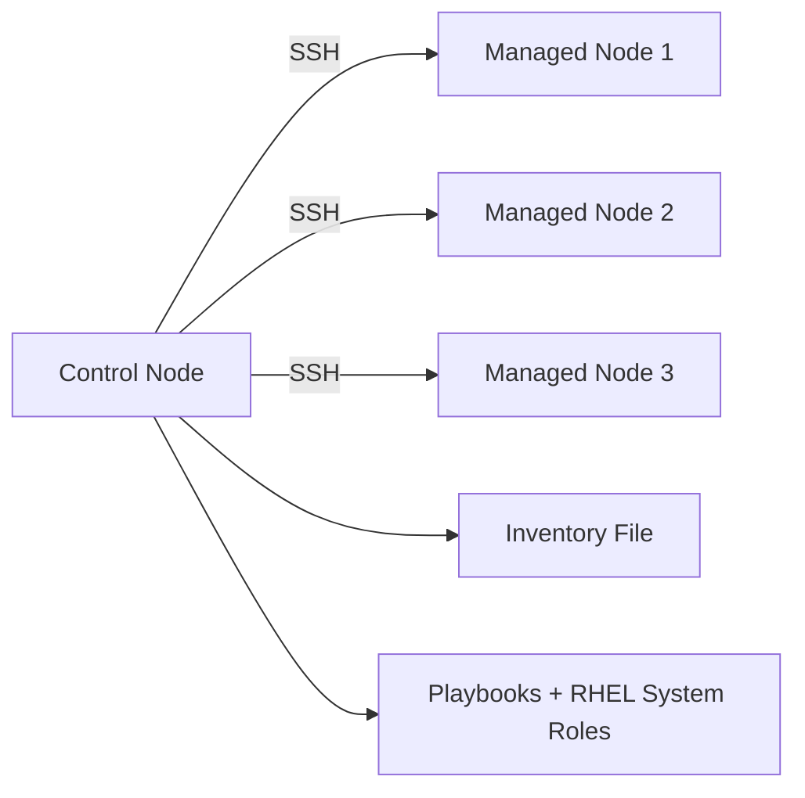
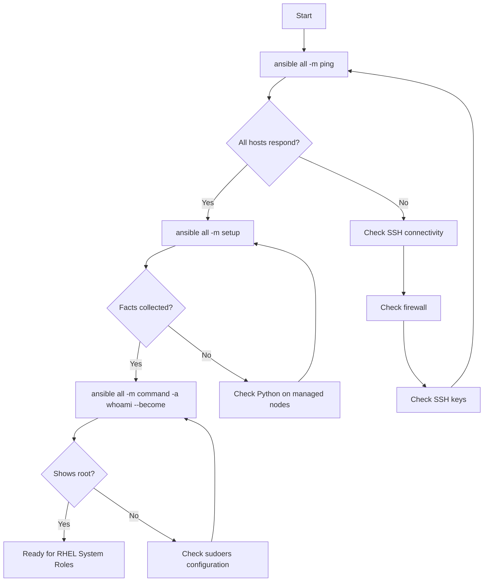

# How to Prepare Control Nodes and Managed Nodes for RHEL System Roles

Author: [nawazdhandala](https://www.github.com/nawazdhandala)

Tags: RHEL, Ansible, System Roles, Control Node, Managed Node, Linux

Description: Step-by-step guide to preparing your Ansible control node and managed nodes on RHEL 9 for using RHEL System Roles, including SSH key setup, Python requirements, inventory configuration, and connectivity testing.

---

## Understanding the Architecture

Before running any RHEL System Roles, you need two things set up: a control node that runs Ansible and one or more managed nodes that Ansible configures. The control node sends commands to managed nodes over SSH. There is no agent running on managed nodes, which is one of Ansible's biggest advantages.



The control node does all the heavy lifting: it reads your playbooks, connects to managed nodes via SSH, transfers small Python scripts, executes them, and collects the results. The managed nodes just need SSH access and Python.

## Setting Up the Control Node

The control node is where you install Ansible and the RHEL System Roles. This should be a dedicated management server or your workstation.

### Installing Ansible

On RHEL 9, Ansible is available from the default repositories.

```bash
# Install Ansible core
sudo dnf install ansible-core

# Verify the installation
ansible --version
```

### Installing RHEL System Roles

```bash
# Install the RHEL system roles package
sudo dnf install rhel-system-roles

# Verify the roles are installed
ls /usr/share/ansible/roles/ | grep rhel-system-roles
```

### Creating a Project Directory

Organize your automation work in a dedicated directory.

```bash
# Create a project directory structure
mkdir -p ~/ansible-project/{playbooks,inventory,group_vars,host_vars}

# Move into the project directory
cd ~/ansible-project
```

### Generating SSH Keys

If you do not already have an SSH key pair, generate one. This key will be used for passwordless authentication to managed nodes.

```bash
# Generate an Ed25519 SSH key for Ansible
ssh-keygen -t ed25519 -f ~/.ssh/id_ansible -C "ansible-control-node"
```

Do not skip the passphrase, but if you are running Ansible from automation (like a CI/CD pipeline), you may need to use ssh-agent or a passphrase-less key stored securely.

## Setting Up Managed Nodes

Each managed node needs minimal preparation. The requirements are:

1. SSH server running and accessible from the control node
2. A user account with sudo privileges
3. Python 3 installed (included by default on RHEL 9)

### Verifying Python

RHEL 9 ships with Python 3 in the base installation.

```bash
# Check Python 3 is available on the managed node
python3 --version
```

If for some reason it is not installed:

```bash
# Install Python 3 (should already be present on RHEL 9)
sudo dnf install python3
```

### Creating an Ansible Service Account

It is good practice to create a dedicated user for Ansible rather than using your personal account or root.

On each managed node:

```bash
# Create the ansible user
sudo useradd -m ansible

# Set a temporary password (will be replaced by SSH key auth)
sudo passwd ansible

# Grant sudo access without a password prompt
echo 'ansible ALL=(ALL) NOPASSWD: ALL' | sudo tee /etc/sudoers.d/ansible

# Set correct permissions on the sudoers file
sudo chmod 0440 /etc/sudoers.d/ansible
```

The `NOPASSWD` directive is important for unattended Ansible runs. Without it, every playbook would prompt for a sudo password.

### Deploying SSH Keys to Managed Nodes

From the control node, copy your SSH public key to each managed node.

```bash
# Copy the SSH key to a managed node
ssh-copy-id -i ~/.ssh/id_ansible.pub ansible@managed-node-1

# Repeat for additional nodes
ssh-copy-id -i ~/.ssh/id_ansible.pub ansible@managed-node-2
ssh-copy-id -i ~/.ssh/id_ansible.pub ansible@managed-node-3
```

Test that you can connect without a password:

```bash
# Test SSH access
ssh -i ~/.ssh/id_ansible ansible@managed-node-1 "hostname"
```

### Firewall on Managed Nodes

Make sure SSH is allowed through the firewall on each managed node.

```bash
# Verify SSH is allowed (run on each managed node)
sudo firewall-cmd --list-services | grep ssh
```

If SSH is not listed:

```bash
# Allow SSH through the firewall
sudo firewall-cmd --permanent --add-service=ssh
sudo firewall-cmd --reload
```

## Configuring the Ansible Inventory

The inventory file tells Ansible which nodes to manage and how to connect to them.

### Basic Inventory File

Create an inventory file in your project directory.

```bash
# Create the inventory file
cat > ~/ansible-project/inventory/hosts << 'EOF'
[webservers]
web1 ansible_host=192.168.1.10
web2 ansible_host=192.168.1.11

[dbservers]
db1 ansible_host=192.168.1.20
db2 ansible_host=192.168.1.21

[all:vars]
ansible_user=ansible
ansible_ssh_private_key_file=~/.ssh/id_ansible
ansible_python_interpreter=/usr/bin/python3
EOF
```

### Using Group Variables

For variables that apply to all hosts in a group, use group_vars files.

```bash
# Create group variables for web servers
cat > ~/ansible-project/group_vars/webservers.yml << 'EOF'
---
http_port: 80
https_port: 443
EOF

# Create group variables for database servers
cat > ~/ansible-project/group_vars/dbservers.yml << 'EOF'
---
db_port: 5432
db_data_dir: /var/lib/pgsql/data
EOF
```

### Using Host Variables

For variables specific to a single host:

```bash
# Create host-specific variables
cat > ~/ansible-project/host_vars/web1.yml << 'EOF'
---
server_role: primary
EOF
```

## Creating the Ansible Configuration File

Create an `ansible.cfg` file in your project directory to set defaults.

```bash
# Create the Ansible configuration file
cat > ~/ansible-project/ansible.cfg << 'EOF'
[defaults]
inventory = inventory/hosts
remote_user = ansible
private_key_file = ~/.ssh/id_ansible
roles_path = /usr/share/ansible/roles
host_key_checking = false

[privilege_escalation]
become = true
become_method = sudo
become_user = root
become_ask_pass = false
EOF
```

Key settings explained:

- `roles_path` includes the directory where RHEL System Roles are installed
- `host_key_checking = false` avoids SSH host key prompts for new servers (set to `true` in high-security environments)
- `become = true` enables privilege escalation by default, since RHEL System Roles need root access

## Testing Connectivity

Before running any playbooks, verify that the control node can reach all managed nodes.

### Ping Test

```bash
# Test connectivity to all hosts
cd ~/ansible-project
ansible all -m ping
```

Expected output for each host:

```
web1 | SUCCESS => {
    "changed": false,
    "ping": "pong"
}
```

### Gathering Facts

Test that Ansible can gather system information:

```bash
# Collect facts from all hosts
ansible all -m setup -a "filter=ansible_distribution*"
```

This should return distribution information for each managed node.

### Testing Privilege Escalation

Verify that the ansible user can run commands as root:

```bash
# Test sudo access
ansible all -m command -a "whoami" --become
```

The output should show `root` for each host.

## Testing with a Simple Playbook

Before jumping into RHEL System Roles, run a simple playbook to confirm everything works end to end.

```bash
# Create a test playbook
cat > ~/ansible-project/playbooks/test.yml << 'EOF'
---
- name: Test playbook
  hosts: all
  become: true
  tasks:
    - name: Check the OS version
      command: cat /etc/redhat-release
      register: os_version
      changed_when: false

    - name: Display OS version
      debug:
        msg: "{{ inventory_hostname }} is running {{ os_version.stdout }}"

    - name: Verify Python 3 is available
      command: python3 --version
      register: python_version
      changed_when: false

    - name: Display Python version
      debug:
        msg: "{{ inventory_hostname }} has {{ python_version.stdout }}"
EOF

# Run the test playbook
ansible-playbook playbooks/test.yml
```

## Troubleshooting Common Issues

### SSH Connection Refused

```bash
# Check if sshd is running on the managed node
systemctl status sshd

# Check if the firewall is blocking SSH
firewall-cmd --list-services
```

### Permission Denied

```bash
# Verify the SSH key is in authorized_keys on the managed node
cat /home/ansible/.ssh/authorized_keys

# Check the permissions on the .ssh directory
ls -la /home/ansible/.ssh/
```

The correct permissions should be:

```
drwx------  .ssh/
-rw-------  .ssh/authorized_keys
```

Fix them if needed:

```bash
# Fix SSH directory permissions on the managed node
chmod 700 /home/ansible/.ssh
chmod 600 /home/ansible/.ssh/authorized_keys
chown -R ansible:ansible /home/ansible/.ssh
```

### Sudo Fails

```bash
# Verify the sudoers file syntax
sudo visudo -cf /etc/sudoers.d/ansible
```

### Python Not Found

If Ansible reports that it cannot find Python on a managed node:

```bash
# Explicitly set the Python interpreter in the inventory
# Add this to the host or group vars
ansible_python_interpreter=/usr/bin/python3
```

## Connectivity Verification Workflow



## Practical Tips

- **Use ssh-agent on the control node** so you do not have to type the key passphrase for every Ansible run.

```bash
# Start ssh-agent and add your key
eval $(ssh-agent)
ssh-add ~/.ssh/id_ansible
```

- **Automate managed node preparation** with a bootstrap script that creates the ansible user, deploys SSH keys, and configures sudo. Run it once manually, then Ansible handles everything else.
- **Keep your inventory organized.** As your infrastructure grows, consider switching from a static inventory file to a dynamic inventory source.
- **Test connectivity after network changes.** Whenever firewall rules, IP addresses, or SSH configurations change, re-run `ansible all -m ping` to catch issues early.
- **Use `--limit` to test against a single host** before rolling out to all managed nodes.

```bash
# Run a playbook on just one host first
ansible-playbook playbooks/setup.yml --limit web1
```

## Summary

Preparing for RHEL System Roles requires setting up a control node with Ansible and the `rhel-system-roles` package, configuring managed nodes with SSH access and a sudo-capable user account, building an inventory file, and testing connectivity. The process is straightforward but each step matters. A misconfigured SSH key or missing sudoers entry will block everything downstream. Take the time to verify each layer, from SSH to sudo to Python, and you will have a solid foundation for automating your RHEL infrastructure.
