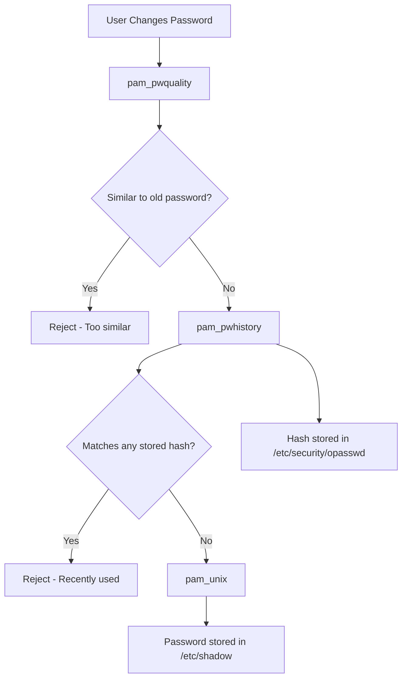

# How to Prevent Password Reuse on RHEL 9

Author: [nawazdhandala](https://www.github.com/nawazdhandala)

Tags: RHEL, Password Reuse, pam_pwhistory, Security, Linux

Description: Configure RHEL 9 to prevent users from recycling old passwords using pam_pwhistory and pam_unix, with compliance-focused examples.

---

Users love to reuse passwords. Change it from "Summer2025!" to "Summer2026!" and call it a day. On RHEL 9, you can prevent this with pam_pwhistory, which maintains a record of previous password hashes and blocks reuse. Combined with pam_pwquality's similarity check, you get solid protection against password recycling.

## Two Mechanisms for Preventing Reuse

RHEL 9 has two ways to block password reuse, and they work at different levels:



1. **pam_pwquality** with `difok` - Checks how many characters differ from the old password.
2. **pam_pwhistory** with `remember` - Stores hashes of previous passwords and blocks exact reuse.

## Configuring pam_pwhistory

### Option 1: Using the pam_pwhistory.conf file (RHEL 9.1+)

RHEL 9.1 introduced a dedicated configuration file:

```bash
sudo vi /etc/security/pwhistory.conf
```

```
# Remember the last 12 passwords
remember = 12

# Apply the restriction to root as well
enforce_for_root

# Number of retries
retry = 3
```

### Option 2: Configure in the PAM stack

If your version does not have the config file, or if you prefer PAM-level configuration:

```bash
# Check if pam_pwhistory is already in the stack
grep pam_pwhistory /etc/pam.d/system-auth
```

If it is not present, you need to add it. The safest way is through an authselect custom profile:

```bash
# Create a custom profile
sudo authselect create-profile myorg --base-on sssd

# Edit the system-auth template
sudo vi /etc/authselect/custom/myorg/system-auth
```

Add the pam_pwhistory line in the password section:

```
password    requisite     pam_pwquality.so retry=3
password    required      pam_pwhistory.so remember=12 use_authtok enforce_for_root
password    sufficient    pam_unix.so sha512 shadow nullok use_authtok
password    required      pam_deny.so
```

Apply the profile:

```bash
sudo authselect select custom/myorg with-faillock --force
```

## Setting Up the opasswd File

The password history is stored in `/etc/security/opasswd`. Make sure it exists with correct permissions:

```bash
# Create the file if it does not exist
sudo touch /etc/security/opasswd
sudo chown root:root /etc/security/opasswd
sudo chmod 600 /etc/security/opasswd
```

## Configuring the pam_unix remember Option

The `pam_unix` module also has a `remember` option, which provides an alternative way to store password history:

```
password    sufficient    pam_unix.so sha512 shadow nullok use_authtok remember=12
```

However, using both `pam_pwhistory` and `pam_unix remember` at the same time can cause confusion. Pick one approach and stick with it. The pam_pwhistory module gives you more options, so it is generally preferred.

## Preventing Similar Passwords with pam_pwquality

The `difok` parameter in pam_pwquality prevents passwords that are too similar to the previous one:

```bash
sudo vi /etc/security/pwquality.conf
```

```
# Require at least 5 characters to differ from the old password
difok = 5
```

This catches the "Summer2025 to Summer2026" problem. The user cannot just change a few characters and call it new.

## Testing Password Reuse Prevention

### Create a test user and set initial passwords

```bash
sudo useradd reusetest
sudo passwd reusetest
# Set: TestP@ss1234
```

### Try to reuse the password

```bash
sudo passwd reusetest
# Enter: TestP@ss1234 (the same password)
# Expected: "Password has been already used. Choose another."
```

### Try a similar password

```bash
sudo passwd reusetest
# Enter: TestP@ss1235 (only 1 character different)
# Expected: "BAD PASSWORD: The password is too similar to the old one"
```

## Compliance Settings

### PCI DSS - Remember last 4 passwords

```
remember = 4
```

### CIS Benchmark - Remember last 24 passwords

```
remember = 24
```

### STIG - Remember last 5 passwords

```
remember = 5
enforce_for_root
```

## Clearing Password History

Sometimes you need to reset a user's password history, for example after a security incident where you want them to set a completely new password:

```bash
# Edit the opasswd file and remove the user's entry
sudo vi /etc/security/opasswd
```

Find and delete the line starting with the username.

Or clear all history:

```bash
sudo truncate -s 0 /etc/security/opasswd
```

## Handling Edge Cases

### Users with no password history

When you first enable pam_pwhistory, the opasswd file is empty. Users can reuse their current password once because there is no history to check against. After the first change, history tracking begins.

To avoid this, force all users to change their passwords after enabling the module:

```bash
# Force password change on next login for all regular users
for user in $(awk -F: '$3 >= 1000 && $3 < 65534 {print $1}' /etc/passwd); do
    sudo chage -d 0 "$user"
done
```

### Root password reuse

By default, root can reuse passwords. Add `enforce_for_root` to prevent this:

```
password    required    pam_pwhistory.so remember=12 use_authtok enforce_for_root
```

### Service accounts

Service accounts that never change passwords interactively are not affected by pam_pwhistory. The module only runs when a password change goes through PAM.

## Troubleshooting

### Password reuse is not blocked

1. Verify pam_pwhistory is in the stack and comes before pam_unix:

```bash
grep -n "^password" /etc/pam.d/system-auth
```

2. Check the opasswd file permissions:

```bash
ls -la /etc/security/opasswd
```

3. Verify the `use_authtok` option is present. Without it, pam_pwhistory might prompt for the password separately.

### "Authentication token manipulation error"

This usually means the opasswd file has wrong permissions or does not exist:

```bash
sudo touch /etc/security/opasswd
sudo chmod 600 /etc/security/opasswd
sudo chown root:root /etc/security/opasswd
```

## Wrapping Up

Preventing password reuse on RHEL 9 requires configuring pam_pwhistory for exact reuse prevention and pam_pwquality's `difok` for similarity checking. Set the `remember` value according to your compliance needs, make sure the opasswd file has the right permissions, and test thoroughly before rolling out. The combination of these two checks ensures users actually pick new passwords rather than just tweaking old ones.
