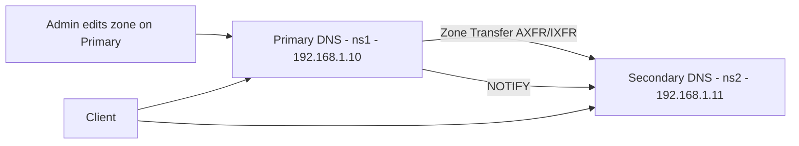

# How to Set Up Primary and Secondary DNS Zones with BIND on RHEL

Author: [nawazdhandala](https://www.github.com/nawazdhandala)

Tags: RHEL, BIND, DNS Zones, Linux

Description: Configure primary and secondary BIND DNS servers on RHEL for redundancy and reliability with automatic zone transfers.

---

Running a single DNS server is a single point of failure. If it goes down, name resolution for your domain stops working. The standard solution is to run at least two DNS servers: a primary that holds the master copy of your zone data, and one or more secondaries that receive copies through zone transfers. This guide sets up both.

## Architecture Overview



The primary server is authoritative for the zone and accepts updates. When the zone changes, it sends a NOTIFY message to the secondary. The secondary then requests a zone transfer (AXFR for full, IXFR for incremental) to get the updated data.

## Setting Up the Primary Server

Install BIND on the primary server (192.168.1.10):

```bash
dnf install bind bind-utils -y
```

Configure named.conf on the primary:

```bash
cat > /etc/named.conf << 'EOF'
options {
    listen-on port 53 { any; };
    listen-on-v6 port 53 { any; };
    directory "/var/named";
    allow-query { any; };
    recursion no;
    dnssec-validation auto;
    pid-file "/run/named/named.pid";

    // Notify secondaries when zone changes
    notify yes;
};

logging {
    channel default_log {
        file "/var/log/named/default.log" versions 3 size 5m;
        severity info;
        print-time yes;
    };
    category default { default_log; };
};

zone "." IN {
    type hint;
    file "named.ca";
};

zone "example.com" IN {
    type primary;
    file "example.com.zone";

    // Allow zone transfers to secondary
    allow-transfer { 192.168.1.11; };

    // Explicitly notify secondary
    also-notify { 192.168.1.11; };
};

zone "1.168.192.in-addr.arpa" IN {
    type primary;
    file "192.168.1.rev";
    allow-transfer { 192.168.1.11; };
    also-notify { 192.168.1.11; };
};
EOF
```

Create the zone file on the primary:

```bash
cat > /var/named/example.com.zone << 'EOF'
$TTL 86400
@   IN  SOA ns1.example.com. admin.example.com. (
            2026030401  ; Serial - increment on every change
            3600        ; Refresh - secondary checks every hour
            900         ; Retry - retry after 15 minutes on failure
            604800      ; Expire - secondary stops answering after 1 week
            86400       ; Minimum TTL
)

@       IN  NS  ns1.example.com.
@       IN  NS  ns2.example.com.

ns1     IN  A   192.168.1.10
ns2     IN  A   192.168.1.11

@       IN  A       192.168.1.100
www     IN  A       192.168.1.100
mail    IN  A       192.168.1.20
@       IN  MX  10  mail.example.com.
EOF
```

Create the reverse zone:

```bash
cat > /var/named/192.168.1.rev << 'EOF'
$TTL 86400
@   IN  SOA ns1.example.com. admin.example.com. (
            2026030401 3600 900 604800 86400 )

@       IN  NS  ns1.example.com.
@       IN  NS  ns2.example.com.

10      IN  PTR ns1.example.com.
11      IN  PTR ns2.example.com.
20      IN  PTR mail.example.com.
100     IN  PTR www.example.com.
EOF
```

Set permissions and start:

```bash
chown named:named /var/named/example.com.zone /var/named/192.168.1.rev
mkdir -p /var/log/named && chown named:named /var/log/named
named-checkconf /etc/named.conf
named-checkzone example.com /var/named/example.com.zone
systemctl enable --now named
firewall-cmd --permanent --add-service=dns && firewall-cmd --reload
```

## Setting Up the Secondary Server

Install BIND on the secondary (192.168.1.11):

```bash
dnf install bind bind-utils -y
```

Configure named.conf on the secondary:

```bash
cat > /etc/named.conf << 'EOF'
options {
    listen-on port 53 { any; };
    listen-on-v6 port 53 { any; };
    directory "/var/named";
    allow-query { any; };
    recursion no;
    dnssec-validation auto;
    pid-file "/run/named/named.pid";
};

logging {
    channel default_log {
        file "/var/log/named/default.log" versions 3 size 5m;
        severity info;
        print-time yes;
    };
    category default { default_log; };
};

zone "." IN {
    type hint;
    file "named.ca";
};

zone "example.com" IN {
    type secondary;
    file "slaves/example.com.zone";
    masters { 192.168.1.10; };

    // Don't allow transfers from secondary (unless you have tertiaries)
    allow-transfer { none; };
};

zone "1.168.192.in-addr.arpa" IN {
    type secondary;
    file "slaves/192.168.1.rev";
    masters { 192.168.1.10; };
    allow-transfer { none; };
};
EOF
```

Create the slaves directory and start:

```bash
mkdir -p /var/named/slaves
chown named:named /var/named/slaves
mkdir -p /var/log/named && chown named:named /var/log/named
named-checkconf /etc/named.conf
systemctl enable --now named
firewall-cmd --permanent --add-service=dns && firewall-cmd --reload
```

## Verifying Zone Transfers

On the secondary, check that the zone files were transferred:

```bash
ls -la /var/named/slaves/
```

You should see the zone files. If they're missing, check the logs:

```bash
journalctl -u named --no-pager -n 30
```

Test resolution on both servers:

```bash
# On primary
dig @192.168.1.10 www.example.com A

# On secondary
dig @192.168.1.11 www.example.com A
```

Both should return the same answer.

## Testing Zone Updates

On the primary, edit the zone file and increment the serial:

```bash
# Change serial from 2026030401 to 2026030402
# Add a new record, for example:
# test    IN  A   192.168.1.200
```

Reload the zone on the primary:

```bash
rndc reload example.com
```

Check the secondary's logs to see it pick up the change:

```bash
journalctl -u named --no-pager -n 10
```

Verify the new record is on both servers:

```bash
dig @192.168.1.10 test.example.com A
dig @192.168.1.11 test.example.com A
```

## SOA Record Timers Explained

The SOA record timers control zone transfer behavior:

| Timer | Value | Meaning |
|-------|-------|---------|
| Refresh | 3600 | Secondary checks for updates every hour |
| Retry | 900 | If refresh fails, retry after 15 minutes |
| Expire | 604800 | If primary is unreachable for 1 week, secondary stops serving the zone |
| Minimum TTL | 86400 | Default TTL for negative caching |

For critical zones, consider shorter refresh and retry values. For stable zones, longer values reduce unnecessary traffic.

## Forcing a Zone Transfer

If you need to force an immediate transfer on the secondary:

```bash
rndc retransfer example.com
```

## Monitoring Transfer Status

Check the zone's serial on both servers:

```bash
dig @192.168.1.10 example.com SOA +short
dig @192.168.1.11 example.com SOA +short
```

The serial numbers should match. If the secondary is behind, something is wrong with the transfer process.

Running primary and secondary DNS servers is one of the most fundamental things you can do for DNS reliability. Once set up, zone transfers happen automatically, and your users always have a backup name server if the primary goes offline.
