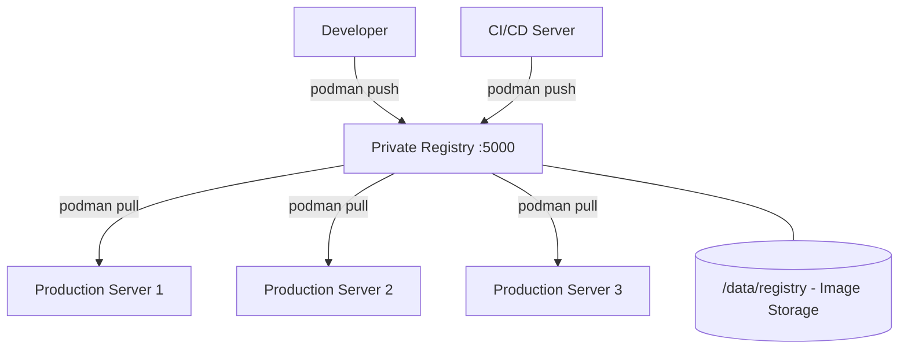

# How to Set Up a Private Container Registry on RHEL 9

Author: [nawazdhandala](https://www.github.com/nawazdhandala)

Tags: RHEL, Container Registry, Podman, Linux

Description: Step-by-step guide to setting up a private container registry on RHEL 9 using Podman, complete with TLS certificates, authentication, and storage configuration.

---

Running your own container registry is essential when you want to keep images close to your infrastructure, control access, and avoid depending on external registries for production deployments. On RHEL 9, you can spin up a private registry with Podman in about 15 minutes.

## Planning the Registry

Before setting up, decide on:

- **Storage location:** Where will images be stored? Needs plenty of disk space.
- **TLS:** Self-signed certs for internal use, or proper CA-signed certs.
- **Authentication:** Who can push and pull images?
- **Port:** Default is 5000, but you can use any port.



## Setting Up TLS Certificates

Create self-signed certificates for the registry:

# Create directories for certificates
```bash
sudo mkdir -p /etc/containers/certs.d/registry.example.com:5000/
sudo mkdir -p /opt/registry/certs
```

# Generate a self-signed certificate
```bash
openssl req -newkey rsa:4096 -nodes -sha256 \
  -keyout /opt/registry/certs/registry.key \
  -x509 -days 365 \
  -out /opt/registry/certs/registry.crt \
  -subj "/CN=registry.example.com" \
  -addext "subjectAltName=DNS:registry.example.com,IP:192.168.1.100"
```

# Copy the certificate for Podman trust on this host
```bash
sudo cp /opt/registry/certs/registry.crt /etc/containers/certs.d/registry.example.com:5000/ca.crt
```

## Setting Up Authentication

Create a password file for basic HTTP authentication:

# Install htpasswd utility
```bash
sudo dnf install -y httpd-tools
```

# Create the auth directory and password file
```bash
sudo mkdir -p /opt/registry/auth

# Add a user (will prompt for password)
sudo htpasswd -Bc /opt/registry/auth/htpasswd admin

# Add additional users
sudo htpasswd -B /opt/registry/auth/htpasswd developer
```

## Creating the Storage Directory

# Create persistent storage for the registry
```bash
sudo mkdir -p /opt/registry/data
```

Make sure this directory is on a partition with enough space for your images.

## Running the Registry

# Run the registry container with TLS and authentication
```bash
sudo podman run -d --name registry \
  -p 5000:5000 \
  -v /opt/registry/data:/var/lib/registry:Z \
  -v /opt/registry/certs:/certs:Z \
  -v /opt/registry/auth:/auth:Z \
  -e REGISTRY_HTTP_TLS_CERTIFICATE=/certs/registry.crt \
  -e REGISTRY_HTTP_TLS_KEY=/certs/registry.key \
  -e REGISTRY_AUTH=htpasswd \
  -e REGISTRY_AUTH_HTPASSWD_REALM="Private Registry" \
  -e REGISTRY_AUTH_HTPASSWD_PATH=/auth/htpasswd \
  docker.io/library/registry:2
```

# Verify the registry is running
```bash
sudo podman ps
```

## Testing the Registry

# Log in to the registry
```bash
podman login registry.example.com:5000
```

# Tag a local image for the private registry
```bash
podman tag docker.io/library/nginx:latest registry.example.com:5000/nginx:latest
```

# Push to the private registry
```bash
podman push registry.example.com:5000/nginx:latest
```

# Pull from the private registry
```bash
podman pull registry.example.com:5000/nginx:latest
```

## Listing Images in the Registry

# List all repositories in the registry
```bash
curl -u admin:password https://registry.example.com:5000/v2/_catalog --cacert /opt/registry/certs/registry.crt
```

# List tags for a specific image
```bash
curl -u admin:password https://registry.example.com:5000/v2/nginx/tags/list --cacert /opt/registry/certs/registry.crt
```

## Making the Registry a systemd Service

Create a Quadlet file so the registry starts on boot:

```bash
sudo mkdir -p /etc/containers/systemd/

sudo cat > /etc/containers/systemd/registry.container << 'EOF'
[Unit]
Description=Private Container Registry
After=network-online.target

[Container]
Image=docker.io/library/registry:2
PublishPort=5000:5000
Volume=/opt/registry/data:/var/lib/registry:Z
Volume=/opt/registry/certs:/certs:Z
Volume=/opt/registry/auth:/auth:Z
Environment=REGISTRY_HTTP_TLS_CERTIFICATE=/certs/registry.crt
Environment=REGISTRY_HTTP_TLS_KEY=/certs/registry.key
Environment=REGISTRY_AUTH=htpasswd
Environment=REGISTRY_AUTH_HTPASSWD_REALM=Private Registry
Environment=REGISTRY_AUTH_HTPASSWD_PATH=/auth/htpasswd

[Service]
Restart=always

[Install]
WantedBy=multi-user.target
EOF
```

```bash
sudo systemctl daemon-reload
sudo systemctl enable --now registry
```

## Configuring Client Machines

On every machine that needs to pull from your registry:

# Copy the CA certificate
```bash
sudo mkdir -p /etc/containers/certs.d/registry.example.com:5000/
sudo cp registry.crt /etc/containers/certs.d/registry.example.com:5000/ca.crt
```

# Also add it to the system trust store
```bash
sudo cp registry.crt /etc/pki/ca-trust/source/anchors/
sudo update-ca-trust
```

# Log in
```bash
podman login registry.example.com:5000
```

## Configuring Garbage Collection

Over time, deleted tags leave orphaned layers. Clean them up:

# Run garbage collection (registry must be in read-only mode or stopped)
```bash
sudo podman exec registry /bin/registry garbage-collect /etc/docker/registry/config.yml
```

## Configuring Storage Quotas

Limit storage usage in the registry configuration:

```bash
sudo cat > /opt/registry/config.yml << 'EOF'
version: 0.1
storage:
  filesystem:
    rootdirectory: /var/lib/registry
    maxthreads: 100
  delete:
    enabled: true
http:
  addr: :5000
  tls:
    certificate: /certs/registry.crt
    key: /certs/registry.key
auth:
  htpasswd:
    realm: "Private Registry"
    path: /auth/htpasswd
EOF
```

Mount this config when running the registry:

```bash
-v /opt/registry/config.yml:/etc/docker/registry/config.yml:Z
```

## Firewall Configuration

# Allow registry port through the firewall
```bash
sudo firewall-cmd --add-port=5000/tcp --permanent
sudo firewall-cmd --reload
```

## Backing Up the Registry

# Back up registry data
```bash
sudo tar czf /backup/registry-$(date +%Y%m%d).tar.gz -C /opt/registry data/
```

# Back up credentials and certificates
```bash
sudo tar czf /backup/registry-config-$(date +%Y%m%d).tar.gz -C /opt/registry auth/ certs/
```

## Summary

A private container registry on RHEL 9 gives you full control over your container images. Set it up with TLS and authentication from the start, configure it as a systemd service for reliability, and distribute the CA certificate to all client machines. With proper storage planning and garbage collection, it will serve your team well.
