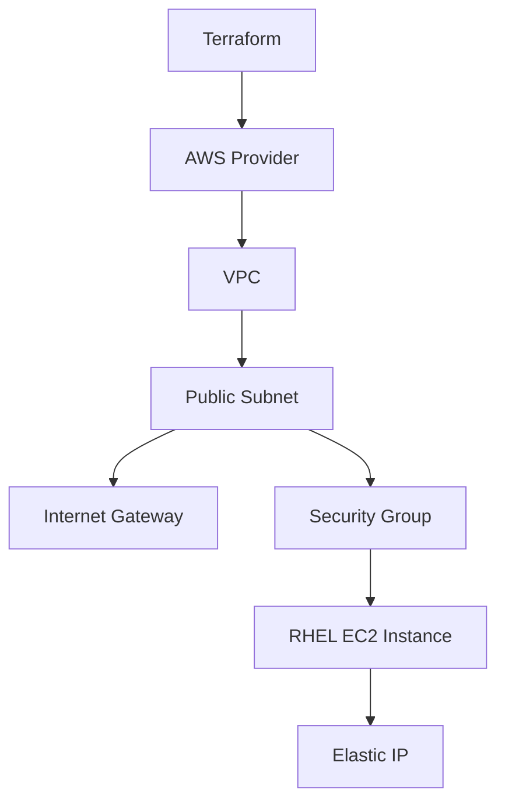

# How to Provision AWS EC2 Instances Running RHEL with Terraform

Author: [nawazdhandala](https://www.github.com/nawazdhandala)

Tags: RHEL, Terraform, AWS, EC2, Cloud, Linux

Description: A step-by-step guide to provisioning RHEL EC2 instances on AWS using Terraform, including VPC setup, security groups, and SSH access.

---

Spinning up RHEL instances on AWS through the console is fine for one-off tasks, but it does not scale. Terraform lets you define your entire AWS infrastructure as code, making deployments repeatable and version-controlled.

## What You Will Build



## Prerequisites

Install Terraform on your RHEL workstation:

```bash
# Add HashiCorp repo and install Terraform
sudo dnf install -y dnf-plugins-core
sudo dnf config-manager --add-repo https://rpm.releases.hashicorp.com/RHEL/hashicorp.repo
sudo dnf install -y terraform
```

Configure AWS credentials:

```bash
# Install the AWS CLI
sudo dnf install -y awscli2

# Configure your credentials
aws configure
# Enter your AWS Access Key ID, Secret Access Key, region, and output format
```

## Provider Configuration

```hcl
# providers.tf - AWS provider setup
terraform {
  required_version = ">= 1.5"

  required_providers {
    aws = {
      source  = "hashicorp/aws"
      version = "~> 5.0"
    }
  }
}

# Configure the AWS provider with your preferred region
provider "aws" {
  region = var.aws_region
}
```

## Variables

```hcl
# variables.tf - Input variables

variable "aws_region" {
  description = "AWS region for resources"
  default     = "us-east-1"
}

variable "instance_type" {
  description = "EC2 instance type"
  default     = "t3.medium"
}

variable "key_name" {
  description = "Name of the SSH key pair in AWS"
  type        = string
}

variable "allowed_ssh_cidr" {
  description = "CIDR block allowed to SSH into instances"
  default     = "0.0.0.0/0"
}
```

## Find the Latest RHEL AMI

```hcl
# ami.tf - Look up the latest official RHEL AMI

data "aws_ami" "rhel9" {
  most_recent = true
  owners      = ["309956199498"]  # Red Hat's AWS account ID

  filter {
    name   = "name"
    values = ["RHEL-9.*_HVM-*-x86_64-*-Hourly*"]
  }

  filter {
    name   = "virtualization-type"
    values = ["hvm"]
  }

  filter {
    name   = "architecture"
    values = ["x86_64"]
  }
}
```

## Network Configuration

```hcl
# network.tf - VPC, subnet, and internet gateway

# Create a VPC for our RHEL instances
resource "aws_vpc" "rhel_vpc" {
  cidr_block           = "10.0.0.0/16"
  enable_dns_hostnames = true
  enable_dns_support   = true

  tags = {
    Name = "rhel9-vpc"
  }
}

# Create a public subnet
resource "aws_subnet" "rhel_public" {
  vpc_id                  = aws_vpc.rhel_vpc.id
  cidr_block              = "10.0.1.0/24"
  map_public_ip_on_launch = true
  availability_zone       = "${var.aws_region}a"

  tags = {
    Name = "rhel9-public-subnet"
  }
}

# Create an internet gateway
resource "aws_internet_gateway" "rhel_igw" {
  vpc_id = aws_vpc.rhel_vpc.id

  tags = {
    Name = "rhel9-igw"
  }
}

# Create a route table with a default route to the internet
resource "aws_route_table" "rhel_public_rt" {
  vpc_id = aws_vpc.rhel_vpc.id

  route {
    cidr_block = "0.0.0.0/0"
    gateway_id = aws_internet_gateway.rhel_igw.id
  }

  tags = {
    Name = "rhel9-public-rt"
  }
}

# Associate the route table with the subnet
resource "aws_route_table_association" "rhel_public_rta" {
  subnet_id      = aws_subnet.rhel_public.id
  route_table_id = aws_route_table.rhel_public_rt.id
}
```

## Security Group

```hcl
# security.tf - Security group for SSH and HTTP access

resource "aws_security_group" "rhel_sg" {
  name        = "rhel9-sg"
  description = "Allow SSH and HTTP traffic to RHEL instances"
  vpc_id      = aws_vpc.rhel_vpc.id

  # Allow SSH from specified CIDR
  ingress {
    from_port   = 22
    to_port     = 22
    protocol    = "tcp"
    cidr_blocks = [var.allowed_ssh_cidr]
    description = "SSH access"
  }

  # Allow HTTP
  ingress {
    from_port   = 80
    to_port     = 80
    protocol    = "tcp"
    cidr_blocks = ["0.0.0.0/0"]
    description = "HTTP access"
  }

  # Allow all outbound traffic
  egress {
    from_port   = 0
    to_port     = 0
    protocol    = "-1"
    cidr_blocks = ["0.0.0.0/0"]
  }

  tags = {
    Name = "rhel9-sg"
  }
}
```

## EC2 Instance

```hcl
# instance.tf - RHEL EC2 instance

resource "aws_instance" "rhel9" {
  ami                    = data.aws_ami.rhel9.id
  instance_type          = var.instance_type
  key_name               = var.key_name
  subnet_id              = aws_subnet.rhel_public.id
  vpc_security_group_ids = [aws_security_group.rhel_sg.id]

  # Root volume configuration
  root_block_device {
    volume_size = 30      # 30 GB root disk
    volume_type = "gp3"   # General purpose SSD
    encrypted   = true    # Encrypt the volume
  }

  # User data script to run on first boot
  user_data = <<-EOF
    #!/bin/bash
    dnf update -y
    dnf install -y vim curl wget
  EOF

  tags = {
    Name = "rhel9-server"
    OS   = "RHEL"
  }
}

# Assign an Elastic IP for a stable public address
resource "aws_eip" "rhel9_eip" {
  instance = aws_instance.rhel9.id
  domain   = "vpc"

  tags = {
    Name = "rhel9-eip"
  }
}
```

## Outputs

```hcl
# outputs.tf - Display useful information after apply

output "instance_id" {
  description = "EC2 instance ID"
  value       = aws_instance.rhel9.id
}

output "public_ip" {
  description = "Public IP address of the RHEL instance"
  value       = aws_eip.rhel9_eip.public_ip
}

output "ssh_command" {
  description = "SSH command to connect to the instance"
  value       = "ssh ec2-user@${aws_eip.rhel9_eip.public_ip}"
}

output "ami_id" {
  description = "RHEL AMI ID used"
  value       = data.aws_ami.rhel9.id
}
```

## Deploy

```bash
# Initialize Terraform and download the AWS provider
terraform init

# Create a terraform.tfvars file with your values
cat > terraform.tfvars <<'TFVARS'
key_name         = "my-aws-keypair"
allowed_ssh_cidr = "203.0.113.0/32"
TFVARS

# Preview the infrastructure
terraform plan

# Deploy the RHEL instance
terraform apply -auto-approve

# Connect via SSH
ssh ec2-user@$(terraform output -raw public_ip)
```

## Clean Up

```bash
# Destroy all AWS resources managed by Terraform
terraform destroy -auto-approve
```

Terraform makes it straightforward to provision RHEL instances on AWS. You get a reproducible setup that you can commit to version control, share with your team, and extend as your infrastructure grows.
