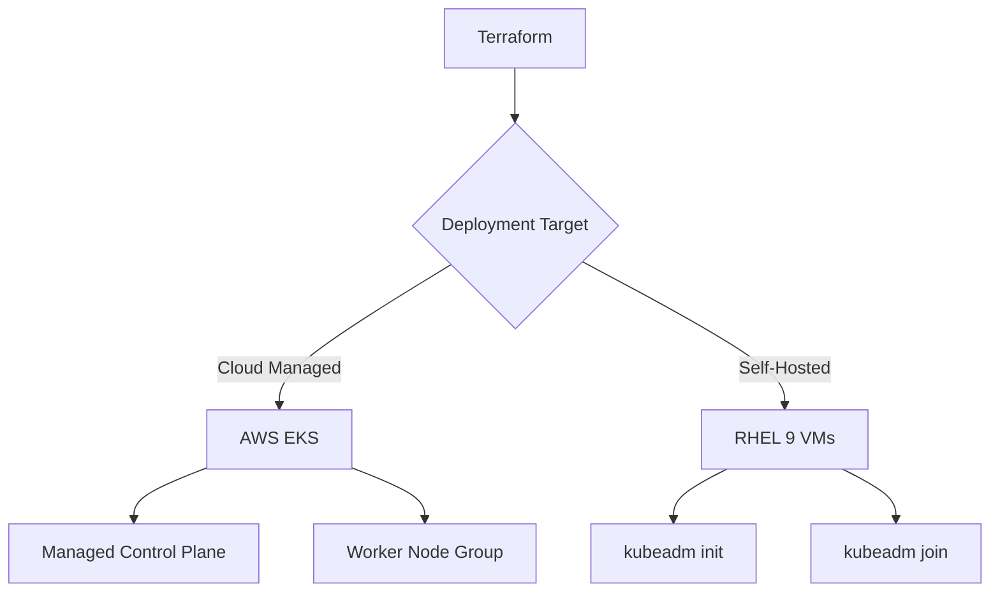

# How to Provision Kubernetes Clusters on RHEL 9 with Terraform

Author: [nawazdhandala](https://www.github.com/nawazdhandala)

Tags: RHEL, Terraform, Kubernetes, IaC, Containers, Linux

Description: Use Terraform to provision Kubernetes clusters on RHEL 9, covering both cloud-managed clusters and self-hosted deployments with kubeadm.

---

Setting up Kubernetes clusters manually is error-prone and hard to reproduce. Terraform lets you define your cluster infrastructure as code, whether you are deploying a managed EKS cluster or provisioning bare RHEL 9 nodes for kubeadm.

## Two Approaches



## Approach 1: Provision EKS with RHEL Worker Nodes

```hcl
# eks.tf - Create an EKS cluster with Terraform

terraform {
  required_providers {
    aws = {
      source  = "hashicorp/aws"
      version = "~> 5.0"
    }
  }
}

provider "aws" {
  region = "us-east-1"
}

# VPC for the EKS cluster
module "vpc" {
  source  = "terraform-aws-modules/vpc/aws"
  version = "~> 5.0"

  name = "k8s-vpc"
  cidr = "10.0.0.0/16"

  azs             = ["us-east-1a", "us-east-1b"]
  private_subnets = ["10.0.1.0/24", "10.0.2.0/24"]
  public_subnets  = ["10.0.101.0/24", "10.0.102.0/24"]

  enable_nat_gateway = true
  single_nat_gateway = true

  # Tag subnets for Kubernetes
  public_subnet_tags = {
    "kubernetes.io/role/elb" = 1
  }

  private_subnet_tags = {
    "kubernetes.io/role/internal-elb" = 1
  }
}

# EKS cluster
module "eks" {
  source  = "terraform-aws-modules/eks/aws"
  version = "~> 19.0"

  cluster_name    = "rhel-k8s-cluster"
  cluster_version = "1.28"

  vpc_id     = module.vpc.vpc_id
  subnet_ids = module.vpc.private_subnets

  # Worker node configuration
  eks_managed_node_groups = {
    rhel_workers = {
      name           = "rhel-workers"
      instance_types = ["t3.large"]
      min_size       = 2
      max_size       = 5
      desired_size   = 3

      # Use a custom RHEL 9 AMI if available
      # ami_id = "ami-0123456789abcdef0"
    }
  }
}

output "cluster_endpoint" {
  value = module.eks.cluster_endpoint
}

output "kubeconfig_command" {
  value = "aws eks update-kubeconfig --name rhel-k8s-cluster --region us-east-1"
}
```

## Approach 2: Provision RHEL 9 Nodes for kubeadm

```hcl
# kubeadm-nodes.tf - Create RHEL 9 VMs for a self-hosted cluster

variable "control_plane_count" {
  default = 1
}

variable "worker_count" {
  default = 3
}

data "aws_ami" "rhel9" {
  most_recent = true
  owners      = ["309956199498"]

  filter {
    name   = "name"
    values = ["RHEL-9.*_HVM-*-x86_64-*-Hourly*"]
  }
}

# Control plane nodes
resource "aws_instance" "control_plane" {
  count         = var.control_plane_count
  ami           = data.aws_ami.rhel9.id
  instance_type = "t3.large"
  key_name      = "my-keypair"

  root_block_device {
    volume_size = 50
    volume_type = "gp3"
  }

  tags = {
    Name = "k8s-control-plane-${count.index + 1}"
    Role = "control-plane"
  }

  # Bootstrap script for control plane prerequisites
  user_data = <<-EOF
    #!/bin/bash
    # Disable swap (required by Kubernetes)
    swapoff -a
    sed -i '/swap/d' /etc/fstab

    # Load kernel modules
    cat > /etc/modules-load.d/k8s.conf <<MODULES
    overlay
    br_netfilter
    MODULES
    modprobe overlay
    modprobe br_netfilter

    # Set sysctl parameters
    cat > /etc/sysctl.d/k8s.conf <<SYSCTL
    net.bridge.bridge-nf-call-iptables = 1
    net.bridge.bridge-nf-call-ip6tables = 1
    net.ipv4.ip_forward = 1
    SYSCTL
    sysctl --system

    # Install containerd
    dnf install -y containerd
    containerd config default > /etc/containerd/config.toml
    sed -i 's/SystemdCgroup = false/SystemdCgroup = true/' /etc/containerd/config.toml
    systemctl enable --now containerd

    # Add Kubernetes repo
    cat > /etc/yum.repos.d/kubernetes.repo <<REPO
    [kubernetes]
    name=Kubernetes
    baseurl=https://pkgs.k8s.io/core:/stable:/v1.28/rpm/
    enabled=1
    gpgcheck=1
    gpgkey=https://pkgs.k8s.io/core:/stable:/v1.28/rpm/repodata/repomd.xml.key
    REPO

    # Install kubeadm, kubelet, kubectl
    dnf install -y kubelet kubeadm kubectl
    systemctl enable kubelet
  EOF
}

# Worker nodes
resource "aws_instance" "workers" {
  count         = var.worker_count
  ami           = data.aws_ami.rhel9.id
  instance_type = "t3.large"
  key_name      = "my-keypair"

  root_block_device {
    volume_size = 50
    volume_type = "gp3"
  }

  tags = {
    Name = "k8s-worker-${count.index + 1}"
    Role = "worker"
  }

  # Same bootstrap as control plane (minus kubeadm init)
  user_data = <<-EOF
    #!/bin/bash
    swapoff -a
    sed -i '/swap/d' /etc/fstab

    cat > /etc/modules-load.d/k8s.conf <<MODULES
    overlay
    br_netfilter
    MODULES
    modprobe overlay
    modprobe br_netfilter

    cat > /etc/sysctl.d/k8s.conf <<SYSCTL
    net.bridge.bridge-nf-call-iptables = 1
    net.bridge.bridge-nf-call-ip6tables = 1
    net.ipv4.ip_forward = 1
    SYSCTL
    sysctl --system

    dnf install -y containerd
    containerd config default > /etc/containerd/config.toml
    sed -i 's/SystemdCgroup = false/SystemdCgroup = true/' /etc/containerd/config.toml
    systemctl enable --now containerd

    cat > /etc/yum.repos.d/kubernetes.repo <<REPO
    [kubernetes]
    name=Kubernetes
    baseurl=https://pkgs.k8s.io/core:/stable:/v1.28/rpm/
    enabled=1
    gpgcheck=1
    gpgkey=https://pkgs.k8s.io/core:/stable:/v1.28/rpm/repodata/repomd.xml.key
    REPO

    dnf install -y kubelet kubeadm kubectl
    systemctl enable kubelet
  EOF
}

# Generate Ansible inventory for cluster bootstrapping
resource "local_file" "k8s_inventory" {
  content = <<-INV
    [control_plane]
    ${join("\n", [for inst in aws_instance.control_plane : "${inst.public_ip} ansible_user=ec2-user"])}

    [workers]
    ${join("\n", [for inst in aws_instance.workers : "${inst.public_ip} ansible_user=ec2-user"])}
  INV

  filename = "k8s-inventory.ini"
}

output "control_plane_ips" {
  value = aws_instance.control_plane[*].public_ip
}

output "worker_ips" {
  value = aws_instance.workers[*].public_ip
}
```

## Deploy

```bash
# Initialize and apply
terraform init
terraform apply -auto-approve

# For kubeadm approach, SSH into the control plane and initialize
ssh ec2-user@$(terraform output -json control_plane_ips | jq -r '.[0]')
sudo kubeadm init --pod-network-cidr=10.244.0.0/16
```

Terraform handles the infrastructure layer, giving you a reproducible foundation for Kubernetes on RHEL 9 regardless of whether you choose managed or self-hosted clusters.
