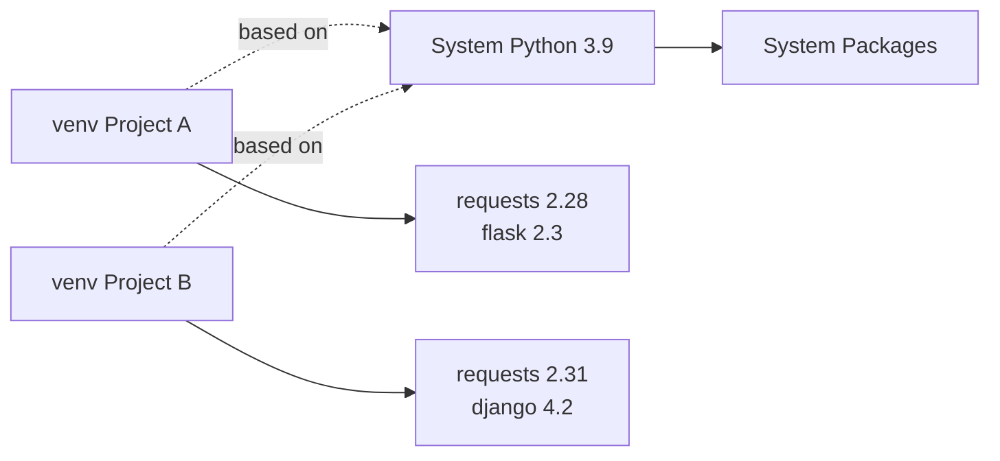

# How to Set Up Python Virtual Environments with venv on RHEL

Author: [nawazdhandala](https://www.github.com/nawazdhandala)

Tags: RHEL, Python, venv, Virtual Environments, Linux, Development

Description: A practical guide to creating and managing Python virtual environments on RHEL using the built-in venv module, keeping your projects isolated and your system Python clean.

---

Python virtual environments solve one of the most common headaches in Python development: dependency conflicts between projects. On RHEL, the `venv` module is the recommended way to create lightweight, isolated Python environments.

## Why Virtual Environments Matter

Without virtual environments, all Python packages install into a shared location. Project A might need `requests==2.28` while Project B needs `requests==2.31`. Virtual environments give each project its own independent set of packages.



## Installing the venv Module

On RHEL, the venv module may not be installed by default. Install it first.

```bash
# Install venv for the default Python 3.9
sudo dnf install -y python3-pip

# If using Python 3.11, install its venv support
sudo dnf install -y python3.11-pip

# Verify venv is available
python3 -m venv --help
```

## Creating a Virtual Environment

```bash
# Navigate to your project directory
mkdir -p ~/projects/myapp
cd ~/projects/myapp

# Create a virtual environment named 'venv'
python3 -m venv venv

# The command creates this directory structure:
# venv/
#   bin/        - activation scripts and Python binary
#   include/    - C headers for compiling extensions
#   lib/        - installed packages (site-packages)
#   pyvenv.cfg  - configuration file
```

## Activating and Deactivating

```bash
# Activate the virtual environment
source venv/bin/activate

# Your shell prompt changes to show the active environment
# (venv) [user@host myapp]$

# Verify you are using the venv Python
which python
# Output: ~/projects/myapp/venv/bin/python

which pip
# Output: ~/projects/myapp/venv/bin/pip

# Deactivate when you are done
deactivate
```

## Installing Packages Inside a Virtual Environment

Once activated, pip installs packages only into the virtual environment.

```bash
# Activate the environment
source venv/bin/activate

# Install packages - they go into venv/lib/python3.x/site-packages/
pip install flask requests

# List installed packages
pip list

# Freeze the current package list for reproducibility
pip freeze > requirements.txt
```

## Recreating an Environment from requirements.txt

```bash
# Create a fresh virtual environment
python3 -m venv venv-new

# Activate it
source venv-new/bin/activate

# Install all packages from the requirements file
pip install -r requirements.txt

# Verify everything installed correctly
pip list
```

## Using a Specific Python Version

If you have multiple Python versions installed, you can create a venv with a specific one.

```bash
# Create a venv with Python 3.11
python3.11 -m venv venv-py311

# Create a venv with Python 3.12
python3.12 -m venv venv-py312

# Each venv uses the Python version it was created with
source venv-py311/bin/activate
python --version  # Python 3.11.x
deactivate

source venv-py312/bin/activate
python --version  # Python 3.12.x
deactivate
```

## Creating a venv Without pip

Sometimes you want a minimal environment without pip pre-installed.

```bash
# Create a venv without pip
python3 -m venv --without-pip venv-minimal

# Activate it
source venv-minimal/bin/activate

# Manually bootstrap pip if needed later
curl -sS https://bootstrap.pypa.io/get-pip.py | python
```

## Including System Site Packages

In some cases, you want access to system-installed packages (like those from RPM) inside your venv.

```bash
# Create a venv that inherits system packages
python3 -m venv --system-site-packages venv-system

source venv-system/bin/activate

# System packages are visible, but new installs stay local
pip list  # Shows both system and local packages
pip install --user somepackage  # Installs only in the venv
```

## Automating venv Activation with a Shell Function

Add this to your `~/.bashrc` to quickly activate environments.

```bash
# Add to ~/.bashrc
workon() {
    # Usage: workon myapp
    # Looks for a venv directory in ~/projects/<name>/
    local project_dir="$HOME/projects/$1"
    if [ -f "$project_dir/venv/bin/activate" ]; then
        source "$project_dir/venv/bin/activate"
        cd "$project_dir"
        echo "Activated venv for $1"
    else
        echo "No virtual environment found at $project_dir/venv"
    fi
}

# Reload your shell
source ~/.bashrc

# Now use it
workon myapp
```

## Cleaning Up Virtual Environments

Virtual environments are just directories. Delete them to remove everything.

```bash
# Deactivate first if active
deactivate

# Remove the virtual environment entirely
rm -rf venv

# Recreate fresh from requirements.txt when needed
python3 -m venv venv
source venv/bin/activate
pip install -r requirements.txt
```

## Best Practices

1. Always add `venv/` to your `.gitignore` file so virtual environments are not committed to version control.
2. Keep a `requirements.txt` or `pyproject.toml` in your repository to document dependencies.
3. Name your virtual environment `venv` or `.venv` by convention so tools recognize it automatically.
4. Never install project packages with `sudo pip install` on RHEL -- use virtual environments instead.

## Summary

The `venv` module is the standard, lightweight tool for Python environment isolation on RHEL. Create a venv per project, activate it before working, and use `pip freeze` to lock your dependencies. This keeps your system Python untouched and your projects conflict-free.
