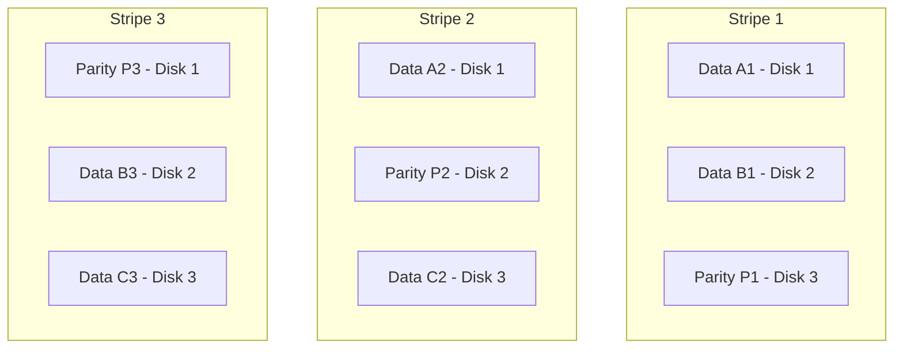

# How to Set Up RAID 5 with mdadm on RHEL for Parity Protection

Author: [nawazdhandala](https://www.github.com/nawazdhandala)

Tags: RHEL, RAID 5, mdadm, Storage, Linux

Description: Step-by-step instructions for configuring a RAID 5 array with mdadm on RHEL, providing both performance and single-disk fault tolerance through distributed parity.

---

## What RAID 5 Brings to the Table

RAID 5 stripes data across three or more disks and distributes parity blocks among all members. This means you can lose any one disk and still recover all your data. You get (N-1) disks worth of usable space, where N is the total number of disks. For example, with four 1 TB drives, you get 3 TB of usable storage.

The trade-off compared to RAID 1 is that rebuilds are slower and more stressful on the remaining disks. For smaller arrays with moderate write loads, RAID 5 is a solid choice.

## Prerequisites

- RHEL with root access
- At least three unused disks of equal size
- mdadm installed

## Step 1 - Install mdadm and Prepare Disks

```bash
# Install mdadm
sudo dnf install -y mdadm

# Wipe signatures on all target disks
sudo wipefs -a /dev/sdb
sudo wipefs -a /dev/sdc
sudo wipefs -a /dev/sdd
```

## Step 2 - Create the RAID 5 Array

```bash
# Create a three-disk RAID 5 array
sudo mdadm --create /dev/md5 --level=5 --raid-devices=3 /dev/sdb /dev/sdc /dev/sdd
```

The initial parity sync will start immediately. Monitor it:

```bash
# Check sync progress
cat /proc/mdstat
```

You will see a progress bar and estimated time remaining. For large disks, this can take hours.

## Step 3 - Understanding the Parity Layout



Parity rotates across all disks, so no single disk is a bottleneck. If any one disk fails, the missing data can be recalculated from the remaining data plus parity.

## Step 4 - Format and Mount

```bash
# Create XFS filesystem
sudo mkfs.xfs /dev/md5

# Mount the array
sudo mkdir -p /mnt/raid5
sudo mount /dev/md5 /mnt/raid5

# Check available space
df -h /mnt/raid5
```

## Step 5 - Save Configuration

```bash
# Persist the RAID configuration
sudo mdadm --detail --scan | sudo tee -a /etc/mdadm.conf

# Update initramfs
sudo dracut --regenerate-all --force

# Add fstab entry
RAID5_UUID=$(sudo blkid -s UUID -o value /dev/md5)
echo "UUID=${RAID5_UUID}  /mnt/raid5  xfs  defaults  0 0" | sudo tee -a /etc/fstab
```

## Step 6 - Verify the Array

```bash
# Show full array details
sudo mdadm --detail /dev/md5
```

Key things to look for:
- **State**: Should be "clean" or "active" after initial sync
- **Active Devices**: Should match the number you specified
- **Failed Devices**: Should be 0

## Choosing the Right Chunk Size

The default chunk size is 512K. For workloads with large sequential I/O (video files, backups), this works well. For database workloads with smaller random I/O, consider 64K or 128K.

```bash
# Create with custom chunk size (specify at creation time only)
sudo mdadm --create /dev/md5 --level=5 --raid-devices=3 --chunk=128 /dev/sdb /dev/sdc /dev/sdd
```

## Adding a Hot Spare

A hot spare sits idle until a disk fails, then automatically starts rebuilding.

```bash
# Add a fourth disk as a hot spare
sudo mdadm --manage /dev/md5 --add /dev/sde
```

Since the array was created with `--raid-devices=3` and you now have a fourth disk, mdadm automatically assigns it as a spare.

## Testing Failure and Recovery

```bash
# Simulate a disk failure
sudo mdadm --manage /dev/md5 --fail /dev/sdc

# Check degraded state
sudo mdadm --detail /dev/md5

# If there is a hot spare, rebuild starts automatically
# Otherwise, remove and add a replacement
sudo mdadm --manage /dev/md5 --remove /dev/sdc
sudo mdadm --manage /dev/md5 --add /dev/sdc

# Monitor rebuild
watch cat /proc/mdstat
```

## Performance Tuning

Increase the stripe cache size for better sequential read performance:

```bash
# Increase stripe cache (value is in pages, default is 256)
echo 8192 | sudo tee /sys/block/md5/md/stripe_cache_size
```

Set the read-ahead value for sequential workloads:

```bash
# Set read-ahead to 4 MB
sudo blockdev --setra 8192 /dev/md5
```

## RAID 5 Write Penalty

Every write to a RAID 5 array requires reading the old data and old parity, computing new parity, then writing the new data and new parity. This is known as the write penalty. For write-heavy workloads, consider RAID 10 instead.

## Wrap-Up

RAID 5 on RHEL gives you a good balance of capacity, performance, and fault tolerance. With three disks you lose only one disk's worth of space to parity. Just remember that RAID 5 cannot survive two simultaneous disk failures, so for larger arrays or mission-critical data, consider RAID 6 or RAID 10. And always keep backups, because RAID is not a backup strategy.
