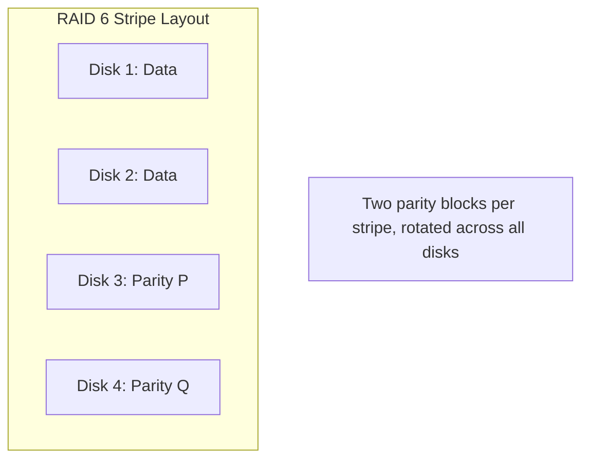

# How to Configure RAID 6 with mdadm for Double-Parity Redundancy on RHEL 9

Author: [nawazdhandala](https://www.github.com/nawazdhandala)

Tags: RHEL, RAID 6, mdadm, Storage, Linux

Description: Configure a RAID 6 array with mdadm on RHEL 9 to achieve double-parity redundancy, allowing your storage to survive two simultaneous disk failures.

---

## Why RAID 6?

RAID 6 extends RAID 5 by adding a second parity block to each stripe. This means the array can survive two disks failing at the same time. With large modern disks, rebuild times can stretch to many hours, and the risk of a second disk failing during a rebuild is real. RAID 6 addresses this risk directly.

The cost is that you lose two disks worth of capacity to parity. With four 1 TB disks, you get 2 TB usable. You also need a minimum of four disks.

## Prerequisites

- RHEL 9 with root access
- At least four unused disks
- mdadm installed

## Step 1 - Prepare the Environment

```bash
# Install mdadm
sudo dnf install -y mdadm

# Wipe all target disks
for disk in sdb sdc sdd sde; do
    sudo wipefs -a /dev/$disk
done
```

## Step 2 - Create the RAID 6 Array

```bash
# Create a four-disk RAID 6 array
sudo mdadm --create /dev/md6 --level=6 --raid-devices=4 /dev/sdb /dev/sdc /dev/sdd /dev/sde
```

The initial sync for RAID 6 takes longer than RAID 5 because two parity blocks must be computed for every stripe.

```bash
# Monitor sync progress
watch cat /proc/mdstat
```

## Step 3 - Understand the Parity Distribution



The P and Q parity blocks rotate across all disks just like in RAID 5, but with two independent parity calculations. This is what allows recovery from two simultaneous failures.

## Step 4 - Format, Mount, and Persist

```bash
# Create filesystem
sudo mkfs.xfs /dev/md6

# Mount it
sudo mkdir -p /mnt/raid6
sudo mount /dev/md6 /mnt/raid6

# Save RAID configuration
sudo mdadm --detail --scan | sudo tee -a /etc/mdadm.conf

# Update initramfs
sudo dracut --regenerate-all --force

# Add fstab entry
RAID6_UUID=$(sudo blkid -s UUID -o value /dev/md6)
echo "UUID=${RAID6_UUID}  /mnt/raid6  xfs  defaults  0 0" | sudo tee -a /etc/fstab
```

## Step 5 - Verify the Array

```bash
# Check detailed status
sudo mdadm --detail /dev/md6
```

Look for:
- **Raid Level**: raid6
- **Array Size**: should be roughly (N-2) x disk size
- **State**: clean (after sync completes)

## Testing Double Failure Tolerance

This is a test you should do on a non-production array to build confidence.

```bash
# Fail two disks
sudo mdadm --manage /dev/md6 --fail /dev/sdd
sudo mdadm --manage /dev/md6 --fail /dev/sde

# Array should still be accessible (degraded)
ls /mnt/raid6

# Check status - should show 2 failed devices
sudo mdadm --detail /dev/md6
```

## Rebuilding After Failure

```bash
# Remove failed disks
sudo mdadm --manage /dev/md6 --remove /dev/sdd
sudo mdadm --manage /dev/md6 --remove /dev/sde

# Add replacement disks
sudo mdadm --manage /dev/md6 --add /dev/sdd
sudo mdadm --manage /dev/md6 --add /dev/sde

# Monitor rebuild
watch cat /proc/mdstat
```

The rebuild will happen in stages. The array moves from "degraded" back to "clean" once all data and parity are recalculated.

## Performance Characteristics

RAID 6 has a higher write penalty than RAID 5 because both parity blocks must be updated on every write. In practice:

- Sequential reads are fast, similar to RAID 5
- Random reads benefit from having data spread across many disks
- Write performance is noticeably lower than RAID 5 due to the double parity overhead
- Larger arrays (6+ disks) amortize the parity cost better

## Tuning Stripe Cache

For better throughput on large sequential operations:

```bash
# Increase the stripe cache size
echo 8192 | sudo tee /sys/block/md6/md/stripe_cache_size

# Set read-ahead
sudo blockdev --setra 8192 /dev/md6
```

## When to Choose RAID 6 Over RAID 5

- You have large disks (4 TB or bigger) where rebuild times exceed 12 hours
- You have more than four disks in the array
- Losing the array would cause significant downtime or data loss
- You need to comply with storage policies that require double-parity protection

## Wrap-Up

RAID 6 with mdadm on RHEL 9 provides the peace of mind that comes from surviving two disk failures. The setup is nearly identical to RAID 5 but requires one extra disk. The trade-offs in write performance and capacity are worth it for arrays where rebuild risk is a concern. Combine it with regular backups and monitoring for a solid storage foundation.
