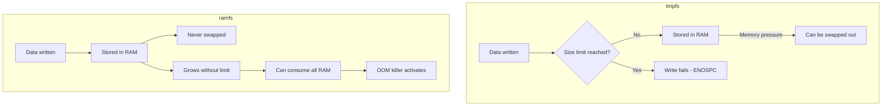
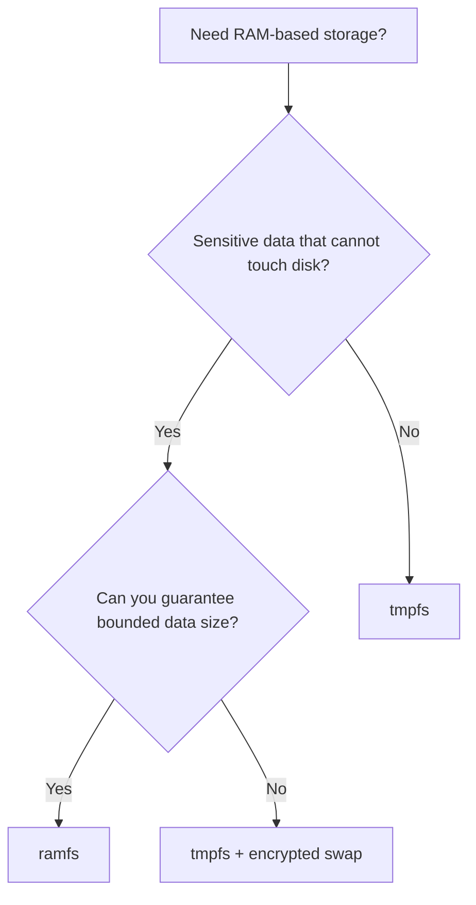

# How to Use ramfs vs tmpfs and Understand the Differences on RHEL

Author: [nawazdhandala](https://www.github.com/nawazdhandala)

Tags: RHEL, Ramfs, Tmpfs, Comparison, Linux

Description: Understand the differences between ramfs and tmpfs on RHEL, when to use each, and the practical implications for memory management.

---

Both ramfs and tmpfs store data in RAM, but they behave quite differently under the hood. Using the wrong one can lead to a system running out of memory with no warning. Here is what every sysadmin needs to know about the differences.

## The Core Difference

The fundamental difference is simple but critical:

- **tmpfs** has a size limit and can use swap
- **ramfs** has no size limit and cannot use swap



## Feature Comparison

| Feature | tmpfs | ramfs |
|---------|-------|-------|
| Size limit | Configurable (default 50% RAM) | None |
| Can use swap | Yes | No |
| Visible in `df` | Yes | No |
| Page cache behavior | Can be reclaimed | Cannot be reclaimed |
| OOM risk | Low (bounded) | High (unbounded) |
| Data persists after reboot | No | No |
| Use case | General temporary storage | Security-sensitive data |

## Using tmpfs

```bash
# Mount tmpfs with a 2 GB limit
mkdir -p /mnt/tmpfs
mount -t tmpfs -o size=2G tmpfs /mnt/tmpfs
```

When to choose tmpfs:
- General temporary storage
- Build directories
- Application caches
- Any case where you want bounded memory usage
- When swap fallback is acceptable

## Using ramfs

```bash
# Mount ramfs (no size limit!)
mkdir -p /mnt/ramfs
mount -t ramfs ramfs /mnt/ramfs
```

When to choose ramfs:
- Storing encryption keys that must never be written to disk (not even swap)
- Security-sensitive temporary data
- When you absolutely need data to stay in RAM
- Small amounts of data where the unbounded growth is not a risk

## The Swap Difference Explained

This is the most important practical difference.

With tmpfs, under memory pressure, the kernel can move tmpfs data to swap. This means your "RAM disk" data might actually end up on a physical disk:

```bash
# tmpfs data can end up in swap
# Check if tmpfs data is in swap
cat /proc/meminfo | grep -E "Shmem|SwapCached"
```

With ramfs, data stays in RAM no matter what. The kernel cannot swap it out. This is important for cryptographic keys and other sensitive data that should never touch persistent storage.

However, this means ramfs can consume unlimited RAM:

```bash
# DANGER: This will consume all RAM and potentially crash the system
# DO NOT actually run this
# dd if=/dev/zero of=/mnt/ramfs/bigfile bs=1M count=unlimited
```

## Practical Example: Encryption Key Storage

This is the classic use case for ramfs:

```bash
# Create a small ramfs for key storage
mkdir -p /mnt/keys
mount -t ramfs -o mode=0700 ramfs /mnt/keys

# Store keys
cp /path/to/encrypted/keyfile /mnt/keys/
# Decrypt keys into ramfs
openssl enc -d -aes-256-cbc -in /mnt/keys/keyfile -out /mnt/keys/plainkey

# Use the key
# ... application reads from /mnt/keys/plainkey ...

# Clean up securely
shred -u /mnt/keys/plainkey
umount /mnt/keys
```

The key never touches swap or persistent storage.

## Practical Example: Safe tmpfs for Builds

```bash
# Use tmpfs (not ramfs) for builds - size-limited and safe
mkdir -p /tmp/build
mount -t tmpfs -o size=4G tmpfs /tmp/build

# Run build
cd /path/to/source
make BUILDDIR=/tmp/build

# Clean up
umount /tmp/build
```

## Memory Visibility

tmpfs shows up in standard tools:

```bash
# tmpfs is visible in df
df -h /mnt/tmpfs
# Shows: tmpfs  2.0G  256M  1.8G  13% /mnt/tmpfs
```

ramfs does not:

```bash
# ramfs shows 0 in df
df -h /mnt/ramfs
# Shows: ramfs  0  0  0  - /mnt/ramfs
```

This makes monitoring ramfs harder. You cannot easily tell how much RAM it is consuming.

To check ramfs usage:

```bash
# Get approximate ramfs usage
du -sh /mnt/ramfs
```

## Security Considerations

### tmpfs Security Issue

tmpfs data can be swapped to disk. If your threat model includes physical disk access (stolen server, decommissioned drives), tmpfs is not secure for sensitive data.

Mitigation: Use encrypted swap if you use tmpfs for any sensitive data:

```bash
# Check if swap is encrypted
swapon --show
dmsetup table | grep swap
```

### ramfs Security Advantage

ramfs data never leaves RAM. Even if swap is unencrypted, ramfs data is safe.

### ramfs Risk

An unbounded ramfs can be exploited to consume all system memory. Never mount ramfs with write access for untrusted users.

## Alternatives

### tmpfs with Encrypted Swap

If you want tmpfs behavior (size limits, visibility) with the security of keeping data off unencrypted disk:

```bash
# Encrypt swap first
cryptsetup open --type plain --cipher aes-xts-plain64 --key-file /dev/urandom /dev/swap_device swap

# Then use tmpfs normally - even if data is swapped, swap is encrypted
mount -t tmpfs -o size=1G tmpfs /mnt/secure
```

### hugetlbfs

For applications that benefit from huge pages:

```bash
# Mount hugetlbfs
mount -t hugetlbfs none /mnt/hugepages
```

## When to Choose What



## Summary

For almost all use cases on RHEL, use tmpfs. It is safer (bounded size), better monitored (shows in df), and can use swap as a safety valve. Use ramfs only when you need an absolute guarantee that data never reaches persistent storage, and only for small, controlled amounts of data. If you need tmpfs-like features with ramfs security, combine tmpfs with encrypted swap.
