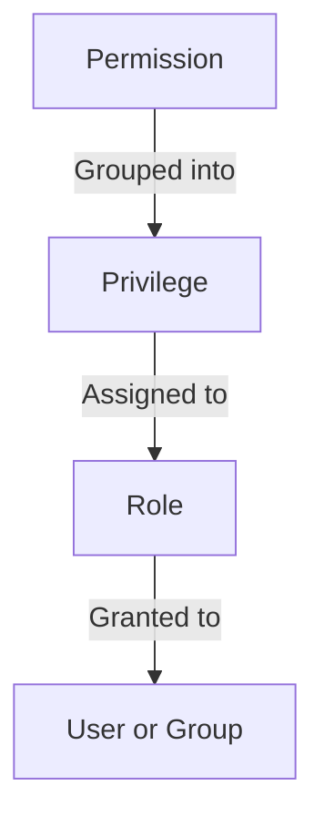

# How to Configure Role-Based Access Control (RBAC) in IdM on RHEL 9

Author: [nawazdhandala](https://www.github.com/nawazdhandala)

Tags: RHEL, IdM, RBAC, Access Control, Linux

Description: A practical guide to configuring role-based access control in Red Hat Identity Management on RHEL 9, covering roles, privileges, permissions, and delegation.

---

IdM has a layered RBAC system that lets you control who can do what in the IdM directory. Instead of giving everyone admin access and hoping for the best, you define roles with specific privileges, assign those roles to users or groups, and let the system enforce the boundaries. This keeps your IdM deployment secure and auditable.

## RBAC Architecture in IdM



- **Permission**: The lowest level. Defines a specific action on a specific target (for example, "write the userPassword attribute on user entries").
- **Privilege**: A collection of permissions grouped together for convenience (for example, "User Administrators" privilege bundles all permissions needed to manage users).
- **Role**: A collection of privileges assigned to users or groups (for example, "helpdesk" role gets the "User Administrators" privilege).

## Built-in Roles

IdM ships with several pre-defined roles. Check what is available before creating custom ones.

```bash
# List all existing roles
ipa role-find

# Show details of a specific role
ipa role-show "User Administrator"

# List privileges assigned to a role
ipa role-show "User Administrator" --all
```

Common built-in roles include:

| Role | Purpose |
|------|---------|
| User Administrator | Manage users and their attributes |
| Group Administrator | Manage groups and membership |
| Host Administrator | Manage hosts and host groups |
| Service Administrator | Manage services |
| Replication Administrators | Manage replication topology |
| DNS Administrators | Manage DNS zones and records |

## Step 1 - Create a Custom Role

Let's create a helpdesk role that can reset passwords and unlock accounts but cannot create or delete users.

```bash
# Create the role
ipa role-add "Helpdesk" --desc="Helpdesk staff - password resets and account unlocks"
```

## Step 2 - Create Custom Permissions

Define the specific actions the helpdesk role needs.

```bash
# Permission to modify user passwords
ipa permission-add "Reset User Password" \
  --type=user \
  --right=write \
  --attrs=userPassword \
  --attrs=krbPrincipalKey \
  --attrs=krbPasswordExpiration \
  --attrs=krbLastPwdChange

# Permission to unlock user accounts
ipa permission-add "Unlock User Account" \
  --type=user \
  --right=write \
  --attrs=krbLastAdminUnlock \
  --attrs=krbLoginFailedCount

# Permission to read user details (needed to find the user)
ipa permission-add "Read User Details" \
  --type=user \
  --right=read \
  --attrs=uid \
  --attrs=givenName \
  --attrs=sn \
  --attrs=mail \
  --attrs=krbLoginFailedCount \
  --attrs=nsAccountLock
```

## Step 3 - Create a Privilege and Add Permissions

Bundle the permissions into a privilege.

```bash
# Create a privilege
ipa privilege-add "Helpdesk Operations" \
  --desc="Permissions needed for helpdesk tasks"

# Add permissions to the privilege
ipa privilege-add-permission "Helpdesk Operations" \
  --permissions="Reset User Password"

ipa privilege-add-permission "Helpdesk Operations" \
  --permissions="Unlock User Account"

ipa privilege-add-permission "Helpdesk Operations" \
  --permissions="Read User Details"
```

## Step 4 - Assign the Privilege to the Role

```bash
# Add the privilege to the helpdesk role
ipa role-add-privilege "Helpdesk" \
  --privileges="Helpdesk Operations"

# Verify the role configuration
ipa role-show "Helpdesk" --all
```

## Step 5 - Assign Users or Groups to the Role

```bash
# Add a user to the role
ipa role-add-member "Helpdesk" --users=jsmith

# Add a group to the role (better practice)
ipa role-add-member "Helpdesk" --groups=helpdesk_staff
```

Now members of the `helpdesk_staff` group can reset passwords and unlock accounts but cannot create users, delete users, or modify other attributes.

## Testing the RBAC Configuration

Log in as a helpdesk user and verify the permissions work as expected.

```bash
# Authenticate as the helpdesk user
kinit jsmith

# This should work - resetting a password
ipa passwd testuser

# This should work - unlocking an account
ipa user-unlock testuser

# This should fail - creating a user (not permitted)
ipa user-add newuser --first=New --last=User
# Expected: ipa: ERROR: Insufficient access
```

## Delegation: Allowing Groups to Manage Their Own Members

Delegation lets group managers add and remove members from their own groups without full admin access.

```bash
# Create a delegation rule
ipa delegation-add "Manage Team Members" \
  --group=team_leads \
  --membergroup=developers \
  --attrs=member

# Now members of team_leads can add/remove members from developers
```

## Self-Service Rules

Self-service rules let users modify their own attributes, like phone number or SSH keys.

```bash
# Allow users to manage their own SSH keys
ipa selfservice-add "Users manage SSH keys" \
  --attrs=ipaSshPubKey

# Allow users to update their own contact info
ipa selfservice-add "Users manage contact info" \
  --attrs=mobile \
  --attrs=telephoneNumber \
  --attrs=street \
  --attrs=l \
  --attrs=st \
  --attrs=postalCode
```

## Auditing RBAC Configuration

Periodically review who has what access.

```bash
# List all roles and their members
for role in $(ipa role-find --sizelimit=0 --raw | grep "cn:" | awk '{print $2}'); do
  echo "=== Role: $role ==="
  ipa role-show "$role" --all | grep -E "Member|Privilege"
  echo ""
done

# List all custom permissions
ipa permission-find --sizelimit=0

# Show what privileges a specific user has through their roles
ipa role-find --users=jsmith
```

## Practical RBAC Examples

### Read-Only Auditor Role

```bash
# Create an auditor role with read-only access
ipa role-add "Auditor" --desc="Read-only access for compliance auditing"

ipa permission-add "Read All Users" \
  --type=user --right=read --attrs="*"

ipa permission-add "Read All Groups" \
  --type=group --right=read --attrs="*"

ipa permission-add "Read All Hosts" \
  --type=host --right=read --attrs="*"

ipa privilege-add "Audit Read Access"
ipa privilege-add-permission "Audit Read Access" \
  --permissions="Read All Users"
ipa privilege-add-permission "Audit Read Access" \
  --permissions="Read All Groups"
ipa privilege-add-permission "Audit Read Access" \
  --permissions="Read All Hosts"

ipa role-add-privilege "Auditor" --privileges="Audit Read Access"
ipa role-add-member "Auditor" --groups=auditors
```

### DNS Manager Role

```bash
# Create a DNS-only admin role
ipa role-add "DNS Manager" --desc="Manages DNS zones and records only"
ipa role-add-privilege "DNS Manager" --privileges="DNS Administrators"
ipa role-add-member "DNS Manager" --groups=dns_team
```

## Best Practices

- Use groups for role membership instead of individual users. This makes it easier to manage when people join or leave teams.
- Start with the built-in roles and privileges. Only create custom ones when the built-in options do not fit.
- Follow the principle of least privilege. Give each role only the permissions it actually needs.
- Review RBAC assignments quarterly. Remove role memberships for users who have changed roles.
- Document your RBAC structure. When the admin who set everything up leaves, the next person needs to understand the layout.
- Test permissions by logging in as a user with the role before rolling it out to the team.

RBAC in IdM is flexible enough to model most organizational access patterns. Take the time to design it properly, and you will have a system that is both secure and manageable.
