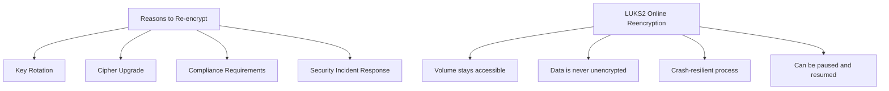

# How to Re-Encrypt LUKS Volumes on RHEL Without Data Loss

Author: [nawazdhandala](https://www.github.com/nawazdhandala)

Tags: RHEL, LUKS, Re-encryption, Online Encryption, Security, Linux

Description: Re-encrypt LUKS volumes on RHEL without data loss using the online reencryption feature to change encryption parameters or rotate the master key.

---

LUKS2 on RHEL supports online reencryption, which lets you change the encryption cipher, key size, or rotate the master key while the volume remains accessible. This is a significant improvement over LUKS1, where reencryption required taking the volume offline. This guide covers how to safely re-encrypt LUKS volumes.

## Why Re-encrypt?

Common reasons for reencryption include:

- Rotating the master key after a suspected compromise
- Upgrading to a stronger cipher or larger key size
- Meeting updated compliance requirements
- Converting from LUKS1 encryption parameters to LUKS2 defaults



## Prerequisites

Before starting reencryption:

```bash
# Verify the device is LUKS2 (reencryption requires LUKS2)
sudo cryptsetup luksDump /dev/sdb | head -5
# Must show: Version: 2

# If LUKS1, convert first
# sudo cryptsetup convert /dev/sdb --type luks2

# Back up the LUKS header
sudo cryptsetup luksHeaderBackup /dev/sdb \
    --header-backup-file /root/luks-header-pre-reencrypt.img

# Check current encryption parameters
sudo cryptsetup luksDump /dev/sdb | grep -E "cipher:|keysize:|hash:"
```

## Online Reencryption (Volume Remains Mounted)

### Change the Cipher

```bash
# Re-encrypt with a new cipher while the device is open and mounted
sudo cryptsetup reencrypt /dev/sdb \
    --cipher aes-xts-plain64 \
    --key-size 512

# You will be prompted for the passphrase
```

### Rotate the Master Key

To generate a completely new master key without changing cipher parameters:

```bash
# Re-encrypt with a new master key
sudo cryptsetup reencrypt /dev/sdb

# This keeps the same cipher but generates a new random master key
```

### Specify All Parameters

```bash
# Full reencryption with specific parameters
sudo cryptsetup reencrypt /dev/sdb \
    --cipher aes-xts-plain64 \
    --key-size 512 \
    --hash sha256 \
    --pbkdf argon2id \
    --iter-time 2000
```

## Monitoring Reencryption Progress

Reencryption can take a long time depending on device size. Monitor the progress:

```bash
# Check reencryption status
sudo cryptsetup status data_encrypted

# The luksDump command shows reencryption progress
sudo cryptsetup luksDump /dev/sdb | grep -i reencrypt

# Watch progress in real time using the --progress-frequency flag
sudo cryptsetup reencrypt /dev/sdb --progress-frequency 5
```

## Offline Reencryption

For maximum safety, you can perform reencryption with the device unmounted:

```bash
# Unmount the filesystem
sudo umount /mnt/encrypted-data

# Close the LUKS device
sudo cryptsetup luksClose data_encrypted

# Perform offline reencryption
sudo cryptsetup reencrypt /dev/sdb \
    --cipher aes-xts-plain64 \
    --key-size 512

# Re-open and mount
sudo cryptsetup luksOpen /dev/sdb data_encrypted
sudo mount /dev/mapper/data_encrypted /mnt/encrypted-data
```

## Encrypting an Existing Unencrypted Device

LUKS2 reencryption can also encrypt a device that was not previously encrypted:

```bash
# Encrypt an existing unencrypted device (data is preserved)
# WARNING: This is a risky operation - back up data first

# Step 1: Unmount the device
sudo umount /dev/sdb1

# Step 2: Initialize LUKS with reencryption mode
sudo cryptsetup reencrypt --encrypt --type luks2 \
    --cipher aes-xts-plain64 \
    --key-size 512 \
    --reduce-device-size 32M \
    /dev/sdb1

# The --reduce-device-size makes room for the LUKS header
# Enter a passphrase when prompted
```

## Decrypting a LUKS Volume

You can also permanently remove encryption:

```bash
# Decrypt a LUKS volume (remove encryption, keep data)
sudo cryptsetup reencrypt --decrypt /dev/sdb

# This removes the LUKS header and decrypts all data
```

## Handling Interrupted Reencryption

If the system crashes or loses power during reencryption, LUKS2 can recover:

```bash
# Check if reencryption was interrupted
sudo cryptsetup luksDump /dev/sdb | grep -i reencrypt

# Resume the interrupted reencryption
sudo cryptsetup reencrypt --resume-only /dev/sdb
```

The crash resilience works because LUKS2 stores a reencryption checkpoint in the header. The reencryption process tracks which sectors have been processed and can resume from the last checkpoint.

## Performance Considerations

Reencryption is I/O intensive. Consider these tips:

```bash
# Set a specific hotzone size for reencryption (default is dynamic)
# Larger values are faster but use more memory
sudo cryptsetup reencrypt /dev/sdb --hotzone-size 256M

# Limit the I/O impact on a production system
# Use ionice to set low I/O priority
sudo ionice -c2 -n7 cryptsetup reencrypt /dev/sdb

# Or combine with nice for low CPU priority
sudo nice -n 19 ionice -c2 -n7 cryptsetup reencrypt /dev/sdb
```

Estimate the time required:

```bash
# Check device size
lsblk -b /dev/sdb | awk 'NR==2 {printf "%.1f GB\n", $4/1024/1024/1024}'

# Rough estimate: reencryption processes about 100-300 MB/s on modern hardware
# A 1 TB disk takes approximately 1-3 hours
```

## Verifying Reencryption Results

After reencryption completes:

```bash
# Verify the new encryption parameters
sudo cryptsetup luksDump /dev/sdb | grep -E "cipher:|keysize:|hash:"

# Test the passphrase
sudo cryptsetup luksOpen --test-passphrase /dev/sdb

# Verify data integrity
sudo mount /dev/mapper/data_encrypted /mnt/encrypted-data
# Check your data

# Back up the new LUKS header
sudo cryptsetup luksHeaderBackup /dev/sdb \
    --header-backup-file /root/luks-header-post-reencrypt.img
```

## Summary

LUKS2 online reencryption on RHEL lets you rotate master keys, upgrade ciphers, and change encryption parameters without data loss and without taking the volume offline. Always back up the LUKS header before starting, monitor the progress, and verify the results after completion. The process is crash-resilient and can be resumed if interrupted, making it safe for production use.
