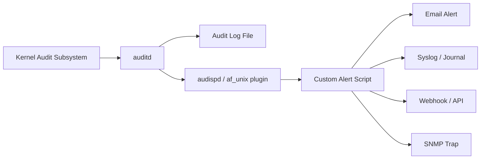

# How to Set Up Real-Time Alerts from Audit Events on RHEL

Author: [nawazdhandala](https://www.github.com/nawazdhandala)

Tags: RHEL, auditd, Alerts, Real-Time Monitoring, Security, Linux

Description: Configure real-time alerting from Linux audit events on RHEL using audisp plugins, custom scripts, and email notifications.

---

Collecting audit logs is only useful if someone actually reviews them. For critical security events, you need real-time alerts that notify your team immediately when something suspicious happens. This guide shows you how to set up real-time alerting from audit events on RHEL.

## Architecture Overview



The audit dispatcher (audispd) passes audit events to plugins in real time. You can write custom plugins that filter events and trigger alerts.

## Method 1: Using the audisp syslog Plugin

The simplest approach is to forward audit events to syslog, where you can process them with existing log monitoring tools:

```bash
# Install the audispd plugins package
sudo dnf install audispd-plugins

# Enable the syslog plugin
sudo vi /etc/audit/plugins.d/syslog.conf
```

Set the plugin to active:

```ini
# /etc/audit/plugins.d/syslog.conf
active = yes
direction = out
path = /sbin/audisp-syslog
type = always
args = LOG_WARNING
format = string
```

Reload auditd:

```bash
sudo service auditd reload
```

Now audit events will appear in the system journal and syslog, where tools like rsyslog can process them.

## Method 2: Custom Alert Script with af_unix Plugin

For more control, use the `af_unix` plugin to send events to a Unix socket that your custom script reads from:

### Step 1: Enable the af_unix Plugin

```bash
sudo tee /etc/audit/plugins.d/af_unix.conf << 'EOF'
active = yes
direction = out
path = builtin_af_unix
type = builtin
args = 0640 /var/run/audispd_events
format = string
EOF
```

### Step 2: Create the Alert Script

```bash
sudo tee /usr/local/bin/audit-alert.sh << 'SCRIPT'
#!/bin/bash
# /usr/local/bin/audit-alert.sh
# Real-time audit event alerter
# Reads from the audispd af_unix socket and sends alerts

SOCKET="/var/run/audispd_events"
ALERT_EMAIL="security@example.com"
HOSTNAME=$(hostname)

# Wait for the socket to be available
while [ ! -S "$SOCKET" ]; do
    sleep 1
done

# Read events from the socket using socat
socat UNIX-RECV:"$SOCKET" STDOUT | while read -r line; do

    # Alert on SSH config changes
    if echo "$line" | grep -q 'key="sshd_config"'; then
        SUBJECT="ALERT: SSH config changed on $HOSTNAME"
        echo "$line" | mail -s "$SUBJECT" "$ALERT_EMAIL" 2>/dev/null
        echo "$line" | systemd-cat -t audit-alert -p crit
    fi

    # Alert on failed logins
    if echo "$line" | grep -q 'type=USER_LOGIN' && echo "$line" | grep -q 'res=failed'; then
        SUBJECT="ALERT: Failed login on $HOSTNAME"
        echo "$line" | mail -s "$SUBJECT" "$ALERT_EMAIL" 2>/dev/null
        echo "$line" | systemd-cat -t audit-alert -p warning
    fi

    # Alert on sudo usage
    if echo "$line" | grep -q 'key="actions"'; then
        SUBJECT="ALERT: sudo config changed on $HOSTNAME"
        echo "$line" | mail -s "$SUBJECT" "$ALERT_EMAIL" 2>/dev/null
        echo "$line" | systemd-cat -t audit-alert -p crit
    fi

    # Alert on kernel module loading
    if echo "$line" | grep -q 'key="modules"'; then
        SUBJECT="ALERT: Kernel module operation on $HOSTNAME"
        echo "$line" | mail -s "$SUBJECT" "$ALERT_EMAIL" 2>/dev/null
        echo "$line" | systemd-cat -t audit-alert -p crit
    fi

    # Alert on user/group changes
    if echo "$line" | grep -q 'type=ADD_USER\|type=DEL_USER\|type=ADD_GROUP\|type=DEL_GROUP'; then
        SUBJECT="ALERT: User/Group change on $HOSTNAME"
        echo "$line" | mail -s "$SUBJECT" "$ALERT_EMAIL" 2>/dev/null
        echo "$line" | systemd-cat -t audit-alert -p warning
    fi

done
SCRIPT

sudo chmod +x /usr/local/bin/audit-alert.sh
```

### Step 3: Create a systemd Service

```bash
sudo tee /etc/systemd/system/audit-alert.service << 'EOF'
[Unit]
Description=Real-time Audit Event Alerter
After=auditd.service
Requires=auditd.service

[Service]
Type=simple
ExecStart=/usr/local/bin/audit-alert.sh
Restart=always
RestartSec=5
User=root

[Install]
WantedBy=multi-user.target
EOF

sudo systemctl daemon-reload
sudo systemctl enable --now audit-alert.service
```

## Method 3: Webhook-Based Alerts

For integration with Slack, PagerDuty, or other services, modify the alert script to send webhook notifications:

```bash
sudo tee /usr/local/bin/audit-webhook-alert.sh << 'SCRIPT'
#!/bin/bash
# Audit event webhook alerter

SOCKET="/var/run/audispd_events"
WEBHOOK_URL="https://hooks.slack.com/services/YOUR/WEBHOOK/URL"
HOSTNAME=$(hostname)

send_webhook() {
    local message="$1"
    local severity="$2"

    curl -s -X POST "$WEBHOOK_URL" \
        -H 'Content-type: application/json' \
        -d "{
            \"text\": \"*Audit Alert [$severity]* on \`$HOSTNAME\`\n\`\`\`$message\`\`\`\"
        }" > /dev/null 2>&1
}

while [ ! -S "$SOCKET" ]; do
    sleep 1
done

socat UNIX-RECV:"$SOCKET" STDOUT | while read -r line; do

    if echo "$line" | grep -q 'key="sshd_config"'; then
        send_webhook "SSH configuration changed: $line" "CRITICAL"
    fi

    if echo "$line" | grep -q 'key="identity"'; then
        send_webhook "User/group file modified: $line" "HIGH"
    fi

    if echo "$line" | grep -q 'key="modules"'; then
        send_webhook "Kernel module operation detected: $line" "CRITICAL"
    fi

done
SCRIPT

sudo chmod +x /usr/local/bin/audit-webhook-alert.sh
```

## Method 4: Using ausearch in a Polling Loop

A simpler but less real-time approach is to periodically poll the audit log:

```bash
sudo tee /usr/local/bin/audit-poll-alert.sh << 'SCRIPT'
#!/bin/bash
# Poll audit log for critical events every 60 seconds

ALERT_EMAIL="security@example.com"
HOSTNAME=$(hostname)
LAST_CHECK_FILE="/var/run/audit-poll-timestamp"

while true; do
    if [ -f "$LAST_CHECK_FILE" ]; then
        SINCE=$(cat "$LAST_CHECK_FILE")
    else
        SINCE="recent"
    fi

    # Check for critical events
    for key in sshd_config identity actions modules; do
        EVENTS=$(ausearch -k "$key" -ts "$SINCE" 2>/dev/null | grep -v "no matches")
        if [ -n "$EVENTS" ]; then
            echo "Critical audit events detected for key: $key" | \
                mail -s "Audit Alert [$key] on $HOSTNAME" "$ALERT_EMAIL" 2>/dev/null
            echo "$EVENTS" | systemd-cat -t audit-poll-alert -p warning
        fi
    done

    date +%H:%M:%S > "$LAST_CHECK_FILE"
    sleep 60
done
SCRIPT

sudo chmod +x /usr/local/bin/audit-poll-alert.sh
```

## Testing Your Alerts

Trigger a test event to verify alerts are working:

```bash
# Make a change that should trigger an alert
sudo touch /etc/ssh/sshd_config

# Check if the alert was generated
sudo journalctl -t audit-alert --since "1 minute ago"

# Verify the event was logged
sudo ausearch -k sshd_config -ts recent
```

## Summary

Real-time alerting from audit events on RHEL can be achieved through several methods: the audisp syslog plugin for integration with existing log monitoring, custom scripts reading from the af_unix socket for full control, webhook integrations for modern alerting platforms, or simple polling scripts for basic setups. Choose the method that best fits your infrastructure and make sure to test your alerts regularly.
