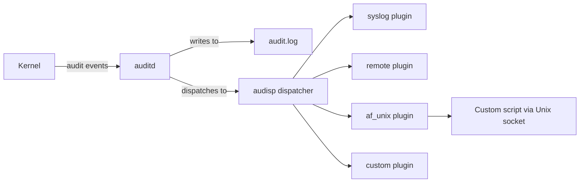

# How to Set Up Real-Time Audit Event Processing with audisp Plugins on RHEL

Author: [nawazdhandala](https://www.github.com/nawazdhandala)

Tags: RHEL, Auditd, Audisp, Plugins, Real-Time Processing, Security, Linux

Description: Configure audisp plugins on RHEL to process audit events in real time, enabling integration with SIEM systems, custom alerting, and event correlation.

---

The audit event dispatcher (audisp) is a component of the Linux audit framework that receives audit events from the kernel and passes them to plugins for real-time processing. On RHEL, audisp plugins allow you to forward events to syslog, remote servers, or custom scripts without affecting the core audit logging. This guide covers how to configure and create audisp plugins.

## How audisp Works



Starting with RHEL, the audisp dispatcher is built directly into auditd rather than running as a separate `audispd` process. Plugins are configured in `/etc/audit/plugins.d/`.

## Listing Available Plugins

```bash
# Check what plugins are installed
ls -la /etc/audit/plugins.d/

# Install additional plugins
sudo dnf install audispd-plugins

# List all available plugins after installation
ls -la /etc/audit/plugins.d/
```

Typical plugins include:

| Plugin | File | Purpose |
|--------|------|---------|
| syslog | syslog.conf | Forward events to syslog |
| af_unix | af_unix.conf | Send events to a Unix domain socket |
| au-remote | au-remote.conf | Forward events to a remote audit server |

## Plugin Configuration Format

Each plugin has a configuration file in `/etc/audit/plugins.d/` with this format:

```ini
active = yes|no
direction = out
path = /path/to/plugin/binary
type = builtin|always
args = plugin_arguments
format = string|binary
```

Fields:
- `active` - Whether the plugin is enabled
- `direction` - Always `out` for current plugins
- `path` - The plugin executable or `builtin_af_unix` for the built-in socket
- `type` - `builtin` for built-in plugins, `always` for external plugins
- `args` - Arguments passed to the plugin
- `format` - `string` for text output, `binary` for binary format

## Configuring the syslog Plugin

The syslog plugin forwards audit events to the system log:

```bash
sudo tee /etc/audit/plugins.d/syslog.conf << 'EOF'
active = yes
direction = out
path = /sbin/audisp-syslog
type = always
args = LOG_LOCAL6
format = string
EOF
```

The `args` field specifies the syslog facility. Common choices:
- `LOG_LOCAL6` - a dedicated local facility for audit events
- `LOG_WARNING` - send as warning-level messages to the default facility

Reload auditd to activate:

```bash
sudo service auditd reload
```

## Configuring the af_unix Plugin

The `af_unix` plugin creates a Unix domain socket that custom programs can read from:

```bash
sudo tee /etc/audit/plugins.d/af_unix.conf << 'EOF'
active = yes
direction = out
path = builtin_af_unix
type = builtin
args = 0640 /var/run/audispd_events
format = string
EOF

sudo service auditd reload
```

The `args` field specifies the socket permissions and path.

## Writing a Custom Plugin

You can write a custom plugin as any executable that reads audit events from standard input.

### Simple Python Plugin

```python
#!/usr/bin/env python3
"""
/usr/local/bin/audit-custom-plugin.py
Custom audisp plugin that filters and processes audit events
"""

import sys
import json
import re
from datetime import datetime

LOG_FILE = "/var/log/audit/custom-events.log"

def process_event(line):
    """Process a single audit event line."""
    # Check for high-priority events
    high_priority_keys = ["sshd_config", "identity", "modules", "actions"]

    for key in high_priority_keys:
        if f'key="{key}"' in line:
            timestamp = datetime.now().isoformat()
            with open(LOG_FILE, "a") as f:
                f.write(f"{timestamp} HIGH_PRIORITY [{key}]: {line}\n")
            return

    # Check for failed operations
    if "success=no" in line or "res=failed" in line:
        timestamp = datetime.now().isoformat()
        with open(LOG_FILE, "a") as f:
            f.write(f"{timestamp} FAILURE: {line}\n")

def main():
    """Read events from stdin and process them."""
    for line in sys.stdin:
        line = line.strip()
        if line:
            try:
                process_event(line)
            except Exception as e:
                with open(LOG_FILE, "a") as f:
                    f.write(f"ERROR processing event: {e}\n")

if __name__ == "__main__":
    main()
```

### Install the Custom Plugin

```bash
# Make the script executable
sudo chmod +x /usr/local/bin/audit-custom-plugin.py

# Create the plugin configuration
sudo tee /etc/audit/plugins.d/custom.conf << 'EOF'
active = yes
direction = out
path = /usr/local/bin/audit-custom-plugin.py
type = always
format = string
EOF

# Create the log file with proper permissions
sudo touch /var/log/audit/custom-events.log
sudo chmod 600 /var/log/audit/custom-events.log

# Reload auditd
sudo service auditd reload
```

### Shell Script Plugin

A simpler approach using a bash script:

```bash
#!/bin/bash
# /usr/local/bin/audit-shell-plugin.sh
# Simple audisp plugin that filters events by key

LOG_FILE="/var/log/audit/filtered-events.log"

while read -r line; do
    # Filter for specific audit keys
    if echo "$line" | grep -qE 'key="(sshd_config|identity|modules)"'; then
        echo "$(date -Iseconds) $line" >> "$LOG_FILE"
    fi
done
```

## Creating a SIEM Integration Plugin

For forwarding events to a SIEM system via HTTP:

```python
#!/usr/bin/env python3
"""
/usr/local/bin/audit-siem-plugin.py
Forward audit events to a SIEM system via HTTP
"""

import sys
import json
import urllib.request
import re
from datetime import datetime

SIEM_URL = "https://siem.example.com/api/v1/events"
API_KEY = "your-api-key-here"
BATCH_SIZE = 10

def parse_audit_line(line):
    """Parse an audit log line into a dictionary."""
    event = {"raw": line, "timestamp": datetime.now().isoformat()}

    # Extract key fields using regex
    patterns = {
        "type": r'type=(\S+)',
        "key": r'key="([^"]*)"',
        "comm": r'comm="([^"]*)"',
        "exe": r'exe="([^"]*)"',
        "auid": r'auid=(\d+)',
        "uid": r'uid=(\d+)',
        "success": r'success=(\w+)',
    }

    for field, pattern in patterns.items():
        match = re.search(pattern, line)
        if match:
            event[field] = match.group(1)

    return event

def send_to_siem(events):
    """Send a batch of events to the SIEM."""
    try:
        data = json.dumps({"events": events}).encode("utf-8")
        req = urllib.request.Request(
            SIEM_URL,
            data=data,
            headers={
                "Content-Type": "application/json",
                "Authorization": f"Bearer {API_KEY}",
            },
        )
        urllib.request.urlopen(req, timeout=5)
    except Exception as e:
        with open("/var/log/audit/siem-errors.log", "a") as f:
            f.write(f"{datetime.now().isoformat()} Error sending to SIEM: {e}\n")

def main():
    batch = []
    for line in sys.stdin:
        line = line.strip()
        if line:
            event = parse_audit_line(line)
            batch.append(event)

            if len(batch) >= BATCH_SIZE:
                send_to_siem(batch)
                batch = []

    # Send remaining events
    if batch:
        send_to_siem(batch)

if __name__ == "__main__":
    main()
```

## Troubleshooting Plugins

```bash
# Check if plugins are running
ps aux | grep audisp

# Check auditd status for plugin errors
sudo systemctl status auditd

# Check the journal for plugin-related messages
sudo journalctl -u auditd --since "10 minutes ago"

# Verify the plugin socket exists (for af_unix)
ls -la /var/run/audispd_events

# Test a plugin manually
echo 'type=SYSCALL msg=audit(1234567890.123:1): key="test"' | sudo /usr/local/bin/audit-custom-plugin.py
```

## Summary

audisp plugins on RHEL provide a flexible way to process audit events in real time. Use the built-in syslog plugin for simple log forwarding, the af_unix plugin for custom socket-based processing, or write your own plugin as a script that reads from standard input. Custom plugins can filter events, send alerts, or forward data to SIEM systems, making the audit framework a powerful foundation for security monitoring.
