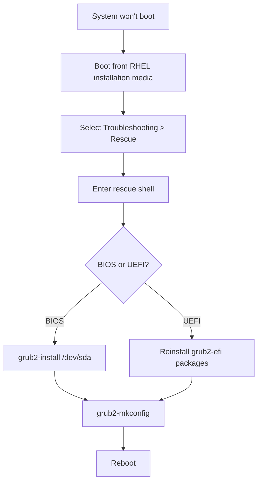

# How to Recover a Corrupted GRUB2 Boot Loader on RHEL 9

Author: [nawazdhandala](https://www.github.com/nawazdhandala)

Tags: RHEL, GRUB2, Recovery, Boot, Linux

Description: A step-by-step guide to recovering a corrupted or broken GRUB2 boot loader on RHEL 9, covering both BIOS and UEFI systems, using the RHEL installation media rescue environment.

---

## How GRUB2 Gets Corrupted

GRUB2 corruption can happen for several reasons:

- A failed OS update that overwrites the boot sector
- Disk errors on the boot partition
- Another OS installation overwriting the Master Boot Record
- Manual edits to GRUB configuration files that introduce syntax errors
- A damaged EFI System Partition on UEFI systems

The result is always the same: the system will not boot. You get a GRUB rescue prompt, a blank screen, or an error message like "error: unknown filesystem" or "no such partition."

## Recovery Overview



## Booting from RHEL Installation Media

1. Insert the RHEL 9 installation DVD or USB, or mount the ISO via your server's management console (iLO, iDRAC, IPMI)
2. Boot from the media
3. At the boot menu, select **Troubleshooting**
4. Select **Rescue a Red Hat Enterprise Linux system**
5. When prompted, select option 1 to mount the existing installation under `/mnt/sysimage`

## Chrooting into the Installed System

```bash
# Change root to the installed system
chroot /mnt/sysimage

# Verify you are now in the installed system
cat /etc/redhat-release

# Mount necessary virtual filesystems (if not already mounted)
mount -t proc proc /proc
mount -t sysfs sys /sys
mount -t devtmpfs devtmpfs /dev
mount /boot
```

## Reinstalling GRUB2 on BIOS Systems

```bash
# Identify the boot disk
lsblk

# Reinstall GRUB2 to the MBR of the boot disk
grub2-install /dev/sda

# Regenerate the GRUB configuration
grub2-mkconfig -o /boot/grub2/grub.cfg

# Verify the configuration was generated
cat /boot/grub2/grub.cfg | head -20
```

## Reinstalling GRUB2 on UEFI Systems

```bash
# Mount the EFI System Partition
mount /boot/efi

# Reinstall the GRUB2 EFI packages
dnf reinstall grub2-efi-x64 shim-x64 -y

# Regenerate the GRUB configuration
grub2-mkconfig -o /boot/efi/EFI/redhat/grub.cfg

# Verify the EFI boot entry
efibootmgr -v
```

If the EFI System Partition itself is damaged:

```bash
# Check the EFI partition filesystem
dosfsck -a /dev/sda1

# If severely damaged, reformat and reinstall
mkfs.vfat /dev/sda1
mount /dev/sda1 /boot/efi
dnf reinstall grub2-efi-x64 shim-x64 -y
grub2-mkconfig -o /boot/efi/EFI/redhat/grub.cfg
```

## Fixing Common GRUB2 Errors

### "error: unknown filesystem"

This usually means GRUB cannot find the partition it needs.

```bash
# From the GRUB rescue prompt (if you get one):
ls

# This lists available partitions. Try to find your root:
ls (hd0,msdos1)/
ls (hd0,msdos2)/

# Once found, set the root and boot:
set root=(hd0,msdos1)
insmod normal
normal
```

Then boot from installation media and properly reinstall GRUB2.

### "error: file not found"

The kernel or initramfs is missing from /boot.

```bash
# After chrooting, check /boot contents
ls -la /boot/vmlinuz-* /boot/initramfs-*

# If initramfs is missing, rebuild it
dracut --force /boot/initramfs-$(uname -r).img $(uname -r)

# If the kernel itself is missing, reinstall it
dnf reinstall kernel-core
```

### "no such partition"

The partition table or device numbering has changed.

```bash
# Check the current partition layout
lsblk
blkid

# Update GRUB to use the correct partitions
grub2-mkconfig -o /boot/grub2/grub.cfg
```

## Recovering When You Cannot Access the Rescue Shell

If even the rescue environment does not work, boot from a live USB of a compatible Linux distribution and manually mount the RHEL installation:

```bash
# Identify the RHEL partitions
lsblk
vgscan
vgchange -ay

# Mount the root filesystem
mount /dev/mapper/rhel-root /mnt
mount /dev/sda1 /mnt/boot  # adjust device as needed

# Bind mount virtual filesystems
mount --bind /dev /mnt/dev
mount --bind /proc /mnt/proc
mount --bind /sys /mnt/sys

# Chroot and reinstall GRUB
chroot /mnt
grub2-install /dev/sda
grub2-mkconfig -o /boot/grub2/grub.cfg
```

## Preventing Future GRUB2 Issues

```bash
# Keep a backup of the GRUB configuration
sudo cp /boot/grub2/grub.cfg /boot/grub2/grub.cfg.backup

# For UEFI, back up the EFI partition
sudo cp -r /boot/efi/EFI/redhat/ /root/efi-backup/

# Always test GRUB changes on a non-production system first
sudo grub2-script-check /boot/grub2/grub.cfg
```

## Wrapping Up

GRUB2 recovery on RHEL 9 follows a predictable pattern: boot from installation media, chroot into the installed system, reinstall GRUB, regenerate the configuration, and reboot. The specific commands differ between BIOS and UEFI systems, so know which one you are working with before you start. Having RHEL installation media readily available (or a remote console that can mount ISOs) is essential for any production environment, because a GRUB failure on a remote server without console access is a very bad day.
