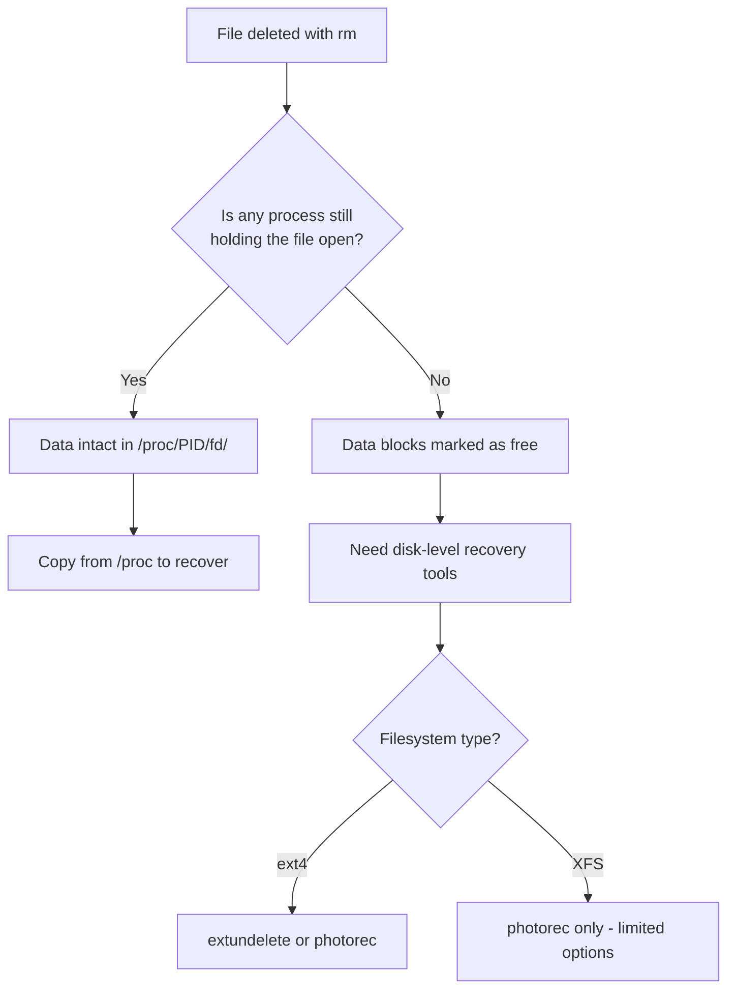

# How to Recover Deleted Files on RHEL

Author: [nawazdhandala](https://www.github.com/nawazdhandala)

Tags: RHEL, File Recovery, Troubleshooting, Linux, Data Recovery

Description: Practical methods for recovering deleted files on RHEL, including the /proc/PID/fd technique for open files, extundelete for ext4, testdisk/photorec for various filesystems, and XFS recovery limitations.

---

## When Deletion Happens

We have all been there. A misplaced `rm -rf`, a script that cleaned up the wrong directory, or a user who deleted something they should not have. The sinking feeling is universal. But before you panic, there are several recovery options on RHEL, depending on the filesystem and the circumstances.

Let me be honest upfront: file recovery on Linux is not guaranteed. Unlike Windows with its Recycle Bin, Linux deletes are immediate. But "deleted" does not always mean "gone," especially if you act quickly.

## Method 1: Recovering Files Still Open by a Process

This is the best-case scenario and the most reliable recovery method. If the deleted file is still being held open by a running process, the data is still on disk and fully accessible through `/proc`.

### How It Works

When you delete a file on Linux, the directory entry is removed, but the actual data blocks remain allocated as long as any process has the file open. Log files, database files, and application data files often fall into this category.



### Step-by-Step Recovery

```bash
# Step 1: Find the deleted file using lsof
# Look for files marked as (deleted)
sudo lsof 2>/dev/null | grep '(deleted)' | grep 'your-filename'

# Or search more broadly
sudo lsof +L1
```

The output will look something like this:

```
httpd     1234  apache  4w   REG  253,0  5242880  0  /var/log/httpd/access_log (deleted)
```

The important columns are the PID (1234) and the file descriptor number (4).

```bash
# Step 2: Verify the file content through /proc
sudo ls -la /proc/1234/fd/4

# Step 3: Copy the file to recover it
sudo cp /proc/1234/fd/4 /var/log/httpd/access_log.recovered

# Step 4: Verify the recovered file
ls -la /var/log/httpd/access_log.recovered
file /var/log/httpd/access_log.recovered
```

### Practical Example: Recovering a Deleted Log File

```bash
# Scenario: Someone accidentally deleted the application log while the app is running

# Find the process and file descriptor
sudo lsof -p $(pgrep -f myapp) 2>/dev/null | grep deleted

# If you see output like:
# myapp  5678  appuser  5w  REG  253,0  10485760  0  /var/log/myapp/app.log (deleted)

# Recover it
sudo cp /proc/5678/fd/5 /var/log/myapp/app.log

# Fix ownership
sudo chown appuser:appuser /var/log/myapp/app.log
```

This method works 100% of the time as long as the process is still running. The moment the process exits or closes the file, the data is gone.

## Method 2: Using extundelete for ext4 Filesystems

If the file is not held open by any process and the filesystem is ext4, `extundelete` can sometimes recover it by scanning the filesystem's journal and inode tables.

### Important: Stop Writing to the Filesystem Immediately

The moment a file is deleted on ext4, its data blocks are marked as free. Any new writes can overwrite those blocks. The sooner you act, the better your chances.

```bash
# If possible, remount the filesystem as read-only
sudo mount -o remount,ro /dev/sda2

# Or unmount it entirely if it is not the root filesystem
sudo umount /mnt/data
```

### Installing and Running extundelete

```bash
# extundelete is available from EPEL
sudo dnf install epel-release -y
sudo dnf install extundelete -y
```

```bash
# Recover a specific file by path
sudo extundelete /dev/sda2 --restore-file var/log/myapp/important.log

# Recover all deleted files from the filesystem
sudo extundelete /dev/sda2 --restore-all

# Recover files deleted after a specific time
sudo extundelete /dev/sda2 --restore-all --after $(date -d "2 hours ago" +%s)
```

Recovered files are placed in a `RECOVERED_FILES/` directory in the current working directory.

```bash
# Check what was recovered
ls -la RECOVERED_FILES/
```

### Limitations of extundelete

- Only works with ext4 (and ext3) filesystems
- Does NOT work with XFS, which is the default filesystem on RHEL
- Recovery success depends on whether the data blocks have been overwritten
- Large files have lower recovery rates because their blocks are spread across the disk
- The filesystem should be unmounted or mounted read-only for best results

## Method 3: Using testdisk and photorec

TestDisk and PhotoRec are powerful open-source recovery tools that work across multiple filesystem types, including XFS.

```bash
# Install testdisk (includes both testdisk and photorec)
sudo dnf install epel-release -y
sudo dnf install testdisk -y
```

### Using photorec for File Recovery

PhotoRec recovers files based on their content signatures rather than filesystem metadata. This means it works even on XFS, but recovered files lose their original names and directory structure.

```bash
# Run photorec on the device containing deleted files
sudo photorec /dev/sda2
```

PhotoRec runs interactively:

1. Select the disk/partition
2. Choose the filesystem type
3. Select whether to scan the whole partition or just free space
4. Choose a destination directory for recovered files (must be on a DIFFERENT filesystem)
5. Wait while it scans

```bash
# Create a recovery destination on a different filesystem
sudo mkdir /mnt/recovery
# Make sure /mnt/recovery is on a different disk or partition

# Run photorec
sudo photorec /dev/sda2
```

### Using testdisk for Partition Recovery

TestDisk is more useful for recovering lost partitions or fixing boot sectors, but it can also recover deleted files from FAT, NTFS, and ext filesystems.

```bash
# Run testdisk
sudo testdisk /dev/sda
```

Navigate through the menus:
1. Select the disk
2. Choose the partition table type
3. Select "Advanced"
4. Choose the partition
5. Select "List" to browse and recover files

## XFS Recovery Limitations

RHEL uses XFS as the default filesystem, and this is where things get difficult. XFS immediately reuses freed blocks and does not maintain the same kind of journal that ext4 does. This makes traditional undelete tools ineffective.

```bash
# Check your filesystem type
df -T /

# If it says xfs, your recovery options are limited
```

For XFS, your realistic options are:

1. **The /proc/PID/fd trick** - if the file is still open by a process
2. **PhotoRec** - can recover files by signature, but you lose filenames and directory structure
3. **Backups** - this is why backups matter
4. **XFS metadata dumps** - in rare cases, `xfs_metadump` and `xfs_mdrestore` can help with filesystem-level recovery, but not for individual deleted files

```bash
# Check if xfs_undelete is available (it is a community script, not officially supported)
# Some community tools exist but they have very limited success on XFS
# The honest truth: XFS recovery without backups is unreliable
```

## Prevention Is Better Than Recovery

Since recovery is never guaranteed, especially on XFS, prevention is critical.

### Use Trash Instead of rm

```bash
# Install trash-cli for a safer delete workflow
sudo dnf install trash-cli -y

# Use trash-put instead of rm
trash-put /path/to/file

# List trashed files
trash-list

# Restore a file from trash
trash-restore

# Empty the trash when you are sure
trash-empty
```

You can also create an alias to make `rm` safer (though this is controversial among sysadmins).

```bash
# Add to ~/.bashrc (optional, some admins prefer this)
alias rm='trash-put'
```

### Set Up Regular Backups

```bash
# Simple rsync backup script
#!/bin/bash
# /usr/local/bin/backup-important.sh

BACKUP_DEST="/mnt/backup/$(hostname)/$(date +%Y%m%d)"
mkdir -p "$BACKUP_DEST"

# Backup critical directories
rsync -a --delete /etc/ "$BACKUP_DEST/etc/"
rsync -a --delete /home/ "$BACKUP_DEST/home/"
rsync -a --delete /opt/myapp/data/ "$BACKUP_DEST/appdata/"

echo "Backup completed at $(date)"
```

### Use Filesystem Snapshots

If you are using LVM, snapshots provide point-in-time recovery.

```bash
# Create an LVM snapshot before risky operations
sudo lvcreate --size 5G --snapshot --name data_snap /dev/vg0/data

# If something goes wrong, restore from the snapshot
sudo lvconvert --merge /dev/vg0/data_snap
```

### Protect Critical Files with chattr

```bash
# Make a file immutable (cannot be deleted even by root without removing the flag)
sudo chattr +i /etc/critical-config.conf

# Verify the attribute
lsattr /etc/critical-config.conf

# Remove the immutable flag when you need to edit
sudo chattr -i /etc/critical-config.conf
```

## Recovery Checklist

When you discover a deleted file, follow this checklist in order:

```bash
# 1. Check if any process still has the file open
sudo lsof +L1 | grep "filename"

# 2. If found, copy from /proc immediately
sudo cp /proc/<PID>/fd/<FD> /path/to/recovered-file

# 3. If not found, check filesystem type
df -T /path/to/deleted/file/parent

# 4. If ext4: try extundelete (remount read-only first)
sudo mount -o remount,ro /dev/sdXN
sudo extundelete /dev/sdXN --restore-file path/to/file

# 5. If XFS: try photorec (recover to a different disk)
sudo photorec /dev/sdXN

# 6. Check backups
# Wherever your backups are stored

# 7. Check LVM snapshots
sudo lvs
```

## Summary

File recovery on RHEL depends heavily on timing and filesystem type. The `/proc/PID/fd` method is the most reliable if the file is still open. For ext4 filesystems, extundelete gives you a reasonable chance. For XFS (the RHEL default), options are limited to PhotoRec's signature-based recovery, which loses filenames and structure. The real lesson is that prevention, through backups, snapshots, and safe deletion practices, is always more reliable than recovery.
