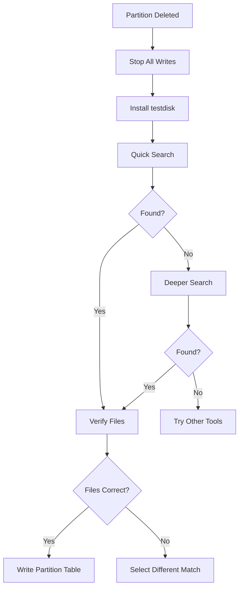

# How to Recover a Deleted Partition on RHEL 9

Author: [nawazdhandala](https://www.github.com/nawazdhandala)

Tags: RHEL, Partition Recovery, Data Recovery, Linux

Description: Learn techniques for recovering accidentally deleted partitions on RHEL 9 using testdisk and other recovery methods before data is permanently lost.

---

## Act Fast

When a partition is deleted, the data is usually still on the disk. The partition table entry is removed, but the actual data blocks remain untouched until something overwrites them. The faster you act, the better your chances of full recovery.

The most important rule: **stop writing to the disk immediately**. Do not create new partitions, do not format, do not install anything. Every write operation risks overwriting the data you want to recover.

## Prerequisites

- RHEL 9 (boot from a live USB if the affected disk is the boot drive)
- testdisk package (from EPEL repository)
- Root access

## Step 1 - Install testdisk

testdisk is the go-to tool for partition recovery on Linux.

```bash
# Enable EPEL repository
sudo dnf install -y epel-release

# Install testdisk
sudo dnf install -y testdisk
```

## Step 2 - Create a Disk Image (Optional but Recommended)

Before attempting recovery, make an image of the disk. This gives you a safety net.

```bash
# Create a bit-for-bit copy of the disk
sudo dd if=/dev/sdb of=/mnt/backup/sdb-image.img bs=4M status=progress

# You can later work on the image instead of the real disk
```

## Step 3 - Launch testdisk

```bash
# Run testdisk
sudo testdisk
```

Follow the interactive prompts:

1. Select **Create** to create a new log file
2. Select the affected disk (e.g., /dev/sdb)
3. Select the partition table type:
   - **Intel** for MBR
   - **EFI GPT** for GPT
4. Select **Analyse** to scan for lost partitions
5. Select **Quick Search** first

## Step 4 - Quick Search

testdisk scans the disk for partition signatures. It looks for filesystem superblocks, boot sectors, and other markers that indicate where partitions used to be.

After the scan, you will see a list of found partitions. Review them carefully:

- Check the partition sizes match what you expect
- Verify the filesystem types are correct
- Use the arrow keys to select each partition and press `p` to list files

## Step 5 - Deeper Search (If Needed)

If Quick Search does not find your partition:

1. Select **Deeper Search** from the testdisk menu
2. This scans every sector for filesystem signatures
3. It takes longer but is more thorough

## Step 6 - Restore the Partition

Once you have found the deleted partition:

1. Select it in the testdisk interface
2. Press **Enter** to proceed
3. Select **Write** to write the restored partition table
4. Confirm the operation
5. Reboot or run `partprobe` to reload the partition table

```bash
# After testdisk writes the partition table
sudo partprobe /dev/sdb

# Verify the partition is back
lsblk /dev/sdb

# Try mounting it
sudo mount /dev/sdb1 /mnt/recovered
ls /mnt/recovered
```

## Recovery Flow



## Alternative: Manual Recovery with fdisk

If you remember the exact start and end sectors of the deleted partition, you can recreate it manually:

```bash
# Recreate the partition with the exact same boundaries
sudo fdisk /dev/sdb
# n (new partition)
# Enter the exact start sector
# Enter the exact end sector or size
# w (write)

# Do NOT format - just mount
sudo mount /dev/sdb1 /mnt/recovered
```

The critical thing is matching the original start sector exactly. If you have the old fdisk output or sfdisk backup, use those values.

## Using sfdisk Backup for Recovery

This is why backups of partition tables are valuable:

```bash
# If you have a previous sfdisk dump
sudo sfdisk /dev/sdb < /root/sdb-partition-backup.txt

# Verify
sudo fdisk -l /dev/sdb
```

## Recovering GPT Partitions

GPT stores a backup partition table at the end of the disk. If the primary GPT is corrupted but the backup is intact:

```bash
# Recover GPT from backup with gdisk
sudo gdisk /dev/sdb
# r (recovery menu)
# b (rebuild primary GPT from backup)
# w (write)
```

## File Recovery When Partition Recovery Fails

If you cannot restore the partition table, you can still recover individual files:

```bash
# Use testdisk's file recovery feature
sudo testdisk /dev/sdb
# Select the disk
# Choose Advanced
# Select the partition area
# Choose List to browse and copy files

# Alternative: use photorec for file carving
sudo photorec /dev/sdb
```

photorec (included with testdisk) recovers files by their signatures, ignoring the filesystem structure entirely. It works even when the filesystem is destroyed.

## Prevention

The best recovery is the one you never need:

```bash
# Back up your partition table regularly
sudo sfdisk -d /dev/sdb > /root/sdb-partitions-$(date +%Y%m%d).txt

# For GPT, also back up with sgdisk
sudo sgdisk -b /root/sdb-gpt-backup.bin /dev/sdb
```

## Wrap-Up

Recovering a deleted partition on RHEL 9 is entirely possible if you act quickly and avoid writing to the disk. testdisk handles most recovery scenarios, and having a prior partition table backup makes recovery trivial. The lesson here is to always back up your partition tables alongside your data, because a quick `sfdisk -d` can save hours of recovery work.
