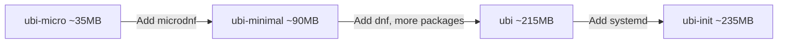

# How to Use Red Hat Universal Base Images (UBI) with Podman on RHEL 9

Author: [nawazdhandala](https://www.github.com/nawazdhandala)

Tags: RHEL, UBI, Podman, Container Images, Linux

Description: Learn how to use Red Hat Universal Base Images (UBI) with Podman on RHEL 9 for building enterprise-grade containers with RHEL packages, security updates, and Red Hat support.

---

Red Hat Universal Base Images (UBI) are freely redistributable container base images built from RHEL. You can use them without a Red Hat subscription, distribute containers built on them freely, and when running on a subscribed RHEL host, you get access to the full RHEL package set. They are the best starting point for building production containers on RHEL 9.

## UBI Image Variants

Red Hat provides several UBI variants:

| Image | Size | Use Case |
|-------|------|----------|
| ubi9/ubi | ~215MB | Full RHEL 9 userspace |
| ubi9/ubi-minimal | ~90MB | Minimal image with microdnf |
| ubi9/ubi-micro | ~35MB | Ultra-minimal, no package manager |
| ubi9/ubi-init | ~235MB | systemd-enabled for multi-service |

## Pulling UBI Images

# Pull the standard UBI 9 image
```bash
podman pull registry.access.redhat.com/ubi9/ubi
```

# Pull the minimal variant
```bash
podman pull registry.access.redhat.com/ubi9/ubi-minimal
```

# Pull the micro variant
```bash
podman pull registry.access.redhat.com/ubi9/ubi-micro
```

# Pull the init variant (systemd-enabled)
```bash
podman pull registry.access.redhat.com/ubi9/ubi-init
```

# Check the sizes
```bash
podman images | grep ubi9
```

## Using UBI Standard

The standard UBI has full `dnf` and a wide package set:

```bash
cat > Containerfile << 'EOF'
FROM registry.access.redhat.com/ubi9/ubi

# Install packages using dnf (full package manager)
RUN dnf install -y httpd mod_ssl php && \
    dnf clean all

COPY app/ /var/www/html/
EXPOSE 80 443
CMD ["/usr/sbin/httpd", "-D", "FOREGROUND"]
EOF
```

```bash
podman build -t my-php-app:latest .
```

## Using UBI Minimal

UBI minimal uses `microdnf` instead of `dnf` for a smaller footprint:

```bash
cat > Containerfile << 'EOF'
FROM registry.access.redhat.com/ubi9/ubi-minimal

# microdnf is the package manager in minimal images
RUN microdnf install -y python3 python3-pip && \
    microdnf clean all

WORKDIR /app
COPY requirements.txt .
RUN pip3 install --no-cache-dir -r requirements.txt
COPY app/ ./app/

EXPOSE 8000
USER 1001
CMD ["python3", "-m", "uvicorn", "app.main:app", "--host", "0.0.0.0"]
EOF
```

## Using UBI Micro

UBI micro has no package manager at all. Use multi-stage builds to add what you need:

```bash
cat > Containerfile << 'EOF'
# Build stage: install packages in a full UBI image
FROM registry.access.redhat.com/ubi9/ubi as builder
RUN dnf install -y --installroot /mnt/rootfs --releasever 9 \
    --setopt install_weak_deps=false --nodocs \
    coreutils-single python3 && \
    dnf clean all --installroot /mnt/rootfs

# Runtime stage: copy into ubi-micro
FROM registry.access.redhat.com/ubi9/ubi-micro
COPY --from=builder /mnt/rootfs /
COPY app.py /app/
WORKDIR /app
CMD ["python3", "app.py"]
EOF
```

This gives you the smallest possible image with just the packages you need.

## Using UBI Init for systemd Services

When your container needs to run multiple services with systemd:

```bash
cat > Containerfile << 'EOF'
FROM registry.access.redhat.com/ubi9/ubi-init

RUN dnf install -y httpd sshd && \
    dnf clean all && \
    systemctl enable httpd sshd

EXPOSE 80 22
CMD ["/sbin/init"]
EOF
```

# Run the init container (needs special flags for systemd)
```bash
podman run -d --name multi-service \
  -p 8080:80 -p 2222:22 \
  my-init-app:latest
```

## Available UBI Repositories

UBI images come with two repositories pre-configured:

- `ubi-9-baseos` - Base OS packages
- `ubi-9-appstream` - Application stream packages

# Check available repositories inside a UBI container
```bash
podman run --rm registry.access.redhat.com/ubi9/ubi dnf repolist
```

When running on a subscribed RHEL host, additional RHEL repositories become available automatically through the host's subscription.

## Language Runtime UBI Images

Red Hat also provides UBI images with language runtimes pre-installed:

```bash
# Python 3.11 on UBI 9
podman pull registry.access.redhat.com/ubi9/python-311

# Node.js 18 on UBI 9
podman pull registry.access.redhat.com/ubi9/nodejs-18

# Go toolset on UBI 9
podman pull registry.access.redhat.com/ubi9/go-toolset
```

Use these when you want a pre-configured language runtime:

```bash
cat > Containerfile << 'EOF'
FROM registry.access.redhat.com/ubi9/python-311

COPY requirements.txt .
RUN pip install --no-cache-dir -r requirements.txt

COPY app/ ./app/
CMD ["python", "-m", "app.main"]
EOF
```

## Security Scanning UBI Images

Red Hat publishes CVE data for UBI images, making them easy to scan:

# Check image health using skopeo
```bash
skopeo inspect docker://registry.access.redhat.com/ubi9/ubi-minimal:latest | jq '.Labels["release"]'
```

# View image advisories
```bash
podman run --rm registry.access.redhat.com/ubi9/ubi-minimal microdnf updateinfo list
```

## Best Practices for UBI

1. **Choose the smallest variant** that meets your needs. Start with `ubi-micro` and move up only if needed.

2. **Pin specific versions** for reproducible builds:
```
FROM registry.access.redhat.com/ubi9/ubi-minimal:9.3-1612
```

3. **Run as non-root** inside the container:
```
RUN useradd -r -u 1001 appuser
USER 1001
```

4. **Clean package caches** in the same layer:
```
RUN microdnf install -y httpd && microdnf clean all
```

5. **Use labels** for image metadata:
```
LABEL name="my-app" \
      version="1.0" \
      summary="My application on UBI"
```

## Comparing UBI Variants



## Summary

UBI images are the foundation for building production containers on RHEL 9. They are free to use and redistribute, receive regular security updates from Red Hat, and give you access to RHEL packages. Start with ubi-micro or ubi-minimal for the smallest images, use the standard ubi when you need full dnf, and use ubi-init only when you genuinely need systemd inside your container.
