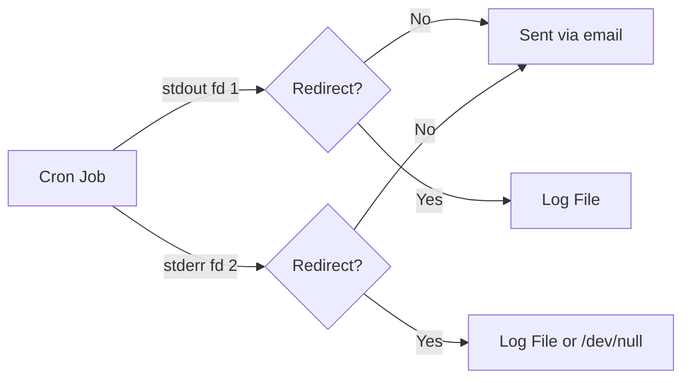

# How to Redirect Cron Job Output to a Log File on RHEL

Author: [nawazdhandala](https://www.github.com/nawazdhandala)

Tags: RHEL, cron, Logging, Output Redirection, Linux

Description: Master the art of redirecting cron job output on RHEL, from basic stdout/stderr redirection to MAILTO configuration and log rotation strategies.

---

## The Problem with Cron Output

By default, cron takes any output your job produces (both stdout and stderr) and tries to email it to the user who owns the crontab. On most servers, local mail is either not configured or nobody reads it. That means your cron job output vanishes into a black hole, and when something breaks, you have zero visibility into what happened.

I have lost count of how many times I have been called in to debug a cron job failure where the first question is "what error did it produce?" and the answer is "we do not know." Let us fix that.

## Understanding stdout and stderr

Before diving into redirection, a quick refresher. Every process in Linux has two output streams:

- **stdout** (file descriptor 1) - normal output, status messages, results
- **stderr** (file descriptor 2) - error messages, warnings, diagnostic info



## Basic Output Redirection

### Redirect stdout Only

```bash
# Send normal output to a log file, errors still go to email
30 2 * * * /usr/local/bin/backup.sh > /var/log/backup.log
```

This creates or overwrites `/var/log/backup.log` each time the job runs. If the script produces any errors on stderr, those will still be emailed.

### Redirect Both stdout and stderr

This is the most common pattern, and what you should use in almost every case.

```bash
# Redirect both stdout and stderr to the same log file
30 2 * * * /usr/local/bin/backup.sh > /var/log/backup.log 2>&1
```

The `2>&1` means "redirect stderr (2) to wherever stdout (1) is going." Order matters here, the `> /var/log/backup.log` must come before `2>&1`.

### Append Instead of Overwrite

If you want to keep a running log across multiple executions, use `>>` instead of `>`.

```bash
# Append output to the log file instead of overwriting
30 2 * * * /usr/local/bin/backup.sh >> /var/log/backup.log 2>&1
```

### Log stdout and stderr Separately

Sometimes you want errors in a separate file so they stand out.

```bash
# Send stdout and stderr to different files
30 2 * * * /usr/local/bin/backup.sh >> /var/log/backup.log 2>> /var/log/backup-errors.log
```

### Discard Output Entirely

For jobs where you truly do not care about the output (health checks, simple cleanups), send everything to `/dev/null`.

```bash
# Suppress all output
*/5 * * * * /usr/local/bin/health-check.sh > /dev/null 2>&1
```

## Adding Timestamps to Log Output

Raw log files without timestamps are hard to work with. Add timestamps in your scripts or use a wrapper.

### Timestamp Within Your Script

```bash
#!/bin/bash
# backup.sh - with built-in timestamps

log() {
    echo "$(date '+%Y-%m-%d %H:%M:%S') - $1"
}

log "Starting backup"
# ... backup commands ...
log "Backup completed"
```

### Using ts from moreutils

If you have the `moreutils` package installed, the `ts` command adds timestamps to any output.

```bash
# Install moreutils for the ts command
sudo dnf install moreutils -y

# Use ts in your crontab to add timestamps
30 2 * * * /usr/local/bin/backup.sh 2>&1 | ts '[%Y-%m-%d %H:%M:%S]' >> /var/log/backup.log
```

### Simple Date Prefix Without Extra Packages

You can also use a while loop to prefix each line with a timestamp, though this is less elegant.

```bash
# Add timestamps without extra packages
30 2 * * * /usr/local/bin/backup.sh 2>&1 | while IFS= read -r line; do printf '%s %s\n' "$(date '+%Y-%m-%d %H:%M:%S')" "$line"; done >> /var/log/backup.log
```

## Using MAILTO for Email Notifications

The `MAILTO` variable in crontab controls where output gets emailed. This is useful when you want email alerts for specific jobs.

```bash
# Set MAILTO at the top of your crontab
MAILTO=sysadmin@example.com

# All jobs below this line will email output to sysadmin@example.com
30 2 * * * /usr/local/bin/backup.sh

# Disable email for a specific job by redirecting output
*/5 * * * * /usr/local/bin/health-check.sh > /dev/null 2>&1

# Change MAILTO for subsequent jobs
MAILTO=dba@example.com
0 4 * * * /usr/local/bin/db-maintenance.sh
```

You can also disable email for all jobs by setting MAILTO to an empty string.

```bash
# Disable cron email entirely
MAILTO=""
```

For email to work, you need a functioning mail transfer agent on the system. On RHEL, postfix is the default.

```bash
# Check if postfix is running
sudo systemctl status postfix

# If not installed, install and start it
sudo dnf install postfix -y
sudo systemctl enable --now postfix
```

## Smart Logging Pattern: Log Everything, Email Errors Only

Here is a pattern I use on production systems. Log all output to a file, but only email when something goes wrong.

```bash
# In your crontab
MAILTO=""
30 2 * * * /usr/local/bin/smart-backup-wrapper.sh
```

The wrapper script:

```bash
#!/bin/bash
# smart-backup-wrapper.sh
# Logs everything, sends email only on failure

LOGFILE="/var/log/backup.log"
MAILTO="admin@example.com"
HOSTNAME=$(hostname -f)

# Run the actual backup, capture exit code
echo "=== Backup started at $(date) ===" >> "$LOGFILE"
/usr/local/bin/backup.sh >> "$LOGFILE" 2>&1
EXIT_CODE=$?
echo "=== Backup finished at $(date) with exit code $EXIT_CODE ===" >> "$LOGFILE"

# Send email only on failure
if [ $EXIT_CODE -ne 0 ]; then
    tail -50 "$LOGFILE" | mail -s "ALERT: Backup failed on $HOSTNAME (exit code: $EXIT_CODE)" "$MAILTO"
fi
```

## Log Rotation with logrotate

If you are appending to log files, they will grow forever. Set up logrotate to manage them.

```bash
# Create a logrotate configuration for your cron job logs
sudo tee /etc/logrotate.d/cron-jobs > /dev/null <<'EOF'
/var/log/backup.log
/var/log/backup-errors.log
/var/log/db-maintenance.log
{
    weekly
    rotate 4
    compress
    delaycompress
    missingok
    notifempty
    create 0640 root root
}
EOF
```

Understanding the options:

```bash
# weekly      - rotate once per week
# rotate 4    - keep 4 old copies
# compress    - gzip old log files
# delaycompress - wait until next rotation to compress (useful if processes still write to old log)
# missingok   - do not error if the log file does not exist
# notifempty  - do not rotate if the file is empty
# create      - create a new empty log file after rotation with these permissions
```

Test the logrotate configuration:

```bash
# Dry run to see what logrotate would do
sudo logrotate -d /etc/logrotate.d/cron-jobs

# Force a rotation to test
sudo logrotate -f /etc/logrotate.d/cron-jobs
```

## Using a Dedicated Log Directory

For systems with many cron jobs, organize logs in a dedicated directory.

```bash
# Create a directory for cron job logs
sudo mkdir -p /var/log/cron-jobs
sudo chmod 755 /var/log/cron-jobs

# Use date-stamped log files for each job
30 2 * * * /usr/local/bin/backup.sh >> /var/log/cron-jobs/backup-$(date +\%Y\%m\%d).log 2>&1
```

Note the escaped percent signs (`\%`). In crontab, the `%` character has special meaning (it is treated as a newline). You must escape it with a backslash when using it in commands.

```bash
# WRONG - % will break your cron entry
30 2 * * * echo "Date: $(date +%Y%m%d)" >> /var/log/test.log

# CORRECT - escape percent signs with backslash
30 2 * * * echo "Date: $(date +\%Y\%m\%d)" >> /var/log/test.log
```

Then add a logrotate rule for the directory:

```bash
# Logrotate for date-stamped logs
sudo tee /etc/logrotate.d/cron-jobs-dir > /dev/null <<'EOF'
/var/log/cron-jobs/*.log {
    daily
    rotate 30
    compress
    delaycompress
    missingok
    notifempty
}
EOF
```

## Logging Best Practices

1. **Always redirect stderr.** Even if you redirect stdout, stderr will still generate emails. Use `2>&1` or `2>> errorfile` consistently.

2. **Use append mode (>>) for recurring jobs.** Single-redirect (`>`) overwrites the log each time, and you lose history.

3. **Escape percent signs.** This catches people off guard regularly. Any `%` in a crontab line that is not escaped will be interpreted as a newline.

4. **Set up logrotate early.** Do not wait until your disk fills up. Add logrotate rules when you create the cron job.

5. **Include the job name and timestamp in log entries.** When you are reviewing logs at 3 AM trying to figure out what went wrong, clear log entries are a lifesaver.

6. **Check log file permissions.** If your cron job runs as a non-root user, make sure that user can write to the log file.

```bash
# Create a log file with proper permissions for a specific user
sudo touch /var/log/cron-jobs/deploy.log
sudo chown deploy:deploy /var/log/cron-jobs/deploy.log
```

## Summary

Proper output redirection is one of those "boring" setup tasks that pays off enormously when something breaks. Redirect both stdout and stderr, add timestamps, set up logrotate, and consider a wrapper script that only emails you when things go wrong. Your future self, the one debugging a failed cron job at midnight, will thank you.
