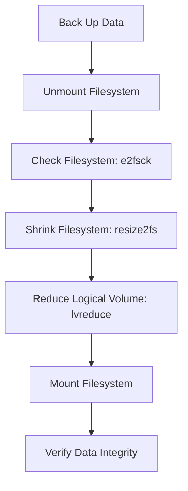

# How to Reduce an ext4 Logical Volume Safely on RHEL

Author: [nawazdhandala](https://www.github.com/nawazdhandala)

Tags: RHEL, LVM, ext4, Reduce, Linux

Description: Safely reduce an ext4 logical volume on RHEL by shrinking the filesystem first, then reducing the LV, without data loss.

---

Growing a logical volume is easy and risk-free. Shrinking one is a different story. You must shrink the filesystem first, then shrink the LV. Get the order wrong or use the wrong size, and you lose data. XFS cannot be shrunk at all, so this only works with ext4. Here is how to do it safely.

## Important Warnings

- XFS filesystems cannot be reduced, only ext4
- The filesystem MUST be unmounted before shrinking
- Always back up your data before shrinking
- Double-check your size calculations

## The Correct Order



The filesystem must always be smaller than or equal to the LV. If you shrink the LV first, you will truncate the filesystem and lose data.

## Step-by-Step Reduction

### Step 1: Back Up Your Data

```bash
# Create a backup before any shrink operation
sudo tar czf /root/data-backup-$(date +%Y%m%d).tar.gz /data/
```

### Step 2: Unmount the Filesystem

```bash
# Check what is using the filesystem
sudo fuser -vm /data

# Stop any services using it, then unmount
sudo umount /data
```

### Step 3: Check the Filesystem

Always run a filesystem check before resizing:

```bash
# Run e2fsck on the unmounted filesystem
sudo e2fsck -f /dev/datavg/datalv
```

The `-f` flag forces the check even if the filesystem appears clean.

### Step 4: Shrink the Filesystem

```bash
# Shrink the ext4 filesystem to 30GB
sudo resize2fs /dev/datavg/datalv 30G
```

### Step 5: Reduce the Logical Volume

Now shrink the LV to match:

```bash
# Reduce the LV to 30GB
sudo lvreduce -L 30G /dev/datavg/datalv
```

You will be prompted to confirm. Type `y` to proceed.

### Step 6: Mount and Verify

```bash
# Mount the filesystem
sudo mount /dev/datavg/datalv /data

# Verify the size and data
df -h /data
ls -la /data/
```

## Using lvreduce with Automatic Filesystem Resize

The `lvreduce` command has a `-r` flag that handles the filesystem resize automatically:

```bash
# Unmount first (required for ext4 shrink)
sudo umount /data

# Run e2fsck
sudo e2fsck -f /dev/datavg/datalv

# Reduce LV and filesystem in one step
sudo lvreduce -r -L 30G /dev/datavg/datalv

# Mount and verify
sudo mount /dev/datavg/datalv /data
df -h /data
```

The `-r` flag calls `resize2fs` and `e2fsck` automatically. This is safer because it coordinates the sizes correctly.

## Reducing by a Specific Amount

```bash
# Reduce by 20GB instead of to a specific size
sudo lvreduce -r -L -20G /dev/datavg/datalv
```

Note the minus sign before the size. `-L -20G` means "reduce by 20GB", while `-L 20G` means "reduce to 20GB total".

## Common Mistakes

1. **Forgetting to unmount** - resize2fs will refuse to shrink a mounted ext4 filesystem

2. **Shrinking the LV first** - This truncates the filesystem. Always shrink the filesystem first (or use `-r`)

3. **Wrong size units** - Make sure you use the same units consistently. A mismatch between the filesystem size and LV size can cause data loss

4. **Trying to shrink XFS** - XFS does not support shrinking. If you need to reduce an XFS volume, you must back up the data, destroy the LV, create a smaller one, create a new filesystem, and restore the data

5. **Not running e2fsck** - resize2fs requires a clean filesystem. Always run e2fsck -f first

## Verifying Free Space

After reducing, the freed space should appear in the volume group:

```bash
# Check VG free space
sudo vgs datavg
```

You can now use that free space for other logical volumes.

## When You Cannot Shrink

If the filesystem contains more data than the target size, the shrink will fail. Check how much data is actually in use:

```bash
# Check actual data usage
df -h /data

# Make sure the target size is larger than the used space
```

Always leave some headroom. Do not shrink to exactly the size of the data.
