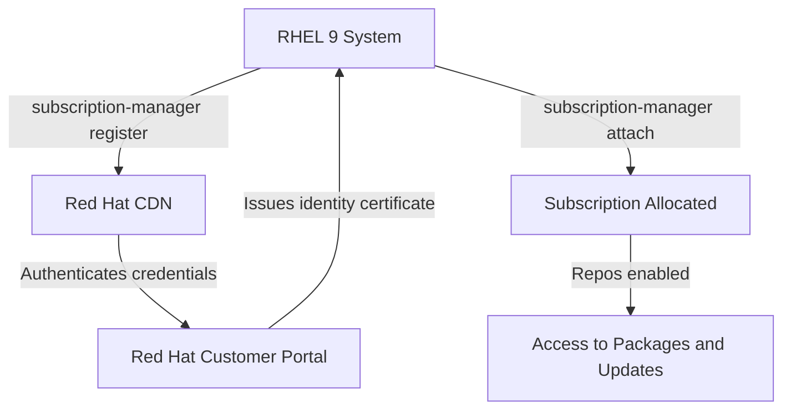

# How to Register a RHEL 9 System to the Red Hat Customer Portal Using subscription-manager

Author: [nawazdhandala](https://www.github.com/nawazdhandala)

Tags: RHEL, Subscription Manager, Registration, Red Hat, Linux

Description: A practical walkthrough for registering your RHEL 9 system to the Red Hat Customer Portal using subscription-manager, covering interactive and non-interactive methods along with common pitfalls.

---

If you have just installed RHEL 9 and need access to official packages, security patches, and support, the first thing you need to do is register the system with Red Hat. The tool for this job is `subscription-manager`, and it has been part of RHEL for years. In this guide, I will walk through the registration process step by step, including tips for automation and what to check when things go sideways.

## Why Register?

Without registration, your RHEL 9 system cannot pull packages from Red Hat's CDN. You will not receive security errata, bug fixes, or access to additional repositories like CodeReady Builder. Registration ties your system to your Red Hat account and lets Red Hat track which subscriptions are in use.

## Prerequisites

Before you begin, make sure you have:

- A Red Hat account (create one at access.redhat.com if needed)
- An active RHEL subscription associated with that account
- Network connectivity to subscription.rhsm.redhat.com (port 443)
- Root or sudo access on the RHEL 9 system

## Step 1 - Verify subscription-manager Is Installed

The `subscription-manager` package should already be installed on a fresh RHEL 9 system. Verify it like this:

```bash
# Check that subscription-manager is available
rpm -q subscription-manager
```

If for some reason it is missing, install it from the local media or a configured repository:

```bash
# Install subscription-manager if not present
sudo dnf install subscription-manager -y
```

## Step 2 - Register Interactively

The simplest way to register is the interactive method, which prompts for your username and password:

```bash
# Register with interactive prompts
sudo subscription-manager register
```

You will be asked for your Red Hat Customer Portal username and password. After successful authentication, the system receives a unique identity certificate stored under `/etc/pki/consumer/`.

## Step 3 - Register Non-Interactively

For scripted deployments or automation, pass credentials on the command line:

```bash
# Register without prompts by passing credentials directly
sudo subscription-manager register --username=your_username --password=your_password
```

If your organization has multiple accounts or sub-organizations, specify the org:

```bash
# Register with a specific organization ID
sudo subscription-manager register --username=your_username --password=your_password --org=your_org_id
```

You can find your organization ID in the Red Hat Customer Portal under Subscription Management.

## Step 4 - Confirm Registration

After registering, verify the system's identity:

```bash
# Show the system's registration identity
sudo subscription-manager identity
```

This will display the system UUID, organization name, and the environment. If the command returns data without errors, registration was successful.

## Step 5 - Auto-Attach a Subscription

If you are not using Simple Content Access (SCA), you may need to attach a subscription manually:

```bash
# Let subscription-manager pick the best matching subscription
sudo subscription-manager attach --auto
```

With SCA enabled on your account (which is the default for most accounts now), explicit attachment is not required, and your system will have access to content as soon as it is registered.

## Registration Flow

Here is how the registration process works at a high level:



## Registering Behind a Proxy

Many corporate environments route traffic through an HTTP proxy. Configure the proxy before registering:

```bash
# Set the proxy for subscription-manager
sudo subscription-manager config --server.proxy_hostname=proxy.example.com \
    --server.proxy_port=8080 \
    --server.proxy_user=proxyuser \
    --server.proxy_password=proxypass
```

You can also edit the configuration file directly at `/etc/rhsm/rhsm.conf` under the `[server]` section.

After setting the proxy, register normally:

```bash
# Register through the configured proxy
sudo subscription-manager register --username=your_username --password=your_password
```

## Checking Registration Status

At any point, you can check whether the system is registered and what subscriptions are attached:

```bash
# Show current subscription status
sudo subscription-manager status

# List attached subscriptions
sudo subscription-manager list --consumed

# List available (unattached) subscriptions
sudo subscription-manager list --available
```

## Using an Authentication Token Instead of Password

For environments where you do not want to pass your password in plain text, you can use a registration token. Generate a token through the Red Hat API and then register:

```bash
# Register using a token
sudo subscription-manager register --token=your_token_here
```

This approach is useful for CI/CD pipelines and automated provisioning.

## Common Issues and Fixes

**DNS resolution failure**: Make sure the system can resolve `subscription.rhsm.redhat.com`. Test with `dig subscription.rhsm.redhat.com` or `nslookup subscription.rhsm.redhat.com`.

**Certificate errors**: If you see SSL certificate errors, ensure the system clock is correct. An incorrect date will cause TLS validation to fail. Check with `timedatectl` and sync if needed:

```bash
# Sync system time using chrony
sudo chronyc makestep
```

**Already registered**: If the system was previously registered (perhaps from a cloned image), clean the old registration first:

```bash
# Remove old registration data
sudo subscription-manager clean

# Then register fresh
sudo subscription-manager register --username=your_username --password=your_password
```

## Verifying Repository Access

Once registered, confirm that you can see and use the default repositories:

```bash
# List enabled repositories
sudo subscription-manager repos --list-enabled

# Test by checking for available updates
sudo dnf check-update
```

You should see at least the `rhel-9-for-x86_64-baseos-rpms` and `rhel-9-for-x86_64-appstream-rpms` repositories.

## Summary

Registering a RHEL 9 system is straightforward with `subscription-manager`. Whether you are doing it interactively for a single workstation or scripting it for hundreds of servers, the process is the same: authenticate, register, and optionally attach. Keep an eye on proxy settings and certificates if you are in a restricted network, and always verify that repositories are accessible after registration. This is the foundation for keeping your RHEL systems patched and secure.
