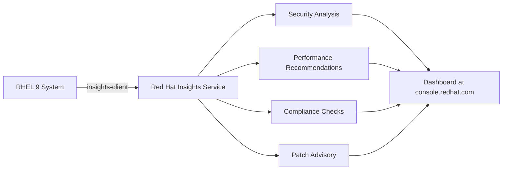

# How to Register a RHEL 9 System with Red Hat Insights

Author: [nawazdhandala](https://www.github.com/nawazdhandala)

Tags: RHEL, Red Hat Insights, Registration, Monitoring, Linux

Description: Learn how to register your RHEL 9 system with Red Hat Insights for proactive security analysis, compliance checking, and system health monitoring.

---

Red Hat Insights is a hosted service that analyzes your RHEL systems for security vulnerabilities, performance issues, configuration drift, and compliance problems. It runs as part of your RHEL subscription at no extra cost. Setting it up on RHEL 9 takes about two minutes, and the value it provides in terms of catching problems before they become incidents is well worth the effort.

## What Red Hat Insights Does

Insights collects system configuration data (not application data or user data) and analyzes it against Red Hat's knowledge base. It can identify:

- Known CVEs affecting your installed packages
- Configuration issues that could cause performance problems
- Compliance deviations from CIS, PCI-DSS, HIPAA, and other benchmarks
- Systems that need attention based on Red Hat's recommendations



## Prerequisites

- The RHEL 9 system must be registered with `subscription-manager` (see the registration guide)
- Network access to `cert-api.access.redhat.com` and `api.access.redhat.com` on port 443
- Root or sudo access

## Step 1 - Verify the System Is Registered

Insights requires a valid registration with Red Hat:

```bash
# Confirm the system is registered
sudo subscription-manager identity
```

If the system is not registered, register it first:

```bash
# Register the system
sudo subscription-manager register
```

## Step 2 - Install the Insights Client

On RHEL 9, the `insights-client` package is usually already installed. Verify and install if needed:

```bash
# Check if insights-client is installed
rpm -q insights-client

# Install it if missing
sudo dnf install insights-client -y
```

## Step 3 - Register with Insights

Run the registration command:

```bash
# Register this system with Red Hat Insights
sudo insights-client --register
```

This uploads an initial data collection to the Insights service and schedules regular uploads going forward. The command output will include a confirmation message and a link to view the system on console.redhat.com.

## Step 4 - Verify Registration

Check that the system is properly registered:

```bash
# Verify Insights registration status
sudo insights-client --status
```

You should see a message confirming the system is registered and the next scheduled upload time.

## Viewing Results

After the initial data collection (which usually takes a few minutes to process), log in to [console.redhat.com](https://console.redhat.com) and navigate to the Insights section. You will see:

- **Advisor**: Recommendations for your system organized by risk and category
- **Vulnerability**: CVEs affecting your installed packages
- **Compliance**: Policy adherence if you have configured compliance profiles
- **Patch**: Available errata and updates
- **Drift**: Configuration differences between systems

## Scheduling Data Collection

By default, `insights-client` runs daily via a systemd timer. Check the schedule:

```bash
# View the Insights timer schedule
sudo systemctl status insights-client.timer

# List all timers to see when it runs next
sudo systemctl list-timers insights-client.timer
```

To change the collection frequency, edit the configuration:

```bash
# Edit the Insights client configuration
sudo vi /etc/insights-client/insights-client.conf
```

You can adjust settings or disable automatic collection if you prefer to run it manually.

## Running a Manual Collection

Trigger an immediate data collection at any time:

```bash
# Run an immediate data upload
sudo insights-client
```

This is useful after making changes to see updated recommendations quickly.

## What Data Is Collected

The Insights client collects system metadata, not application data. This includes:

- Installed packages and versions
- Kernel and OS version
- Hardware information
- Network configuration
- SELinux status
- Running services
- Selected configuration files

You can see exactly what will be collected before it is sent:

```bash
# Generate the collection archive locally without uploading
sudo insights-client --no-upload
```

The output tells you where the archive is saved. You can extract and review it:

```bash
# Extract and review the collection data
tar xzf /var/tmp/insights-*.tar.gz -C /tmp/insights-review/
ls /tmp/insights-review/
```

## Excluding Sensitive Data

If you need to prevent certain data from being collected, configure redaction rules:

```bash
# Create or edit the file content redaction configuration
sudo vi /etc/insights-client/remove.conf
```

Example `remove.conf`:

```ini
[remove]
files=/etc/shadow,/etc/my-secret-config.conf
commands=hostname
patterns=password,secret_key
keywords=my_sensitive_keyword
```

This removes specified files, command outputs, patterns, and keywords from the data before it is uploaded.

## Insights with Ansible Remediation

One of the most powerful features is automated remediation. Insights can generate Ansible playbooks to fix identified issues:

1. Log in to console.redhat.com
2. Navigate to Insights, then Advisor
3. Select a recommendation
4. Click "Remediate" to generate an Ansible playbook
5. Download and run the playbook, or use the Remediations service

## Registering Multiple Systems

For fleet registration, use Ansible:

```yaml
# Ansible playbook to register systems with Insights
- name: Register all RHEL systems with Insights
  hosts: rhel9_servers
  become: true
  tasks:
    - name: Install insights-client
      dnf:
        name: insights-client
        state: present

    - name: Register with Insights
      command: insights-client --register
      register: result
      changed_when: "'Successfully registered' in result.stdout"
```

## Unregistering from Insights

If you need to remove a system from Insights:

```bash
# Unregister from Red Hat Insights
sudo insights-client --unregister
```

This stops data collection and removes the system from the Insights dashboard.

## Troubleshooting

**Connection refused**: Ensure the system can reach the Insights endpoints:

```bash
# Test connectivity to Insights API
curl -v https://cert-api.access.redhat.com/r/insights 2>&1 | head -15
```

**Proxy configuration**: If you need to go through a proxy:

```bash
# Edit Insights configuration for proxy
sudo vi /etc/insights-client/insights-client.conf
```

Add the proxy settings:

```ini
[insights-client]
proxy=http://proxy.example.com:8080
```

**Stale system**: If a system appears stale in the dashboard, run a manual collection to refresh it.

## Summary

Red Hat Insights is one of those tools that quietly saves you hours of work by flagging problems before they escalate. It takes minutes to set up, runs silently in the background, and gives you a centralized dashboard for tracking security, compliance, and system health across your entire RHEL fleet. If you have RHEL subscriptions, you already have access to Insights, so there is no reason not to use it.
