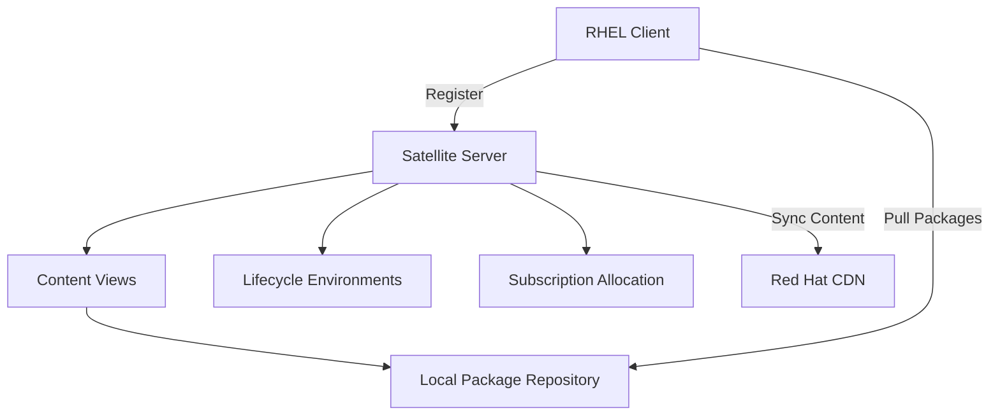

# How to Register a RHEL System to Red Hat Satellite Server

Author: [nawazdhandala](https://www.github.com/nawazdhandala)

Tags: RHEL, Satellite Server, Registration, Red Hat, Linux

Description: Step-by-step guide to registering RHEL systems with a Red Hat Satellite Server for centralized subscription and content management in enterprise environments.

---

In enterprise environments, managing subscriptions and content for hundreds or thousands of RHEL systems through the Red Hat Customer Portal is not practical. Red Hat Satellite Server provides a centralized platform for system registration, subscription management, content delivery, and configuration management. This guide walks through registering a RHEL system to a Satellite Server.

## Why Use Satellite Instead of Direct Registration?

Direct registration sends each system to Red Hat's CDN for packages. That works fine for small environments, but when you have a large fleet, Satellite offers major advantages:

- Local content mirrors reduce bandwidth and speed up updates
- Centralized management of subscriptions, errata, and configurations
- Content views let you control exactly which packages and versions are available
- Lifecycle environments support staged rollouts (dev, staging, production)
- Systems can operate in disconnected or air-gapped networks

## Prerequisites

Before registering, make sure you have:

- A running Red Hat Satellite Server (version 6.x)
- An activation key or credentials configured in Satellite
- Network access from the RHEL system to the Satellite Server (ports 443, 5647, 8000, 8140, 8443, 9090)
- The Satellite Server's FQDN

## Registration Architecture



## Step 1 - Install the Satellite CA Certificate

The RHEL system needs to trust the Satellite Server's SSL certificate. Download and install the CA certificate RPM:

```bash
# Download and install the Satellite CA certificate
sudo dnf install -y http://satellite.example.com/pub/katello-ca-consumer-latest.noarch.rpm
```

Replace `satellite.example.com` with your Satellite Server's hostname. This installs the CA certificate and configures `subscription-manager` to point at your Satellite instead of the Red Hat CDN.

## Step 2 - Verify the Configuration

After installing the CA cert, confirm that `subscription-manager` is now pointing to your Satellite:

```bash
# Check the configured server hostname
sudo subscription-manager config | grep hostname
```

The output should show your Satellite Server's FQDN, not `subscription.rhsm.redhat.com`.

## Step 3 - Register with an Activation Key

The preferred method for Satellite registration is using an activation key. Your Satellite admin should provide the key name and organization:

```bash
# Register to Satellite using an activation key
sudo subscription-manager register --activationkey=rhel9-production --org=MyOrganization
```

The activation key in Satellite can be configured to:
- Auto-attach subscriptions
- Set content views and lifecycle environments
- Apply system purpose attributes
- Enable specific repositories

## Step 4 - Register with Username and Password

Alternatively, register with Satellite credentials:

```bash
# Register to Satellite with credentials
sudo subscription-manager register --username=admin --password=your_password \
    --org=MyOrganization --environment=Library
```

The `--environment` flag specifies the lifecycle environment. Common values are `Library`, `Development`, `Staging`, and `Production`, depending on how your Satellite is configured.

## Step 5 - Install the Katello Agent (Optional)

The Katello agent enables remote package management from the Satellite web interface:

```bash
# Enable the Satellite tools repository
sudo subscription-manager repos --enable=satellite-client-6-for-rhel-9-x86_64-rpms

# Install the katello host tools
sudo dnf install -y katello-host-tools
```

For newer Satellite versions, the `katello-host-tools` package may be replaced with `katello-host-tools-tracer` for tracking services that need restarting after updates.

## Step 6 - Verify Registration in Satellite

On the Satellite web interface, navigate to Hosts, then All Hosts. Your newly registered system should appear in the list. You can also verify from the client:

```bash
# Verify the system is registered
sudo subscription-manager identity

# Check subscription status
sudo subscription-manager status

# List enabled repos (should point to Satellite)
sudo subscription-manager repos --list-enabled
```

## Using the Satellite Global Registration Template

Satellite 6.9 and later support a simplified global registration method. In the Satellite web UI, go to Hosts, then Register Host. This generates a curl command you can run on the RHEL system:

```bash
# Example generated registration command from Satellite
curl -sS 'https://satellite.example.com/register?activation_keys=rhel9-prod&organization_id=1' \
    -H 'Authorization: Bearer your_token_here' | bash
```

This single command handles CA certificate installation, registration, and repository setup all at once.

## Configuring Host Groups

When registering through Satellite, systems can be assigned to host groups that define:
- Puppet classes or Ansible roles
- Configuration parameters
- Provisioning templates
- Content sources

Assign a host group during registration or afterward through the Satellite UI.

## Registering Behind a Capsule Server

If your environment uses Satellite Capsule Servers (proxies for distributed content delivery), point the system to the nearest Capsule instead of the main Satellite:

```bash
# Install the Capsule CA certificate
sudo dnf install -y http://capsule.example.com/pub/katello-ca-consumer-latest.noarch.rpm

# Register pointing to the Capsule
sudo subscription-manager register --activationkey=rhel9-production --org=MyOrganization
```

The Capsule handles content delivery locally while the Satellite maintains centralized management.

## Bulk Registration with Ansible

For registering many systems, use an Ansible playbook:

```yaml
# Ansible playbook for Satellite registration
- name: Register RHEL systems to Satellite
  hosts: rhel9_servers
  become: true
  tasks:
    - name: Install Satellite CA certificate
      dnf:
        name: "http://satellite.example.com/pub/katello-ca-consumer-latest.noarch.rpm"
        state: present
        disable_gpg_check: true

    - name: Register with Satellite
      community.general.redhat_subscription:
        activationkey: rhel9-production
        org_id: MyOrganization
        state: present
```

## Troubleshooting

**Unable to reach Satellite**: Check firewall rules. The client needs access to the Satellite on ports 443 and 8443:

```bash
# Test connectivity to Satellite
curl -k https://satellite.example.com/rhsm
```

**Certificate issues**: If you see SSL errors, reinstall the CA cert:

```bash
# Remove old CA cert and reinstall
sudo dnf remove -y katello-ca-consumer-*
sudo dnf install -y http://satellite.example.com/pub/katello-ca-consumer-latest.noarch.rpm
```

**Wrong organization or environment**: List available environments:

```bash
# List available environments on the Satellite
sudo subscription-manager environments --org=MyOrganization
```

## Summary

Registering RHEL systems with Satellite Server is the standard approach for enterprise environments. It gives you centralized control over subscriptions, packages, and configuration while reducing bandwidth through local content mirrors. Use activation keys for automated, credential-free registration, and consider Capsule Servers for geographically distributed environments. Once registered, your systems pull content from Satellite, giving you full control over what packages are available in each lifecycle stage.
