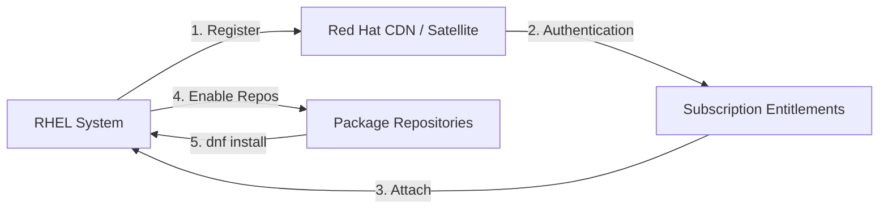

# How to Register and Subscribe a RHEL System with Red Hat Subscription Manager

Author: [nawazdhandala](https://www.github.com/nawazdhandala)

Tags: RHEL, Subscription Manager, Registration, Red Hat, Linux

Description: A practical walkthrough of registering RHEL systems with Red Hat Subscription Manager, attaching subscriptions, enabling repositories, and using activation keys for automated deployments.

---

A freshly installed RHEL system cannot install or update packages until it is registered with Red Hat and has a subscription attached. The tool that handles this is `subscription-manager`, and it connects your system to either Red Hat's CDN (Customer Delivery Network) or a local Satellite/Capsule server. Without registration, you are stuck with whatever packages were on the installation media and nothing more.

This guide covers the registration process from start to finish, including manual registration, auto-attach, activation keys, and repository management.

## How Subscription Manager Works



The workflow is straightforward: register your system with credentials or an activation key, attach a subscription entitlement, enable the repositories you need, and then `dnf` works normally.

## Prerequisites

Before you register, make sure:

- Your system has internet access (or network access to a Satellite server)
- You have a Red Hat account with active subscriptions (even a free Developer Subscription works)
- DNS resolution is working (subscription-manager needs to reach `subscription.rhsm.redhat.com`)

```bash
# Verify network connectivity to Red Hat CDN
curl -I https://subscription.rhsm.redhat.com
```

## Method 1: Register with Username and Password

The most straightforward approach for manual or one-off registrations.

```bash
# Register the system with your Red Hat account
sudo subscription-manager register --username=your_rh_username --password=your_rh_password
```

You will see output like:

```
The system has been registered with ID: xxxxxxxx-xxxx-xxxx-xxxx-xxxxxxxxxxxx
The registered system name is: rhel9-server.example.com
```

At this point, the system is registered but does not have a subscription attached yet. No repositories are available.

## Attaching a Subscription

After registration, you need to attach a subscription. The easiest way is auto-attach:

```bash
# Automatically find and attach the best matching subscription
sudo subscription-manager attach --auto
```

Auto-attach looks at the system's architecture, installed products, and available subscriptions, then picks the best match. For most setups with a single RHEL subscription, this just works.

If you need to attach a specific subscription (useful when you have multiple subscription types):

```bash
# List all available subscriptions for your account
sudo subscription-manager list --available

# Attach a specific subscription by pool ID
sudo subscription-manager attach --pool=8a85f9997abc1234def567890abc1234
```

## Verifying Registration and Subscription Status

Always verify after registration:

```bash
# Check registration identity
sudo subscription-manager identity

# Check subscription status
sudo subscription-manager status

# List attached subscriptions with details
sudo subscription-manager list --consumed

# List installed products and their subscription status
sudo subscription-manager list --installed
```

The `status` command should show "Overall Status: Current" if everything is working. If it shows "Invalid" or "Insufficient," your subscription is not properly attached.

## Method 2: Register with an Activation Key

Activation keys are the proper way to handle registration in automated environments. They are created in your Red Hat account or on your Satellite server and bundle together the registration, subscription attachment, and sometimes repository enablement in a single step.

```bash
# Register using an activation key and organization ID
sudo subscription-manager register --activationkey=my-rhel9-key --org=12345678
```

The organization ID is a numeric value you can find in your Red Hat Customer Portal under Subscription Management.

Activation keys are better than username/password for several reasons:

- No credentials stored in scripts or Kickstart files
- Keys can be scoped to specific subscriptions and service levels
- Keys can be revoked without changing account passwords
- Multiple keys can exist for different environments (dev, staging, prod)

### Using Activation Keys in Kickstart

For automated installations, put the registration in your Kickstart file:

```bash
# Kickstart registration section
rhsm --organization=12345678 --activation-key=my-rhel9-key
```

This registers the system during installation so that packages from Red Hat repos can be installed as part of the Kickstart process.

## Managing Repositories

Once registered and subscribed, you can manage which repositories are enabled.

```bash
# List all available repositories
sudo subscription-manager repos --list

# List only enabled repositories
sudo subscription-manager repos --list-enabled

# Enable a repository
sudo subscription-manager repos --enable=rhel-9-for-x86_64-appstream-rpms

# Disable a repository
sudo subscription-manager repos --disable=rhel-9-for-x86_64-supplementary-rpms
```

### Default Repositories for RHEL

After registration, these repos are typically enabled by default:

- `rhel-9-for-x86_64-baseos-rpms` - Core OS packages
- `rhel-9-for-x86_64-appstream-rpms` - Applications and developer tools

You might want to enable additional repos:

```bash
# CodeReady Builder (needed for some development dependencies)
sudo subscription-manager repos --enable=codeready-builder-for-rhel-9-x86_64-rpms

# Supplementary (additional packages like flash, etc.)
sudo subscription-manager repos --enable=rhel-9-for-x86_64-supplementary-rpms
```

After enabling repos, verify that `dnf` can see them:

```bash
# List all configured repositories
dnf repolist all

# List only enabled repositories
dnf repolist enabled
```

## Registering to a Satellite Server

If your organization runs a Red Hat Satellite server, you register against that instead of the Red Hat CDN.

```bash
# Install the Satellite server's CA certificate
sudo rpm -ivh http://satellite.example.com/pub/katello-ca-consumer-latest.noarch.rpm

# Register to Satellite with an activation key
sudo subscription-manager register --org="MyOrg" --activationkey="rhel9-prod" --serverurl=https://satellite.example.com/rhsm
```

The CA certificate RPM configures subscription-manager to trust your Satellite server's SSL certificate and points it to the correct server URL.

## Common Operations

### Unregister a System

When decommissioning a server, always unregister it to free up the subscription entitlement:

```bash
# Remove all subscriptions and unregister
sudo subscription-manager unregister
```

### Refresh Subscription Data

If you have made changes in the Customer Portal (added subscriptions, changed pools), refresh locally:

```bash
# Refresh subscription data from the server
sudo subscription-manager refresh
```

### Set the System Purpose

RHEL supports "system purpose" attributes that help auto-attach pick the right subscription:

```bash
# Set the system role
sudo subscription-manager syspurpose role --set="Red Hat Enterprise Linux Server"

# Set the usage type
sudo subscription-manager syspurpose usage --set="Production"

# Set the service level
sudo subscription-manager syspurpose service-level --set="Premium"

# Verify system purpose settings
sudo subscription-manager syspurpose --show
```

Setting system purpose before running `attach --auto` improves the matching accuracy, especially in environments with multiple subscription types.

### Check Certificate Expiry

Subscription certificates expire periodically and are automatically renewed. But if something goes wrong:

```bash
# Check when the current entitlement certificates expire
sudo subscription-manager list --consumed | grep "Expires"

# Force a certificate refresh
sudo subscription-manager refresh
```

## Troubleshooting

### "Unable to verify server's identity"

This usually means the system cannot validate the SSL certificate for the Red Hat CDN or Satellite server.

```bash
# Check the CA certificates
ls -la /etc/rhsm/ca/

# Test connectivity with curl
curl -v https://subscription.rhsm.redhat.com/subscription
```

### "This system is not yet registered"

If `dnf` complains that the system is not registered even after you think you registered it:

```bash
# Check if subscription-manager thinks the system is registered
sudo subscription-manager identity

# If it returns an error, re-register
sudo subscription-manager clean
sudo subscription-manager register --username=your_rh_username --password=your_rh_password
sudo subscription-manager attach --auto
```

The `clean` command removes all local subscription data so you can start fresh.

### "No repositories available"

Registration succeeded but no repos show up:

```bash
# Check if subscriptions are actually attached
sudo subscription-manager list --consumed

# If nothing is attached, run auto-attach
sudo subscription-manager attach --auto

# Then check repos
sudo subscription-manager repos --list-enabled
```

### Proxy Configuration

If your server accesses the internet through a proxy:

```bash
# Configure subscription-manager to use a proxy
sudo subscription-manager config --server.proxy_hostname=proxy.example.com --server.proxy_port=8080

# If the proxy requires authentication
sudo subscription-manager config --server.proxy_hostname=proxy.example.com --server.proxy_port=8080 --server.proxy_user=proxyuser --server.proxy_password=proxypass
```

## Wrapping Up

Registration is the first thing you should do after installing RHEL. Without it, your system cannot receive security updates, bug fixes, or new packages. For single systems, username/password registration with auto-attach is fine. For anything beyond a handful of machines, set up activation keys and automate the process through Kickstart. And when you decommission a server, always unregister it so you are not wasting subscription entitlements on machines that no longer exist.
