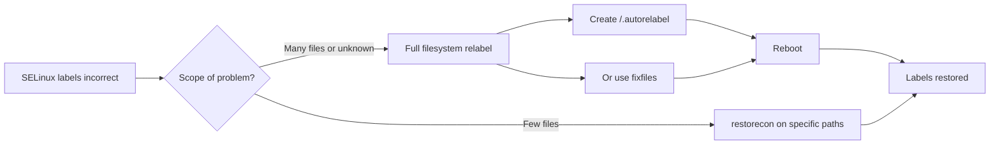

# How to Relabel the Entire Filesystem for SELinux on RHEL

Author: [nawazdhandala](https://www.github.com/nawazdhandala)

Tags: RHEL, SELinux, Filesystems, Security, Linux

Description: Learn how to trigger a full SELinux filesystem relabel on RHEL to fix incorrect security contexts and resolve access denials.

---

SELinux uses security labels (contexts) on every file and directory to enforce mandatory access control. Sometimes these labels get out of sync, especially after system migrations, restores from backup, or changes to SELinux policy. When that happens, you need to relabel the entire filesystem. This guide covers when and how to perform a full relabel on RHEL.

## When You Need a Full Relabel

A full filesystem relabel is necessary in the following situations:

- After switching SELinux from disabled to enforcing mode
- After a major policy change or policy module update
- After restoring files from a backup that did not preserve SELinux contexts
- When you see widespread "avc: denied" messages in the audit log
- After a system migration or cloning operation



## Method 1: Using the .autorelabel File

The simplest way to trigger a full relabel is to create a file called `.autorelabel` in the root directory and then reboot:

```bash
# Create the autorelabel trigger file
sudo touch /.autorelabel

# Reboot the system
sudo systemctl reboot
```

During the next boot, the system will detect the `.autorelabel` file and relabel every file on every mounted filesystem. The file is automatically removed after the relabel completes.

**Important:** A full relabel can take a long time depending on the number of files on your system. A system with millions of files might take 30 minutes or more. Plan accordingly and do not interrupt the process.

## Method 2: Using fixfiles

The `fixfiles` command provides more control over the relabel process:

```bash
# Relabel the entire filesystem on next boot
sudo fixfiles onboot

# Or relabel immediately without rebooting (system should be in permissive or single-user mode)
sudo fixfiles -F relabel
```

The `-F` flag forces a relabel even if the policy has not changed. Without it, `fixfiles` might skip the relabel if it determines the policy version has not changed.

You can also check what `fixfiles` would do without actually making changes:

```bash
# Verify mode - show what would be relabeled
sudo fixfiles check
```

## Method 3: Relabel Specific Directories

If you know which directories have incorrect labels, you can save time by relabeling only those paths:

```bash
# Relabel a specific directory recursively
sudo restorecon -Rv /var/www

# Relabel multiple specific paths
sudo restorecon -Rv /etc /var /home
```

The flags mean:

- `-R` - recurse into subdirectories
- `-v` - verbose output showing each file that gets relabeled

You can also do a dry run first:

```bash
# Show what would change without actually changing anything
sudo restorecon -Rvn /var/www
```

## Checking Current SELinux Labels

Before and after a relabel, you can inspect file labels:

```bash
# View the SELinux context of files
ls -Z /etc/passwd
# Output: system_u:object_r:passwd_file_t:s0 /etc/passwd

# View the context of a directory and its contents
ls -laZ /var/www/

# Check what the expected context should be based on policy
matchpathcon /var/www/html
```

## Monitoring the Relabel Progress

During a boot-time relabel, the progress is shown on the console. If you are relabeling from the command line:

```bash
# Relabel with verbose output to track progress
sudo fixfiles -F -v relabel 2>&1 | tee /tmp/relabel.log
```

After the relabel, verify it worked by checking for remaining context mismatches:

```bash
# Find files with contexts that do not match the policy
sudo restorecon -Rvn / 2>&1 | head -50
```

If no output appears, all file contexts match the current policy.

## Handling Custom File Contexts

If you have custom file context rules, make sure they are loaded before relabeling:

```bash
# List custom file context rules
sudo semanage fcontext -l -C

# If you need to add a custom rule before relabeling
sudo semanage fcontext -a -t httpd_sys_content_t "/srv/website(/.*)?"

# Then relabel that specific path
sudo restorecon -Rv /srv/website
```

## Troubleshooting After Relabeling

If access denials continue after a relabel, check the audit log:

```bash
# View recent SELinux denials
sudo ausearch -m avc -ts recent

# Generate a human-readable report
sudo sealert -a /var/log/audit/audit.log
```

If specific files still have wrong contexts after a full relabel, the policy itself might need updating. Use `semanage fcontext` to add custom rules for non-standard file locations.

## Summary

Relabeling the filesystem is a straightforward but time-consuming operation. Use `touch /.autorelabel` followed by a reboot for the simplest approach, `fixfiles` for more control, or `restorecon` when you only need to fix specific directories. Always verify the results after relabeling by checking for remaining context mismatches.
