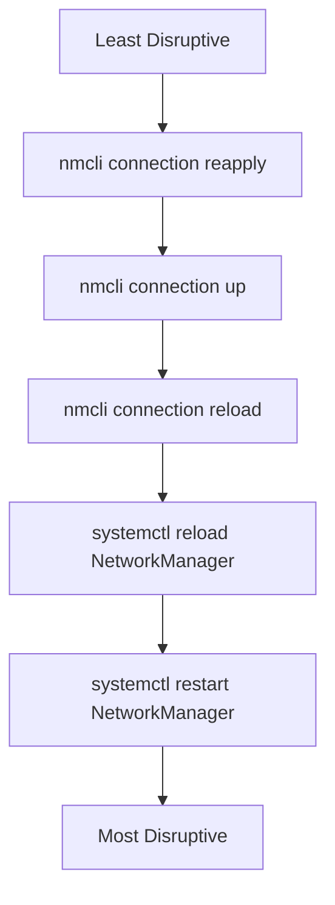

# How to Reload and Apply NetworkManager Configuration Changes on RHEL 9

Author: [nawazdhandala](https://www.github.com/nawazdhandala)

Tags: RHEL, NetworkManager, Configuration, Linux

Description: Understand the different ways to reload and apply NetworkManager configuration changes on RHEL 9, from individual connection updates to full daemon reloads.

---

One thing that trips up admins new to NetworkManager is the relationship between changing a configuration and applying it. Unlike the old `network` service where you just restarted the whole thing, NetworkManager offers several levels of reload and reapply, each with different behaviors and impacts. Picking the right one matters, especially on production systems where you want to minimize disruption.

## The Reload Hierarchy

NetworkManager has multiple levels of configuration reload, from least disruptive to most disruptive:



Let's go through each one.

## Method 1: Connection Reapply

The `reapply` subcommand applies pending changes to an already active connection without fully deactivating and reactivating it. This is the least disruptive option.

```bash
# Reapply changes to an active connection
nmcli device reapply ens192
```

Not all properties can be reapplied live. Properties that can be changed without reactivation include:

- MTU
- DNS configuration
- Some firewall zone changes
- Bridge and bond parameters (some)

If a property cannot be reapplied, nmcli will tell you and you will need to use `connection up` instead.

```bash
# Check which properties have pending changes
nmcli device reapply ens192 --check
```

## Method 2: Connection Up (Reactivation)

This is the most common approach. It deactivates the connection briefly and reactivates it with the new settings:

```bash
# Modify a connection property
nmcli connection modify ens192 ipv4.dns "1.1.1.1,1.0.0.1"

# Reactivate to apply changes
nmcli connection up ens192
```

During reactivation, there is a brief network interruption, usually just a second or two. The interface goes down and comes back up with the new settings.

For remote servers, this is generally safe if you are modifying non-breaking changes (like DNS). If you are changing the IP address over SSH, you need to be more careful:

```bash
# When changing IP via SSH, chain the commands so the new IP activates even if SSH drops
nmcli connection modify ens192 ipv4.addresses 10.0.1.51/24 && nmcli connection up ens192
```

## Method 3: Connection Reload

If you edited keyfiles directly on disk (instead of using `nmcli connection modify`), you need to tell NetworkManager to re-read them:

```bash
# Reload all connection profiles from disk
nmcli connection reload

# Reload a specific connection file
nmcli connection load /etc/NetworkManager/system-connections/ens192.nmconnection
```

`connection reload` does not activate or deactivate anything. It just makes NetworkManager aware of changes to the files on disk. After reloading, you still need to run `connection up` to apply the changes to a running connection.

```bash
# Full workflow for manual keyfile editing
vi /etc/NetworkManager/system-connections/ens192.nmconnection
nmcli connection reload
nmcli connection up ens192
```

## Method 4: NetworkManager Daemon Reload

If you changed NetworkManager's own configuration (files in `/etc/NetworkManager/` or `/etc/NetworkManager/conf.d/`), you need to reload the daemon:

```bash
# Reload NetworkManager daemon configuration
systemctl reload NetworkManager
```

This reloads the daemon configuration without restarting the service. Active connections stay up. Use this when you have changed:

- `/etc/NetworkManager/NetworkManager.conf`
- Files in `/etc/NetworkManager/conf.d/`
- Plugin configuration
- Logging settings
- DNS processing mode

## Method 5: Full Restart

The nuclear option. Restarting NetworkManager tears down and rebuilds all connections:

```bash
# Full restart of NetworkManager
systemctl restart NetworkManager
```

This briefly disrupts all network connections. Use it only when:

- NetworkManager is in a bad state and not responding
- You have made fundamental changes to how NetworkManager operates
- You are troubleshooting and need a clean slate

## When to Use Which Method

| Scenario | Method |
|---|---|
| Changed DNS servers | `connection modify` + `connection up` |
| Changed MTU | `connection modify` + `device reapply` |
| Changed IP address | `connection modify` + `connection up` |
| Edited keyfile directly | `connection reload` + `connection up` |
| Changed NM global config | `systemctl reload NetworkManager` |
| NM is unresponsive | `systemctl restart NetworkManager` |
| Added new keyfile to disk | `connection load <file>` |

## Applying Changes to Multiple Connections

If you need to update several connections at once:

```bash
# Modify multiple connections
nmcli connection modify conn1 ipv4.dns "1.1.1.1"
nmcli connection modify conn2 ipv4.dns "1.1.1.1"
nmcli connection modify conn3 ipv4.dns "1.1.1.1"

# Reactivate them (each briefly drops)
nmcli connection up conn1
nmcli connection up conn2
nmcli connection up conn3
```

Or with a loop:

```bash
# Update DNS on all active ethernet connections
for conn in $(nmcli -t -f NAME,TYPE connection show --active | grep ethernet | cut -d: -f1); do
    nmcli connection modify "$conn" ipv4.dns "1.1.1.1,1.0.0.1"
    nmcli connection up "$conn"
done
```

## Verifying Changes Were Applied

After any reload or reapply operation, verify the running state matches your expectations:

```bash
# Check the active IP configuration
ip addr show ens192

# Check the active DNS configuration
nmcli device show ens192 | grep DNS

# Check the active routes
ip route show dev ens192

# Compare running config to saved profile
nmcli device show ens192
nmcli connection show ens192
```

## Handling Remote Configuration Changes

When you are connected via SSH and need to change the IP address or gateway, there is always a risk of locking yourself out. Here are some safety strategies:

```bash
# Strategy 1: Use at/cron to revert changes after a timeout
echo "nmcli connection up ens192" | at now + 5 minutes

# Strategy 2: Chain commands so they run together
nmcli connection modify ens192 ipv4.addresses 10.0.1.51/24 && \
  nmcli connection up ens192

# Strategy 3: Test with a temporary IP first
ip addr add 10.0.1.51/24 dev ens192
# SSH to the new IP to verify, then make it permanent
nmcli connection modify ens192 ipv4.addresses 10.0.1.51/24
nmcli connection up ens192
```

## Watching Changes in Real Time

Use nmcli's monitor mode to see when changes are applied:

```bash
# In one terminal, watch for events
nmcli monitor

# In another terminal, apply your changes
nmcli connection up ens192
```

## Wrapping Up

The key takeaway is that modifying a connection profile and applying it are two separate steps in NetworkManager. Use `device reapply` for the least disruption, `connection up` for most day-to-day changes, `connection reload` after manual file edits, and `systemctl reload` or `restart` for daemon-level configuration changes. Matching the right reload method to your situation minimizes downtime and reduces the risk of unexpected behavior.
