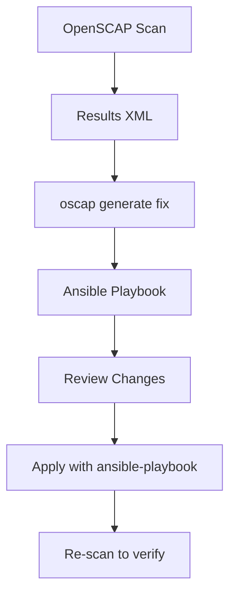

# How to Remediate CIS Benchmark Failures on RHEL Using Ansible

Author: [nawazdhandala](https://www.github.com/nawazdhandala)

Tags: RHEL, CIS, Ansible, Remediation, Linux

Description: Use Ansible to automatically fix CIS benchmark failures on RHEL, turning compliance scan results into actionable remediation playbooks.

---

Scanning for CIS compliance is only half the battle. The other half is fixing the failures. Doing it manually on one server is tedious. Doing it across fifty servers is impossible without automation. Ansible is the natural tool for this on RHEL, especially since the SCAP Security Guide ships with ready-made Ansible content.

## Prerequisites

You need a control node with Ansible installed and SSH access to your RHEL targets:

```bash
# Install Ansible on your control node
dnf install -y ansible-core

# On each target, install the SCAP Security Guide
dnf install -y scap-security-guide openscap-scanner
```

## Option 1: Use the Pre-Built Ansible Playbook

The scap-security-guide package includes pre-built Ansible playbooks for each profile:

```bash
# List available playbooks
ls /usr/share/scap-security-guide/ansible/

# The CIS-related playbooks:
# rhel9-playbook-cis.yml         (CIS Level 2 Server)
# rhel9-playbook-cis_server_l1.yml  (CIS Level 1 Server)
```

Run the playbook against your targets:

```bash
# Apply CIS Level 1 Server hardening
ansible-playbook -i inventory.ini \
  /usr/share/scap-security-guide/ansible/rhel9-playbook-cis_server_l1.yml \
  --check --diff

# Once you have reviewed the changes, run for real
ansible-playbook -i inventory.ini \
  /usr/share/scap-security-guide/ansible/rhel9-playbook-cis_server_l1.yml
```

Always run with `--check --diff` first to preview the changes before applying them.

## Option 2: Generate a Playbook from Scan Results

If you only want to fix the items that actually failed, generate a targeted remediation playbook:

```bash
# First, run a scan and save results
oscap xccdf eval \
  --profile xccdf_org.ssgproject.content_profile_cis_server_l1 \
  --results /tmp/cis-results.xml \
  /usr/share/xml/scap/ssg/content/ssg-rhel9-ds.xml

# Generate an Ansible playbook from the failures
oscap xccdf generate fix \
  --fix-type ansible \
  --result-id "" \
  --output /tmp/cis-fix.yml \
  /tmp/cis-results.xml
```



## Common CIS Remediations as Ansible Tasks

Here are some of the most frequently needed CIS fixes written as Ansible tasks:

### Password policy configuration

```yaml
# Enforce password aging requirements
- name: Set password maximum age to 365 days
  ansible.builtin.lineinfile:
    path: /etc/login.defs
    regexp: '^PASS_MAX_DAYS'
    line: 'PASS_MAX_DAYS   365'

- name: Set password minimum age to 1 day
  ansible.builtin.lineinfile:
    path: /etc/login.defs
    regexp: '^PASS_MIN_DAYS'
    line: 'PASS_MIN_DAYS   1'

- name: Set password warning age to 7 days
  ansible.builtin.lineinfile:
    path: /etc/login.defs
    regexp: '^PASS_WARN_AGE'
    line: 'PASS_WARN_AGE   7'
```

### SSH hardening

```yaml
# Harden SSH server configuration
- name: Disable SSH root login
  ansible.builtin.lineinfile:
    path: /etc/ssh/sshd_config
    regexp: '^#?PermitRootLogin'
    line: 'PermitRootLogin no'
  notify: restart sshd

- name: Set SSH MaxAuthTries
  ansible.builtin.lineinfile:
    path: /etc/ssh/sshd_config
    regexp: '^#?MaxAuthTries'
    line: 'MaxAuthTries 4'
  notify: restart sshd

- name: Disable SSH X11 forwarding
  ansible.builtin.lineinfile:
    path: /etc/ssh/sshd_config
    regexp: '^#?X11Forwarding'
    line: 'X11Forwarding no'
  notify: restart sshd

- name: Set SSH ClientAliveInterval
  ansible.builtin.lineinfile:
    path: /etc/ssh/sshd_config
    regexp: '^#?ClientAliveInterval'
    line: 'ClientAliveInterval 300'
  notify: restart sshd
```

### Kernel parameter hardening

```yaml
# Set secure kernel parameters
- name: Apply network hardening sysctl parameters
  ansible.posix.sysctl:
    name: "{{ item.name }}"
    value: "{{ item.value }}"
    sysctl_file: /etc/sysctl.d/99-cis.conf
    reload: yes
  loop:
    - { name: 'net.ipv4.conf.all.send_redirects', value: '0' }
    - { name: 'net.ipv4.conf.default.send_redirects', value: '0' }
    - { name: 'net.ipv4.conf.all.accept_redirects', value: '0' }
    - { name: 'net.ipv4.conf.default.accept_redirects', value: '0' }
    - { name: 'net.ipv4.conf.all.log_martians', value: '1' }
    - { name: 'net.ipv4.conf.default.log_martians', value: '1' }
    - { name: 'net.ipv4.tcp_syncookies', value: '1' }
    - { name: 'net.ipv4.ip_forward', value: '0' }
```

### File permissions

```yaml
# Fix permissions on critical files
- name: Set correct permissions on /etc/passwd
  ansible.builtin.file:
    path: /etc/passwd
    owner: root
    group: root
    mode: '0644'

- name: Set correct permissions on /etc/shadow
  ansible.builtin.file:
    path: /etc/shadow
    owner: root
    group: root
    mode: '0000'

- name: Set correct permissions on /etc/group
  ansible.builtin.file:
    path: /etc/group
    owner: root
    group: root
    mode: '0644'

- name: Set correct permissions on /etc/gshadow
  ansible.builtin.file:
    path: /etc/gshadow
    owner: root
    group: root
    mode: '0000'
```

## Build a Complete Remediation Playbook

Combine the individual tasks into a structured playbook:

```yaml
---
# CIS Level 1 Server Remediation Playbook for RHEL
- name: Apply CIS Level 1 Server hardening
  hosts: rhel9_servers
  become: yes

  handlers:
    - name: restart sshd
      ansible.builtin.service:
        name: sshd
        state: restarted

    - name: restart auditd
      ansible.builtin.command:
        cmd: service auditd restart

  tasks:
    - name: Include password policy tasks
      ansible.builtin.include_tasks: tasks/password-policy.yml

    - name: Include SSH hardening tasks
      ansible.builtin.include_tasks: tasks/ssh-hardening.yml

    - name: Include kernel parameters
      ansible.builtin.include_tasks: tasks/kernel-params.yml

    - name: Include file permissions
      ansible.builtin.include_tasks: tasks/file-permissions.yml
```

## Verify Remediation with a Re-Scan

After running the playbook, always re-scan to confirm the fixes took effect:

```bash
# Re-run the CIS scan
oscap xccdf eval \
  --profile xccdf_org.ssgproject.content_profile_cis_server_l1 \
  --results /tmp/cis-post-remediation.xml \
  --report /tmp/cis-post-remediation.html \
  /usr/share/xml/scap/ssg/content/ssg-rhel9-ds.xml

# Compare pass/fail counts
echo "Before:"
grep -c 'result="fail"' /tmp/cis-results.xml
echo "After:"
grep -c 'result="fail"' /tmp/cis-post-remediation.xml
```

## Handle Exceptions

Some CIS rules may not be applicable to your environment. Document exceptions and skip them in your playbook:

```yaml
# Skip rules that do not apply to this environment
- name: CIS 1.4.1 - Skip GRUB password (managed by BMC)
  ansible.builtin.debug:
    msg: "Skipped - GRUB password managed by BMC/iDRAC"
  tags:
    - skip
    - cis_1_4_1
```

The combination of OpenSCAP for scanning and Ansible for remediation gives you a repeatable, auditable process for CIS compliance. Scan, fix, re-scan, and document any exceptions. That is the workflow that keeps auditors happy and systems secure.
