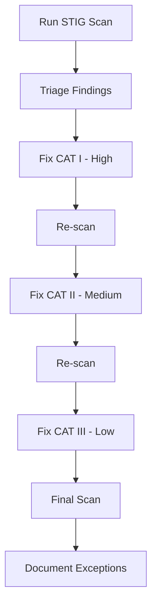

# How to Remediate DISA STIG Findings on RHEL Step by Step

Author: [nawazdhandala](https://www.github.com/nawazdhandala)

Tags: RHEL, DISA STIG, Remediation, Compliance, Linux

Description: A step-by-step guide to remediating the most common DISA STIG findings on RHEL, organized by severity category.

---

After running a STIG scan, you will likely see dozens of findings. The sheer number can be overwhelming, but the trick is to work through them systematically: fix all CAT I findings first, then CAT II, then CAT III. This guide walks through the most common findings on a default RHEL installation and shows you exactly how to fix each one.

## Triage Your Findings

Start by understanding the scope:

```bash
# Run the initial scan
oscap xccdf eval \
  --profile xccdf_org.ssgproject.content_profile_stig \
  --results /tmp/stig-results.xml \
  --report /tmp/stig-report.html \
  /usr/share/xml/scap/ssg/content/ssg-rhel9-ds.xml || true

# Get the overall picture
echo "Pass: $(grep -c 'result="pass"' /tmp/stig-results.xml)"
echo "Fail: $(grep -c 'result="fail"' /tmp/stig-results.xml)"
```



## CAT I Findings - Fix These First

### Enable FIPS Mode

This is the single most common CAT I finding:

```bash
# Check current FIPS status
fips-mode-setup --check

# Enable FIPS mode (requires reboot)
fips-mode-setup --enable

# Reboot to complete FIPS activation
systemctl reboot

# After reboot, verify
fips-mode-setup --check
cat /proc/sys/crypto/fips_enabled
# Should output: 1
```

### Disable Root SSH Login

```bash
# Set PermitRootLogin to no
sed -i 's/^#*PermitRootLogin.*/PermitRootLogin no/' /etc/ssh/sshd_config

# Or use a drop-in config file
echo "PermitRootLogin no" > /etc/ssh/sshd_config.d/no-root.conf

# Restart SSH
systemctl restart sshd
```

### Set SELinux to Enforcing

```bash
# Check current mode
getenforce

# Set to enforcing
setenforce 1
sed -i 's/^SELINUX=.*/SELINUX=enforcing/' /etc/selinux/config
```

### Install and Initialize AIDE

```bash
# Install AIDE for file integrity monitoring
dnf install -y aide

# Initialize the database
aide --init
mv /var/lib/aide/aide.db.new.gz /var/lib/aide/aide.db.gz

# Schedule daily checks
echo "0 5 * * * root /usr/sbin/aide --check" >> /etc/crontab
```

## CAT II Findings - Core Configuration

### Password Complexity

```bash
# Configure password quality requirements
cat > /etc/security/pwquality.conf.d/stig.conf << 'EOF'
minlen = 15
minclass = 4
dcredit = -1
ucredit = -1
ocredit = -1
lcredit = -1
maxrepeat = 3
maxclassrepeat = 4
dictcheck = 1
EOF
```

### Password Aging

```bash
# Set password aging in /etc/login.defs
sed -i 's/^PASS_MAX_DAYS.*/PASS_MAX_DAYS   60/' /etc/login.defs
sed -i 's/^PASS_MIN_DAYS.*/PASS_MIN_DAYS   1/' /etc/login.defs
sed -i 's/^PASS_MIN_LEN.*/PASS_MIN_LEN    15/' /etc/login.defs
sed -i 's/^PASS_WARN_AGE.*/PASS_WARN_AGE   7/' /etc/login.defs

# Apply to existing users
for user in $(awk -F: '$3 >= 1000 && $3 < 65534 {print $1}' /etc/passwd); do
    chage --maxdays 60 --mindays 1 --warndays 7 "$user"
done
```

### Account Lockout

```bash
# Configure faillock
cat > /etc/security/faillock.conf << 'EOF'
deny = 3
fail_interval = 900
unlock_time = 0
even_deny_root
silent
audit
EOF
```

### SSH Hardening

```bash
# Apply all STIG-required SSH settings
cat > /etc/ssh/sshd_config.d/stig.conf << 'EOF'
PermitRootLogin no
PermitEmptyPasswords no
HostbasedAuthentication no
ClientAliveInterval 600
ClientAliveCountMax 0
X11Forwarding no
MaxAuthTries 4
Banner /etc/issue.net
StrictModes yes
IgnoreRhosts yes
Ciphers aes256-ctr,aes192-ctr,aes128-ctr,aes256-gcm@openssh.com,aes128-gcm@openssh.com
MACs hmac-sha2-512,hmac-sha2-256,hmac-sha2-512-etm@openssh.com,hmac-sha2-256-etm@openssh.com
KexAlgorithms ecdh-sha2-nistp256,ecdh-sha2-nistp384,ecdh-sha2-nistp521,diffie-hellman-group14-sha256,diffie-hellman-group16-sha512,diffie-hellman-group18-sha512
RekeyLimit 1G 1h
EOF

systemctl restart sshd
```

### Audit Configuration

```bash
# Ensure auditd is enabled
systemctl enable --now auditd

# Set audit configuration
sed -i 's/^max_log_file .*/max_log_file = 50/' /etc/audit/auditd.conf
sed -i 's/^space_left_action.*/space_left_action = email/' /etc/audit/auditd.conf
sed -i 's/^action_mail_acct.*/action_mail_acct = root/' /etc/audit/auditd.conf
sed -i 's/^admin_space_left_action.*/admin_space_left_action = single/' /etc/audit/auditd.conf
```

### Kernel Parameters

```bash
# Apply STIG-required sysctl settings
cat > /etc/sysctl.d/99-stig.conf << 'EOF'
kernel.randomize_va_space = 2
kernel.dmesg_restrict = 1
kernel.kptr_restrict = 2
net.ipv4.conf.all.accept_redirects = 0
net.ipv4.conf.default.accept_redirects = 0
net.ipv4.conf.all.send_redirects = 0
net.ipv4.conf.default.send_redirects = 0
net.ipv4.conf.all.accept_source_route = 0
net.ipv4.conf.default.accept_source_route = 0
net.ipv4.ip_forward = 0
net.ipv4.tcp_syncookies = 1
net.ipv6.conf.all.accept_redirects = 0
net.ipv6.conf.default.accept_redirects = 0
net.ipv6.conf.all.accept_source_route = 0
net.ipv6.conf.default.accept_source_route = 0
EOF

sysctl --system
```

## CAT III Findings - Polish

### Login Banners

```bash
# Set the DoD consent banner
cat > /etc/issue << 'EOF'
You are accessing a U.S. Government information system, which includes this computer, this network, all computers connected to this network, and all devices and storage media attached to this network or to a computer on this network. This information system is provided for U.S. Government-authorized use only. Unauthorized or improper use of this system may result in disciplinary action, as well as civil and criminal penalties.
EOF

cp /etc/issue /etc/issue.net
```

### File Permissions

```bash
# Fix critical file permissions
chmod 644 /etc/passwd
chmod 000 /etc/shadow
chmod 644 /etc/group
chmod 000 /etc/gshadow
chmod 600 /boot/grub2/grub.cfg
```

### Remove Unnecessary Software

```bash
# Remove STIG-prohibited packages
dnf remove -y telnet tftp-server vsftpd 2>/dev/null
```

## Re-scan After Remediation

```bash
# Run the scan again to verify fixes
oscap xccdf eval \
  --profile xccdf_org.ssgproject.content_profile_stig \
  --results /tmp/stig-post-fix.xml \
  --report /tmp/stig-post-fix.html \
  /usr/share/xml/scap/ssg/content/ssg-rhel9-ds.xml || true

# Compare before and after
echo "Before remediation:"
echo "  Fail: $(grep -c 'result="fail"' /tmp/stig-results.xml)"
echo "After remediation:"
echo "  Fail: $(grep -c 'result="fail"' /tmp/stig-post-fix.xml)"
```

Work through STIG findings methodically. Do not try to fix everything at once. Start with CAT I, verify those are clean, then move to CAT II and CAT III. Document any items you cannot fix with a POA&M (Plan of Action and Milestones) that explains why and what compensating controls are in place.
