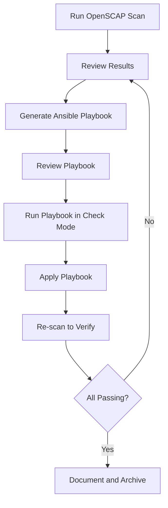

# How to Remediate OpenSCAP Findings with Ansible Playbooks on RHEL 9

Author: [nawazdhandala](https://www.github.com/nawazdhandala)

Tags: RHEL, OpenSCAP, Ansible, Remediation, Linux

Description: Turn OpenSCAP scan results into Ansible playbooks that automatically fix compliance failures on RHEL 9, creating a closed-loop remediation workflow.

---

Scanning is only valuable if you actually fix what is broken. The real power of OpenSCAP comes from its ability to generate Ansible playbooks from scan results. Instead of reading through a report and manually fixing each finding, you can generate a playbook that does it all for you. This gives you a scan, fix, re-scan workflow that is repeatable and auditable.

## The Remediation Workflow



## Step 1: Run the Initial Scan

```bash
# Run a compliance scan and save results
oscap xccdf eval \
  --profile xccdf_org.ssgproject.content_profile_stig \
  --results /var/log/compliance/scan-results.xml \
  --report /var/log/compliance/scan-report.html \
  /usr/share/xml/scap/ssg/content/ssg-rhel9-ds.xml || true

# Check how many items failed
echo "Failed: $(grep -c 'result="fail"' /var/log/compliance/scan-results.xml)"
```

## Step 2: Generate an Ansible Playbook from Results

```bash
# Generate a playbook that fixes only the failed rules
oscap xccdf generate fix \
  --fix-type ansible \
  --result-id "" \
  --output /tmp/remediation-playbook.yml \
  /var/log/compliance/scan-results.xml

# Check the size of the generated playbook
wc -l /tmp/remediation-playbook.yml
```

The generated playbook only contains tasks for rules that failed. Rules that already pass are not included.

## Step 3: Review the Playbook

Always review generated playbooks before running them:

```bash
# View the playbook structure
head -50 /tmp/remediation-playbook.yml

# Count the number of tasks
grep -c "name:" /tmp/remediation-playbook.yml

# Look for potentially disruptive tasks
grep -i "reboot\|restart\|disable\|remove" /tmp/remediation-playbook.yml
```

## Step 4: Test with Check Mode

```bash
# Run the playbook in check mode (dry run)
ansible-playbook -i localhost, -c local \
  --check --diff \
  /tmp/remediation-playbook.yml

# Review the output to understand what changes will be made
```

## Step 5: Apply the Remediation

```bash
# Apply the playbook
ansible-playbook -i localhost, -c local \
  /tmp/remediation-playbook.yml

# For remote hosts, use your inventory
ansible-playbook -i inventory.ini \
  /tmp/remediation-playbook.yml
```

## Step 6: Re-scan to Verify

```bash
# Run the scan again
oscap xccdf eval \
  --profile xccdf_org.ssgproject.content_profile_stig \
  --results /var/log/compliance/post-remediation.xml \
  --report /var/log/compliance/post-remediation.html \
  /usr/share/xml/scap/ssg/content/ssg-rhel9-ds.xml || true

# Compare before and after
echo "Before: $(grep -c 'result="fail"' /var/log/compliance/scan-results.xml) failures"
echo "After:  $(grep -c 'result="fail"' /var/log/compliance/post-remediation.xml) failures"
```

## Use Pre-Built SSG Playbooks Instead

For full-profile remediation, use the playbooks that ship with scap-security-guide:

```bash
# List available playbooks
ls /usr/share/scap-security-guide/ansible/rhel9-playbook-*.yml

# Apply the full STIG playbook
ansible-playbook -i localhost, -c local \
  /usr/share/scap-security-guide/ansible/rhel9-playbook-stig.yml

# Apply CIS Level 1
ansible-playbook -i localhost, -c local \
  /usr/share/scap-security-guide/ansible/rhel9-playbook-cis_server_l1.yml
```

The difference between generated and pre-built playbooks:
- **Generated from results**: Only fixes what failed on this specific system
- **Pre-built from SSG**: Applies all rules in the profile, regardless of current state

## Handle Tasks That Require a Reboot

Some remediation tasks require a reboot (like enabling FIPS mode or changing kernel parameters):

```yaml
# Add a reboot handler to the generated playbook
# Append this at the end of the playbook

  handlers:
    - name: reboot system
      ansible.builtin.reboot:
        reboot_timeout: 300

# Add notify directives to tasks that need it
```

## Create a Complete Remediation Pipeline Script

```bash
cat > /usr/local/bin/remediation-pipeline.sh << 'SCRIPT'
#!/bin/bash
set -e

PROFILE="xccdf_org.ssgproject.content_profile_stig"
CONTENT="/usr/share/xml/scap/ssg/content/ssg-rhel9-ds.xml"
DATE=$(date +%Y%m%d-%H%M)
DIR="/var/log/compliance/${DATE}"

mkdir -p "$DIR"

echo "=== Step 1: Initial Scan ==="
oscap xccdf eval \
  --profile "$PROFILE" \
  --results "${DIR}/pre-scan.xml" \
  --report "${DIR}/pre-scan.html" \
  "$CONTENT" 2>/dev/null || true

PRE_FAIL=$(grep -c 'result="fail"' "${DIR}/pre-scan.xml")
echo "Initial failures: $PRE_FAIL"

if [ "$PRE_FAIL" -eq 0 ]; then
    echo "All rules passing. No remediation needed."
    exit 0
fi

echo "=== Step 2: Generate Remediation ==="
oscap xccdf generate fix \
  --fix-type ansible \
  --result-id "" \
  --output "${DIR}/remediation.yml" \
  "${DIR}/pre-scan.xml"

echo "=== Step 3: Apply Remediation ==="
ansible-playbook -i localhost, -c local "${DIR}/remediation.yml"

echo "=== Step 4: Re-scan ==="
oscap xccdf eval \
  --profile "$PROFILE" \
  --results "${DIR}/post-scan.xml" \
  --report "${DIR}/post-scan.html" \
  "$CONTENT" 2>/dev/null || true

POST_FAIL=$(grep -c 'result="fail"' "${DIR}/post-scan.xml")

echo "=== Results ==="
echo "Before: $PRE_FAIL failures"
echo "After:  $POST_FAIL failures"
echo "Fixed:  $((PRE_FAIL - POST_FAIL)) items"
echo "Reports in: $DIR"
SCRIPT
chmod +x /usr/local/bin/remediation-pipeline.sh
```

## Handle Persistent Failures

Some rules may continue to fail after remediation. Common reasons:

- **Requires reboot**: Kernel parameters, FIPS mode, SELinux changes
- **Requires partitioning**: Mount point rules that cannot be fixed on a running system
- **Manual steps**: Rules that need human judgment (like removing specific users)

```bash
# Identify remaining failures after remediation
oscap xccdf eval \
  --profile xccdf_org.ssgproject.content_profile_stig \
  /usr/share/xml/scap/ssg/content/ssg-rhel9-ds.xml 2>&1 | \
  grep -B1 "^Result.*fail" | grep "^Title"
```

Document these remaining items as exceptions with justifications and timelines for resolution.

The scan-remediate-verify cycle with OpenSCAP and Ansible is the most efficient way to achieve and maintain compliance on RHEL 9. Automate it, run it regularly, and keep your reports for audit evidence.
