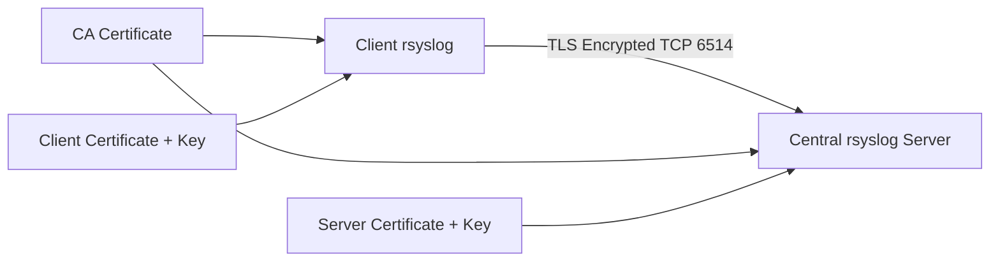

# How to Set Up Remote Logging with rsyslog Over TLS on RHEL

Author: [nawazdhandala](https://www.github.com/nawazdhandala)

Tags: RHEL, Rsyslog, TLS, Security, Logging, Linux

Description: Learn how to secure your centralized logging infrastructure by configuring rsyslog to forward and receive logs over TLS-encrypted connections on RHEL.

---

Sending logs over the network in plaintext means anyone with network access can read sensitive information like authentication events, application errors, and system details. TLS encryption for rsyslog solves this by encrypting log traffic between clients and the central log server. On RHEL, rsyslog supports TLS natively through the GnuTLS library.

## Architecture



## Prerequisites

- RHEL servers with rsyslog installed
- The rsyslog GnuTLS module package
- Root or sudo access on all servers
- A working centralized rsyslog setup (plain TCP) is helpful but not required

## Step 1: Install the TLS Module

On both the server and all clients:

```bash
# Install the rsyslog GnuTLS module for TLS support
sudo dnf install rsyslog-gnutls -y
```

## Step 2: Generate TLS Certificates

You need a Certificate Authority (CA), a server certificate, and optionally client certificates. For production, use your organization's CA. For testing, you can create a self-signed CA.

```bash
# Install certtool from GnuTLS utils
sudo dnf install gnutls-utils -y

# Create a directory for the certificates
sudo mkdir -p /etc/pki/rsyslog
cd /etc/pki/rsyslog
```

### Create the CA Key and Certificate

```bash
# Generate the CA private key
sudo certtool --generate-privkey --outfile ca-key.pem

# Create the CA certificate template
sudo bash -c 'cat > ca.tmpl << EOF
cn = "Rsyslog CA"
ca
cert_signing_key
expiration_days = 3650
EOF'

# Generate the self-signed CA certificate
sudo certtool --generate-self-signed \
    --load-privkey ca-key.pem \
    --template ca.tmpl \
    --outfile ca-cert.pem
```

### Create the Server Certificate

```bash
# Generate the server private key
sudo certtool --generate-privkey --outfile server-key.pem

# Create the server certificate template
# Replace the cn and dns_name with your server's actual hostname
sudo bash -c 'cat > server.tmpl << EOF
cn = "logserver.example.com"
dns_name = "logserver.example.com"
tls_www_server
expiration_days = 730
EOF'

# Generate the server certificate signed by the CA
sudo certtool --generate-certificate \
    --load-privkey server-key.pem \
    --load-ca-certificate ca-cert.pem \
    --load-ca-privkey ca-key.pem \
    --template server.tmpl \
    --outfile server-cert.pem
```

### Create a Client Certificate

```bash
# Generate the client private key
sudo certtool --generate-privkey --outfile client-key.pem

# Create the client certificate template
sudo bash -c 'cat > client.tmpl << EOF
cn = "client1.example.com"
dns_name = "client1.example.com"
tls_www_client
expiration_days = 730
EOF'

# Generate the client certificate signed by the CA
sudo certtool --generate-certificate \
    --load-privkey client-key.pem \
    --load-ca-certificate ca-cert.pem \
    --load-ca-privkey ca-key.pem \
    --template client.tmpl \
    --outfile client-cert.pem
```

### Set Proper Permissions

```bash
# Restrict access to the private keys
sudo chmod 600 /etc/pki/rsyslog/*-key.pem
sudo chmod 644 /etc/pki/rsyslog/*-cert.pem

# Ensure rsyslog (running as root) can read them
sudo chown root:root /etc/pki/rsyslog/*
```

## Step 3: Distribute Certificates

Copy the appropriate files to each machine:

- **Central server** needs: `ca-cert.pem`, `server-cert.pem`, `server-key.pem`
- **Each client** needs: `ca-cert.pem`, `client-cert.pem`, `client-key.pem`

```bash
# Example: copy client certificates to a remote client
scp /etc/pki/rsyslog/ca-cert.pem user@client1:/tmp/
scp /etc/pki/rsyslog/client-cert.pem user@client1:/tmp/
scp /etc/pki/rsyslog/client-key.pem user@client1:/tmp/

# On the client, move them into place
sudo mkdir -p /etc/pki/rsyslog
sudo mv /tmp/ca-cert.pem /etc/pki/rsyslog/
sudo mv /tmp/client-cert.pem /etc/pki/rsyslog/
sudo mv /tmp/client-key.pem /etc/pki/rsyslog/
sudo chmod 600 /etc/pki/rsyslog/*-key.pem
```

## Step 4: Configure the Central Log Server

Create a TLS configuration for the server:

```bash
# Create the TLS server configuration
sudo vi /etc/rsyslog.d/tls-server.conf
```

Add the following:

```bash
# Load the GnuTLS stream driver module
module(load="imtcp"
    StreamDriver.Name="gtls"
    StreamDriver.Mode="1"
    StreamDriver.Authmode="x509/name"
)

# Set global TLS parameters
global(
    DefaultNetstreamDriver="gtls"
    DefaultNetstreamDriverCAFile="/etc/pki/rsyslog/ca-cert.pem"
    DefaultNetstreamDriverCertFile="/etc/pki/rsyslog/server-cert.pem"
    DefaultNetstreamDriverKeyFile="/etc/pki/rsyslog/server-key.pem"
)

# Listen on port 6514 for TLS-encrypted syslog connections
input(type="imtcp" port="6514")

# Template for organizing remote logs by hostname
template(name="RemoteTLSLogs" type="string"
    string="/var/log/remote/%HOSTNAME%/%PROGRAMNAME%.log"
)

# Store remote logs in per-host directories
if $fromhost-ip != '127.0.0.1' then {
    action(type="omfile" dynaFile="RemoteTLSLogs")
    stop
}
```

### Open the Firewall

```bash
# Allow TLS syslog port
sudo firewall-cmd --permanent --add-port=6514/tcp
sudo firewall-cmd --reload
```

### Restart rsyslog on the Server

```bash
sudo systemctl restart rsyslog

# Verify it is listening on port 6514
sudo ss -tlnp | grep 6514
```

## Step 5: Configure the Client

```bash
# Create the TLS client configuration
sudo vi /etc/rsyslog.d/tls-forward.conf
```

Add the following:

```bash
# Load the GnuTLS stream driver
global(
    DefaultNetstreamDriver="gtls"
    DefaultNetstreamDriverCAFile="/etc/pki/rsyslog/ca-cert.pem"
    DefaultNetstreamDriverCertFile="/etc/pki/rsyslog/client-cert.pem"
    DefaultNetstreamDriverKeyFile="/etc/pki/rsyslog/client-key.pem"
)

# Forward all logs to the central server over TLS
# Port 6514 is the standard syslog-over-TLS port
*.* action(
    type="omfwd"
    target="logserver.example.com"
    port="6514"
    protocol="tcp"
    StreamDriver="gtls"
    StreamDriverMode="1"
    StreamDriverAuthMode="x509/name"
    StreamDriverPermittedPeers="logserver.example.com"
    # Queue for reliability
    queue.type="LinkedList"
    queue.filename="fwdTLS"
    queue.maxdiskspace="1g"
    queue.saveonshutdown="on"
    action.resumeRetryCount="-1"
    action.resumeInterval="30"
)
```

### Restart rsyslog on the Client

```bash
sudo systemctl restart rsyslog

# Check for any errors
sudo journalctl -u rsyslog --no-pager -n 20
```

## Step 6: Test the TLS Connection

From the client:

```bash
# Send a test message
logger "TLS test message from $(hostname)"
```

On the server:

```bash
# Check for the test message
sudo tail -f /var/log/remote/*/*
```

You can also verify the TLS connection is actually encrypted:

```bash
# On the server, check active TLS connections
sudo ss -tlnp | grep 6514

# Use openssl to test the TLS handshake
openssl s_client -connect logserver.example.com:6514 \
    -CAfile /etc/pki/rsyslog/ca-cert.pem
```

## Using Anonymous TLS (Simpler Setup)

If you want encryption without client certificate verification, you can use anonymous authentication mode:

On the server:

```bash
# Anonymous TLS - no client certificate required
module(load="imtcp"
    StreamDriver.Name="gtls"
    StreamDriver.Mode="1"
    StreamDriver.Authmode="anon"
)
```

On the client:

```bash
*.* action(
    type="omfwd"
    target="logserver.example.com"
    port="6514"
    protocol="tcp"
    StreamDriver="gtls"
    StreamDriverMode="1"
    StreamDriverAuthMode="anon"
)
```

This is simpler but provides only encryption without mutual authentication.

## Troubleshooting

```bash
# Check rsyslog configuration syntax
rsyslogd -N1

# Look for GnuTLS errors in the journal
sudo journalctl -u rsyslog | grep -i "gnutls\|tls\|certificate"

# Verify certificate validity
certtool --certificate-info --infile /etc/pki/rsyslog/server-cert.pem

# Check that the CA certificate can verify the server certificate
certtool --verify --load-ca-certificate /etc/pki/rsyslog/ca-cert.pem \
    --infile /etc/pki/rsyslog/server-cert.pem

# Test TLS connectivity
openssl s_client -connect logserver.example.com:6514 \
    -CAfile /etc/pki/rsyslog/ca-cert.pem 2>&1 | head -20
```

## Summary

Securing rsyslog with TLS on RHEL protects your log data in transit using certificate-based encryption. The setup involves generating a CA and certificates, distributing them to servers and clients, and configuring both sides to use the GnuTLS stream driver. For production environments, always use mutual TLS authentication with proper certificate management and rotation.
