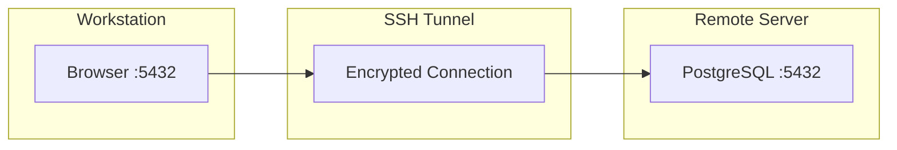

# How to Set Up Remote System Administration Using SSH on RHEL 9

Author: [nawazdhandala](https://www.github.com/nawazdhandala)

Tags: RHEL, SSH, Remote Administration, Security, Linux

Description: A complete guide to setting up and hardening SSH for remote system administration on RHEL 9, covering key-based authentication, sshd configuration, SSH tunneling, and firewall rules.

---

## SSH Is Your Primary Remote Access Tool

If you manage Linux servers, SSH is the backbone of your workflow. Every remote command, file transfer, and tunnel runs through it. On RHEL 9, OpenSSH is installed and enabled by default on most installation profiles, but the default configuration is not as locked down as it should be for production use.

This guide walks through setting up SSH properly, from generating keys to hardening the configuration, so you can manage your servers securely.

## Verifying the SSH Service

Start by confirming the SSH daemon is running and enabled.

```bash
# Check if sshd is active
systemctl status sshd

# Enable sshd to start on boot (usually already enabled)
sudo systemctl enable sshd

# Verify the SSH port is open
ss -tlnp | grep :22
```

## Setting Up Key-Based Authentication

Password authentication is the weakest link in SSH security. Key-based authentication is significantly more secure and eliminates the risk of brute-force password attacks.

### Generating an SSH Key Pair

On your workstation (not the server), generate a key pair.

```bash
# Generate an Ed25519 key (recommended for RHEL 9)
ssh-keygen -t ed25519 -C "admin@workstation"
```

You will be prompted for a file location (the default `~/.ssh/id_ed25519` is fine) and a passphrase. Always set a passphrase on your private key. It protects you if someone gets access to your workstation.

If you need RSA for compatibility with older systems:

```bash
# Generate a 4096-bit RSA key
ssh-keygen -t rsa -b 4096 -C "admin@workstation"
```

### Copying the Public Key to the Server

```bash
# Copy your public key to the server
ssh-copy-id user@server-ip
```

This adds your public key to `~/.ssh/authorized_keys` on the server. Test the connection:

```bash
# Test key-based login
ssh user@server-ip
```

If it works without asking for the server account password (it may ask for your key passphrase), key authentication is set up.

### Managing Multiple Keys

If you manage many servers, you can organize keys and configure shortcuts in `~/.ssh/config` on your workstation.

```bash
# Create or edit your SSH client configuration
vi ~/.ssh/config
```

```
# Production database server
Host db-prod
    HostName 10.0.1.50
    User dbadmin
    IdentityFile ~/.ssh/id_ed25519_prod

# Staging web server
Host web-staging
    HostName 10.0.2.30
    User webadmin
    IdentityFile ~/.ssh/id_ed25519_staging

# Default settings for all hosts
Host *
    ServerAliveInterval 60
    ServerAliveCountMax 3
```

Now you can connect with just:

```bash
ssh db-prod
```

## Hardening the SSH Configuration

The SSH daemon configuration file is `/etc/ssh/sshd_config`. Additional configuration snippets can go in `/etc/ssh/sshd_config.d/`.

### Disabling Root Login

Never allow direct root login over SSH. Use a regular account and `sudo` instead.

```bash
# Create a hardening configuration file
sudo tee /etc/ssh/sshd_config.d/99-hardening.conf << 'EOF'
# Disable direct root login
PermitRootLogin no

# Disable password authentication (key-only)
PasswordAuthentication no

# Disable empty passwords
PermitEmptyPasswords no

# Limit authentication attempts
MaxAuthTries 3

# Set login grace time (seconds to authenticate)
LoginGraceTime 30

# Disable X11 forwarding unless needed
X11Forwarding no

# Display last login info
PrintLastLog yes
EOF
```

Before restarting sshd, make sure you can still log in through another method (console, existing SSH session) in case something goes wrong.

```bash
# Test the configuration for syntax errors
sudo sshd -t

# Restart sshd to apply changes
sudo systemctl restart sshd
```

### Restricting SSH to Specific Users or Groups

If only certain users should have SSH access:

```bash
# Add to your hardening config
echo 'AllowUsers admin deployer dbadmin' | sudo tee -a /etc/ssh/sshd_config.d/99-hardening.conf

# Or restrict by group
echo 'AllowGroups sshusers' | sudo tee -a /etc/ssh/sshd_config.d/99-hardening.conf
```

Create the group and add users to it:

```bash
# Create the SSH access group
sudo groupadd sshusers

# Add users to the group
sudo usermod -aG sshusers admin
sudo usermod -aG sshusers deployer
```

### Changing the SSH Port

Some administrators change the default port to reduce noise from automated scanners. This is security through obscurity, not real security, but it does reduce log spam.

```bash
# Change SSH to listen on port 2222
echo 'Port 2222' | sudo tee -a /etc/ssh/sshd_config.d/99-hardening.conf
```

If you change the port, you also need to update SELinux and the firewall:

```bash
# Tell SELinux about the new SSH port
sudo semanage port -a -t ssh_port_t -p tcp 2222

# Update firewall rules
sudo firewall-cmd --permanent --remove-service=ssh
sudo firewall-cmd --permanent --add-port=2222/tcp
sudo firewall-cmd --reload

# Restart sshd
sudo systemctl restart sshd
```

## Firewall Configuration

RHEL 9 uses firewalld by default. Make sure SSH traffic is allowed.

```bash
# Check current firewall rules
sudo firewall-cmd --list-all

# Allow SSH (already allowed by default on most installations)
sudo firewall-cmd --permanent --add-service=ssh
sudo firewall-cmd --reload
```

To restrict SSH access to specific source IP ranges:

```bash
# Create a rich rule allowing SSH only from a specific subnet
sudo firewall-cmd --permanent --add-rich-rule='rule family="ipv4" source address="10.0.0.0/8" service name="ssh" accept'

# Remove the general SSH rule
sudo firewall-cmd --permanent --remove-service=ssh

sudo firewall-cmd --reload
```

## SSH Tunneling

SSH tunnels are invaluable for accessing services on remote servers that are not exposed to the network.

### Local Port Forwarding

Forward a local port to a remote service. For example, access a database on a remote server through an SSH tunnel:

```bash
# Forward local port 5432 to the remote server's PostgreSQL instance
ssh -L 5432:localhost:5432 admin@db-server
```

Now you can connect to `localhost:5432` on your workstation, and traffic is tunneled to the database server.

### Dynamic Port Forwarding (SOCKS Proxy)

Create a SOCKS proxy through the SSH connection:

```bash
# Set up a SOCKS proxy on local port 1080
ssh -D 1080 admin@jump-server
```

Configure your browser or application to use `localhost:1080` as a SOCKS5 proxy, and all traffic goes through the SSH tunnel.

### Remote Port Forwarding

Expose a local service through a remote server:

```bash
# Make your local port 8080 accessible on the remote server's port 9090
ssh -R 9090:localhost:8080 admin@remote-server
```



## Using SSH Agent

Typing your key passphrase every time gets old fast. Use ssh-agent to cache it.

```bash
# Start the SSH agent
eval $(ssh-agent)

# Add your key to the agent
ssh-add ~/.ssh/id_ed25519
```

The agent holds your decrypted key in memory for the duration of your session. You can set a timeout:

```bash
# Add key with a 4-hour timeout
ssh-add -t 14400 ~/.ssh/id_ed25519
```

## Transferring Files

SSH includes tools for secure file transfer.

```bash
# Copy a file to a remote server
scp /local/file.tar.gz admin@server:/remote/path/

# Copy a directory recursively
scp -r /local/directory admin@server:/remote/path/

# Use rsync over SSH for efficient transfers (only sends differences)
rsync -avz -e ssh /local/directory/ admin@server:/remote/path/
```

For interactive file management, use `sftp`:

```bash
# Start an SFTP session
sftp admin@server
```

## Monitoring SSH Access

Keep track of who is connecting to your servers.

```bash
# Check currently connected SSH users
who

# View recent SSH login attempts
journalctl -u sshd --since "24 hours ago" | grep "Accepted"

# Check for failed login attempts
journalctl -u sshd --since "24 hours ago" | grep "Failed"

# See last login history
last -10
```

## Practical Tips

- **Always test SSH changes from a separate session.** Keep an existing connection open while you restart sshd with new settings. If you lock yourself out, the existing session still works.
- **Use `ssh-agent` forwarding carefully.** The `-A` flag forwards your agent to the remote server, which is convenient but means anyone with root on that server can use your key. Only use it on trusted servers.
- **Set up fail2ban or a similar tool** to automatically block IPs after repeated failed login attempts.
- **Rotate SSH keys periodically.** Generate new keys, deploy them, then remove the old ones from `authorized_keys` files.
- **Back up your `~/.ssh/config`** and private keys. Losing them means regenerating and redeploying everything.

## Summary

SSH on RHEL 9 is your gateway to remote server management. Start by setting up key-based authentication and disabling password login. Harden the sshd configuration by disabling root login, limiting authentication attempts, and restricting access by user or group. Use the firewall to control which networks can reach the SSH port. SSH tunneling extends your reach to services behind firewalls. With these basics in place, you have a secure, flexible foundation for managing your RHEL infrastructure remotely.
