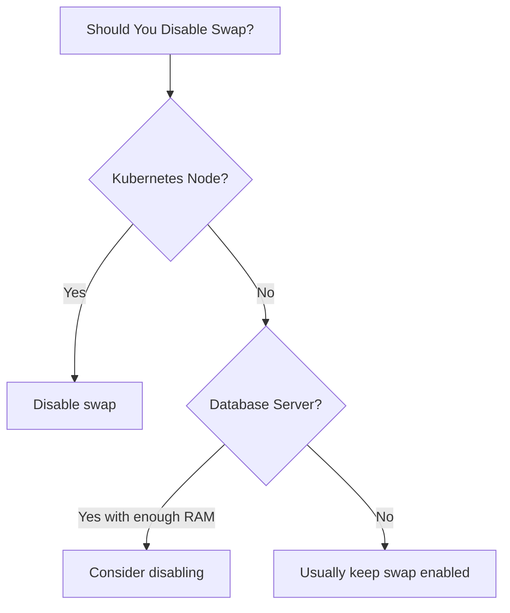

# How to Remove and Disable Swap on RHEL

Author: [nawazdhandala](https://www.github.com/nawazdhandala)

Tags: RHEL, Swap, Disable, Linux

Description: Learn how to safely remove and disable swap on RHEL, whether you are setting up Kubernetes nodes, reducing disk usage, or reclaiming storage.

---

There are legitimate reasons to disable swap. Kubernetes requires swap to be off on worker nodes. Some database administrators prefer no swap for predictable performance. Or maybe you are reclaiming the space for something else. Whatever the reason, here is how to do it properly on RHEL.

## Before You Disable Swap

Think carefully before removing swap:

- Systems without swap are vulnerable to OOM kills during memory spikes
- Some applications assume swap exists and may fail without it
- Hibernation will not work without swap
- Kubernetes is the most common valid reason to disable swap (though newer versions can work with swap enabled)



## Check What Swap You Have

```bash
# Show all active swap
swapon --show

# Check fstab for swap entries
grep swap /etc/fstab

# See how much swap is in use
free -h
```

## Step 1: Disable Swap Immediately

Turn off all swap:

```bash
# Disable all swap devices and files
swapoff -a
```

If swap is heavily used, this command moves all pages from swap back to RAM. It can take a while and will fail if there is not enough free RAM:

```bash
# Check if swapoff succeeded
swapon --show
free -h
```

If `swapoff` fails with "Cannot allocate memory", you need to free up RAM first or add temporary swap elsewhere.

To disable a specific swap device:

```bash
# Disable just one swap device
swapoff /dev/rhel/swap
```

## Step 2: Remove from fstab

Comment out or remove swap entries in `/etc/fstab`:

```bash
# Comment out swap lines in fstab
sed -i '/swap/s/^/#/' /etc/fstab
```

Verify the change:

```bash
# Confirm swap lines are commented out
grep swap /etc/fstab
```

You should see lines starting with `#`.

## Step 3: Remove the Swap Partition or File

### For LVM Swap Volumes

```bash
# Remove the swap logical volume
lvremove /dev/rhel/swap
```

Confirm when prompted.

### For Swap Files

```bash
# Remove the swap file
rm /swapfile
```

### For Swap Partitions

If swap is on a dedicated partition, you can either leave it (it will not be used without the fstab entry) or repartition the disk.

## Step 4: Reclaim the Space (Optional)

If you removed an LVM swap volume, the space returns to the volume group. Use it for something else:

```bash
# Check free space in the VG
vgs

# Extend another LV with the freed space
lvextend -l +100%FREE /dev/rhel/root
xfs_growfs /
```

## Step 5: Mask the Swap Unit (systemd)

Systemd might try to activate swap even without fstab. Mask the swap target:

```bash
# Prevent systemd from activating swap
systemctl mask swap.target
```

Check for any auto-generated swap units:

```bash
# List swap-related systemd units
systemctl list-units --type=swap
```

If any exist, mask them individually:

```bash
# Mask specific swap units
systemctl mask dev-rhel-swap.swap
```

## Disabling Swap for Kubernetes

For Kubernetes nodes, this is the standard procedure:

```bash
# Disable swap immediately
swapoff -a

# Remove swap from fstab
sed -i '/swap/s/^/#/' /etc/fstab

# Mask swap target
systemctl mask swap.target

# Verify swap is off
free -h | grep Swap
```

The output should show `Swap: 0B 0B 0B`.

## Re-enabling Swap Later

If you change your mind:

```bash
# Unmask the swap target
systemctl unmask swap.target

# Uncomment swap lines in fstab
sed -i '/swap/s/^#//' /etc/fstab

# Activate swap
swapon -a

# Verify
free -h
```

If you deleted the swap volume, you will need to recreate it first:

```bash
# Recreate swap LV
lvcreate -L 4G -n swap rhel
mkswap /dev/rhel/swap

# Add fstab entry and enable
echo "/dev/rhel/swap  none  swap  defaults  0 0" >> /etc/fstab
swapon -a
```

## Verifying Swap Is Permanently Disabled

After a reboot (or to simulate one):

```bash
# Check that no swap is active
swapon --show

# Should show 0 for swap
free -h

# No swap units should be active
systemctl list-units --type=swap --state=active
```

## Summary

Disabling swap on RHEL involves four steps: turn it off with `swapoff -a`, remove fstab entries, optionally remove the swap device, and mask the systemd swap target. The most common reason is Kubernetes node preparation. Always make sure you have enough physical RAM before removing swap, and keep the procedure documented so you can reverse it if needed.
