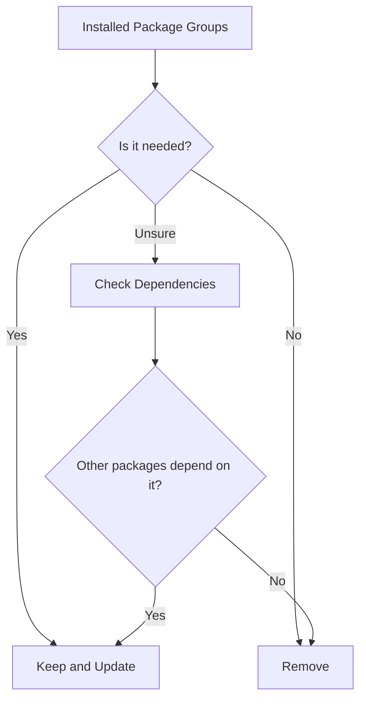

# How to Remove Unnecessary Packages to Reduce the Attack Surface on RHEL 9

Author: [nawazdhandala](https://www.github.com/nawazdhandala)

Tags: RHEL, Security, Packages, Attack Surface, Linux

Description: Learn how to identify and remove unnecessary packages on RHEL 9 to minimize the attack surface, following the principle of least functionality.

---

Every package installed on your server is a potential attack vector. Each one brings its own set of binaries, libraries, configuration files, and possible vulnerabilities. The principle of least functionality says that a system should only have the software it needs to do its job, nothing more. On RHEL 9, following this principle is straightforward but requires some careful thought.

## Start with a Minimal Install

The easiest way to reduce your attack surface is to start small. During RHEL 9 installation, always pick the "Minimal Install" base environment. This gives you a functional system with about 300-400 packages, compared to over 1,500 with a "Server with GUI" installation.

```bash
# Check how many packages are installed
rpm -qa | wc -l

# On a minimal install, you should see roughly 300-450
```

## Identify What You Do Not Need

### List all installed packages grouped by purpose

```bash
# Show installed groups
dnf group list --installed

# Show all installed packages sorted alphabetically
dnf list installed | sort
```

### Common packages that should be removed from servers

```bash
# GUI-related packages (should never be on a headless server)
dnf remove -y xorg-x11* gtk2* gtk3*

# Wireless networking tools (useless on servers)
dnf remove -y iwl* wireless-tools wpa_supplicant

# Bluetooth packages
dnf remove -y bluez*

# Printing services
dnf remove -y cups*

# Audio packages
dnf remove -y alsa* pulseaudio*
```

## Audit Installed Services

Some packages install services that listen on network ports. These are the highest-risk items:

```bash
# Find packages that own listening services
ss -tlnp | awk '{print $4, $6}' | sort

# Cross-reference with RPM to find the owning package
rpm -qf /usr/sbin/some-binary
```

### Services commonly removed from production servers

```bash
# Avahi (mDNS/DNS-SD) - not needed on servers
dnf remove -y avahi avahi-libs

# ABRT (automatic bug reporting) - sends data externally
dnf remove -y abrt*

# Sendmail (if you use postfix or no local MTA)
dnf remove -y sendmail*

# NFS client utilities (if not using NFS)
dnf remove -y nfs-utils

# Telnet client (use SSH instead)
dnf remove -y telnet
```

## Using dnf to Find Weak Dependencies

RHEL 9's dnf has a concept of weak dependencies. These are packages that were pulled in as recommendations but are not strictly required:

```bash
# Show packages installed as weak dependencies
dnf repoquery --installed --extras

# List packages that were installed as dependencies but
# whose parent package has been removed
dnf autoremove --assumeno
```

## Clean Up Orphaned Dependencies

When you remove a package, its dependencies might still be hanging around:

```bash
# Preview what autoremove would clean up
dnf autoremove --assumeno

# If the list looks safe, go ahead
dnf autoremove -y
```

Always review the list before confirming. Autoremove can occasionally flag packages that something else depends on indirectly.

## Package Groups to Evaluate



### Check for development tools

Development tools should never be on production servers. Compilers make it easy for attackers to build exploits locally:

```bash
# Check if development tools are installed
dnf group list --installed | grep -i devel

# Remove development tools
dnf group remove -y "Development Tools" 2>/dev/null

# Specifically remove compilers
dnf remove -y gcc gcc-c++ make automake autoconf
```

### Check for documentation packages

On a minimal production server, man pages and documentation packages waste space:

```bash
# Configure dnf to skip documentation in future installs
echo "tsflags=nodocs" >> /etc/dnf/dnf.conf
```

## Create an Allowlist of Required Packages

Rather than chasing down what to remove, a better approach for large environments is to define what should be present:

```bash
# Export your current package list
rpm -qa --qf '%{NAME}\n' | sort > /tmp/current-packages.txt

# Create your approved baseline list
cat > /tmp/approved-packages.txt << 'EOF'
basesystem
bash
coreutils
dnf
firewalld
grub2
kernel
openssh-server
openssl
rsyslog
sudo
systemd
vim-minimal
EOF

# Find packages not in your approved list
comm -23 /tmp/current-packages.txt /tmp/approved-packages.txt > /tmp/review-these.txt
```

This gives you a list of packages that deserve a closer look. Not all of them should be removed, but each one should have a justification for being there.

## Preventing Unwanted Packages from Being Installed

After cleaning up, prevent new unnecessary packages from creeping back in:

```bash
# Exclude specific packages from being installed via dnf
echo "excludepkgs=cups*,avahi*,bluetooth*" >> /etc/dnf/dnf.conf

# Or use the installonlypkgs directive to limit kernel versions kept
echo "installonly_limit=3" >> /etc/dnf/dnf.conf
```

## Verify No Unexpected Network Listeners Remain

After removing packages, confirm that no unexpected services are listening:

```bash
# Show all listening TCP and UDP ports
ss -tulnp

# Expected output on a hardened server should only show
# SSH (port 22) and maybe a monitoring agent
```

## Document Your Decisions

For each package you choose to keep or remove, document why. This is especially important in regulated environments where auditors will ask for justification:

```bash
# Create a simple documentation file
cat > /root/package-decisions.txt << 'EOF'
Package: nfs-utils
Decision: Removed
Reason: Server does not use NFS mounts

Package: postfix
Decision: Kept
Reason: Required for local mail delivery of cron job output
EOF
```

## Automate Package Auditing

Set up a periodic check that alerts you when new packages appear:

```bash
# Save the current package list as a baseline
rpm -qa --qf '%{NAME}-%{VERSION}\n' | sort > /root/package-baseline.txt

# Create a cron job to detect changes
cat > /etc/cron.daily/package-audit << 'SCRIPT'
#!/bin/bash
rpm -qa --qf '%{NAME}-%{VERSION}\n' | sort > /tmp/current-pkgs.txt
diff /root/package-baseline.txt /tmp/current-pkgs.txt > /tmp/pkg-changes.txt
if [ -s /tmp/pkg-changes.txt ]; then
    mail -s "Package changes detected on $(hostname)" root < /tmp/pkg-changes.txt
fi
SCRIPT
chmod +x /etc/cron.daily/package-audit
```

Reducing the attack surface is not glamorous work, but it is one of the most effective security measures you can take. Every package you remove is one less thing to patch, one less potential vulnerability, and one less item for an attacker to exploit. Start minimal, stay minimal, and document everything.
