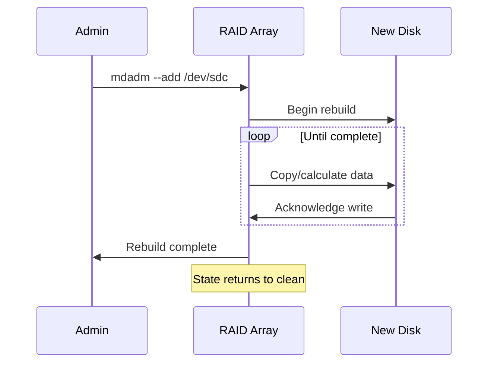

# How to Replace a Failed Drive in an mdadm RAID Array on RHEL

Author: [nawazdhandala](https://www.github.com/nawazdhandala)

Tags: RHEL, RAID, Mdadm, Recovery, Linux

Description: A practical walkthrough for identifying and replacing a failed drive in an mdadm RAID array on RHEL, covering detection, removal, physical swap, and rebuild.

---

## Recognizing a Failed Disk

Disk failures are a matter of when, not if. When a drive fails in an mdadm array, the array goes into a "degraded" state but continues serving data (assuming RAID 1, 5, 6, or 10). Your job is to replace the dead disk before another one fails.

Signs of a failed disk:
- `cat /proc/mdstat` shows `[U_]` or similar (underscores indicate missing disks)
- mdadm sends an email alert (if monitoring is configured)
- System logs show I/O errors on specific devices

## Step 1 - Identify the Failed Disk

```bash
# Check overall array status
cat /proc/mdstat

# Get detailed info including which disk failed
sudo mdadm --detail /dev/md5
```

In the output, look for disks marked as "faulty" or "removed." Note the device name (e.g., /dev/sdc) and the serial number if you need to identify the physical drive.

```bash
# Get the serial number of the failed disk (if it is still visible)
sudo smartctl -i /dev/sdc | grep "Serial Number"

# Alternative: use lsblk to map device to physical slot
lsblk -o NAME,SIZE,SERIAL,HCTL
```

## Step 2 - Remove the Failed Disk from the Array

If the disk has not already been removed automatically:

```bash
# Mark the disk as failed (if not already)
sudo mdadm --manage /dev/md5 --fail /dev/sdc

# Remove it from the array
sudo mdadm --manage /dev/md5 --remove /dev/sdc
```

Verify the removal:

```bash
# The failed disk should no longer appear in the array
sudo mdadm --detail /dev/md5
```

## Step 3 - Physically Replace the Disk

This is the part where you actually swap hardware. Depending on your server:

- **Hot-swap bays**: Pull the failed drive and insert the new one. The kernel should detect the new disk automatically.
- **No hot-swap**: You will need to shut down or use the SCSI rescan method.

For hot-plug detection:

```bash
# Rescan the SCSI bus to detect the new disk
echo "- - -" | sudo tee /sys/class/scsi_host/host0/scan

# Verify the new disk appears
lsblk
```

## Step 4 - Prepare the Replacement Disk

```bash
# Clear any existing signatures on the new disk
sudo wipefs -a /dev/sdc
```

## Step 5 - Add the New Disk to the Array

```bash
# Add the replacement disk to the array
sudo mdadm --manage /dev/md5 --add /dev/sdc
```

The rebuild starts immediately. Monitor progress:

```bash
# Watch the rebuild
watch cat /proc/mdstat
```

You will see something like:

```bash
md5 : active raid5 sdc[3] sdd[2] sdb[0]
      2093056 blocks super 1.2 level 5, 512k chunk, algorithm 2 [3/2] [U_U]
      [=>...................]  recovery = 8.2% (86016/1046528) finish=2.3min speed=86016K/sec
```

## The Rebuild Process



## Step 6 - Verify the Rebuild Completed

```bash
# Confirm the array is healthy again
sudo mdadm --detail /dev/md5 | grep -E "State|Devices"
```

The state should show "clean" and all devices should show as active.

## Step 7 - Update the Configuration

After replacing a disk, update the saved config:

```bash
# Refresh the mdadm configuration
sudo sed -i '/^ARRAY/d' /etc/mdadm.conf
sudo mdadm --detail --scan | sudo tee -a /etc/mdadm.conf

# Rebuild initramfs
sudo dracut --regenerate-all --force
```

## Speeding Up the Rebuild

By default, RHEL limits rebuild speed to avoid impacting regular I/O. For faster rebuilds (at the cost of application performance):

```bash
# Set minimum rebuild speed to 100 MB/s
echo 100000 | sudo tee /proc/sys/dev/raid/speed_limit_min

# Set maximum rebuild speed to 500 MB/s
echo 500000 | sudo tee /proc/sys/dev/raid/speed_limit_max
```

To make this permanent, add to /etc/sysctl.conf:

```bash
echo "dev.raid.speed_limit_min = 100000" | sudo tee -a /etc/sysctl.conf
echo "dev.raid.speed_limit_max = 500000" | sudo tee -a /etc/sysctl.conf
```

## Replacing a Disk in a RAID 1 Array

The process is identical for RAID 1:

```bash
sudo mdadm --manage /dev/md1 --fail /dev/sdc
sudo mdadm --manage /dev/md1 --remove /dev/sdc
# ... physically swap the disk ...
sudo wipefs -a /dev/sdc
sudo mdadm --manage /dev/md1 --add /dev/sdc
```

## Common Pitfalls

1. **Wrong disk size**: The replacement disk must be at least as large as the original. mdadm will refuse to add a smaller disk.
2. **Forgetting to update mdadm.conf**: The array may not assemble correctly on reboot.
3. **Not checking SMART data**: Before adding the replacement, verify it is healthy: `sudo smartctl -H /dev/sdc`
4. **Pulling the wrong disk**: Always double-check the serial number before physically removing a drive.

## Wrap-Up

Replacing a failed disk in an mdadm array is straightforward: fail, remove, swap, wipe, add. The array handles the rest. The key is to act promptly, because a degraded array cannot survive another failure (for RAID 5) or may have reduced tolerance (for RAID 6 and RAID 10). Set up monitoring and alerting so you know the moment a disk goes bad.
