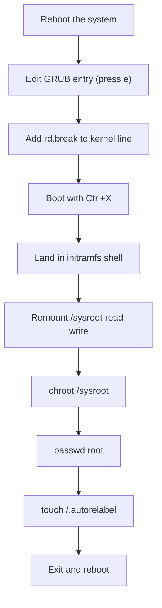

# How to Reset the Root Password Using GRUB2 on RHEL

Author: [nawazdhandala](https://www.github.com/nawazdhandala)

Tags: RHEL, Root Password, GRUB2, Recovery, Linux

Description: A step-by-step guide to resetting a forgotten root password on RHEL by editing GRUB2 boot parameters and using the rd.break method.

---

## When You Need to Reset the Root Password

Forgetting the root password happens. Maybe you inherited a server from a colleague who left, or maybe the password was set during installation and never documented. Whatever the reason, RHEL provides a supported method to reset it through the GRUB2 boot loader.

This process requires physical or console access to the server (via iLO, iDRAC, IPMI, or similar). You cannot do this remotely through SSH.

## The rd.break Method

The recommended approach on RHEL is to interrupt the boot process using `rd.break`, which drops you into the initramfs before the root filesystem is fully mounted. From there, you can remount the filesystem and change the password.



## Step-by-Step Process

### Step 1: Reboot and Edit the GRUB Entry

Reboot the server. When the GRUB menu appears, highlight the default kernel entry and press `e` to edit.

### Step 2: Add rd.break to the Kernel Line

Find the line that starts with `linux` or `linuxefi`. Move to the end of that line and add `rd.break`.

```bash
linuxefi /vmlinuz-5.14.0-362.el9.x86_64 root=/dev/mapper/rhel-root ro crashkernel=256M ... rd.break
```

Also remove `rhgb` and `quiet` if present, so you can see what is happening during boot.

Press `Ctrl+X` or `F10` to boot with the modified parameters.

### Step 3: Remount /sysroot Read-Write

You will land at a `switch_root:/#` prompt. The actual root filesystem is mounted at `/sysroot` but in read-only mode. Remount it:

```bash
# Remount the root filesystem as read-write
mount -o remount,rw /sysroot
```

### Step 4: Chroot into the System

```bash
# Change root to the actual system
chroot /sysroot
```

### Step 5: Set the New Root Password

```bash
# Change the root password
passwd root
# Enter and confirm the new password
```

### Step 6: Handle SELinux Relabeling

Since you changed a file (the shadow password file) without SELinux context, you need to trigger a relabel on the next boot.

```bash
# Create the autorelabel trigger file
touch /.autorelabel
```

This tells SELinux to relabel the entire filesystem on the next boot. The relabeling process takes a few minutes depending on the number of files on your system.

### Step 7: Exit and Reboot

```bash
# Exit the chroot
exit

# Exit the initramfs shell
exit
```

The system will reboot. It will take extra time on the first boot because of the SELinux relabeling. Do not interrupt this process.

### Step 8: Verify

Once the system boots normally, log in with the new root password.

```bash
# Test the new password
ssh root@your-server
```

## Important Notes

### GRUB Password Protection

If GRUB2 is password-protected, you will need the GRUB password before you can edit boot entries. Without it, you cannot use this method and will need to boot from installation media instead.

### Encrypted Root Filesystem

If the root filesystem uses LUKS encryption, you will be prompted for the LUKS passphrase during the `rd.break` boot. You need both the LUKS passphrase and console access.

### SELinux Relabeling Time

The `/.autorelabel` step is critical. Without it, you will not be able to log in with the new password because SELinux will block access to the shadow file with the wrong security context. The relabeling can take anywhere from 1-15 minutes depending on filesystem size.

### Physical Security Implications

The fact that anyone with console access can reset the root password is a security consideration. To mitigate this:

- Password-protect the GRUB boot loader
- Use UEFI Secure Boot
- Set a BIOS/UEFI password
- Use full disk encryption (LUKS)
- Restrict physical and console access

## Alternative: Using Installation Media

If you cannot access the GRUB menu (for example, if GRUB itself is broken or password-protected), boot from RHEL installation media:

1. Boot from the RHEL DVD/USB
2. Select **Troubleshooting > Rescue a Red Hat Enterprise Linux system**
3. Let it mount your installation under `/mnt/sysimage`
4. Chroot into the system:

```bash
chroot /mnt/sysimage
passwd root
touch /.autorelabel
exit
reboot
```

## Wrapping Up

Resetting the root password on RHEL takes about five minutes once you know the process. The key steps are: edit the GRUB entry to add `rd.break`, remount `/sysroot` as read-write, chroot in, change the password, touch `/.autorelabel`, and reboot. The most common mistake people make is forgetting the `/.autorelabel` step, which leads to the new password not working because of SELinux context mismatches. Follow the steps in order and you will be fine.
