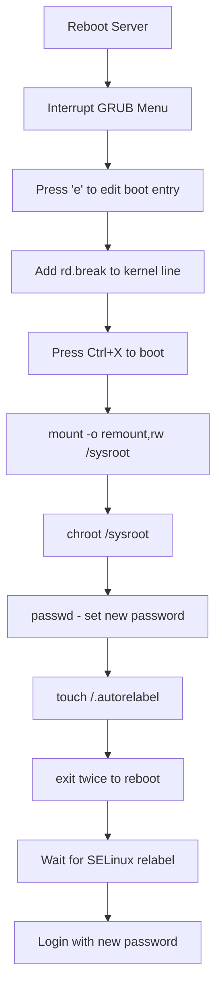

# How to Reset the Root Password on RHEL When Locked Out

Author: [nawazdhandala](https://www.github.com/nawazdhandala)

Tags: RHEL, Root Password, Password Reset, Linux, Security

Description: Step-by-step instructions for resetting a forgotten root password on RHEL using the GRUB bootloader, rd.break, and chroot, including SELinux relabeling.

---

## When You Need This

You have been there. A server that was set up months ago, the root password was documented "somewhere," and now nobody can find it. Or maybe you inherited a system and the previous admin did not leave credentials behind. Whatever the reason, you need physical console access (or virtual console access for VMs) and about 10 minutes.

This procedure works on RHEL with default configurations. It requires access to the GRUB boot menu, which means you need physical access, a KVM connection, or virtual machine console access. You cannot do this over SSH.

## Before You Start

A few important notes:

- This requires a server reboot, so plan for downtime.
- If the disk is encrypted with LUKS, you will need the LUKS passphrase. This guide does not cover disk encryption recovery.
- SELinux is enabled by default on RHEL. You must relabel the file system after changing the password, otherwise SELinux will prevent login with the new password.
- If your organization has compliance requirements, document that you performed this procedure and why.

## Step-by-Step Password Reset

### Step 1: Reboot and Access GRUB

Reboot the server and watch the console. When the GRUB boot menu appears, press any key to stop the countdown timer.

If GRUB appears very briefly or not at all, try pressing `Esc` or holding `Shift` during the BIOS/UEFI phase to interrupt the boot process.

### Step 2: Edit the Boot Entry

With the GRUB menu visible:

1. Select the default boot entry (usually the first one).
2. Press `e` to edit the boot parameters.

You will see the GRUB configuration for that entry, including lines starting with `linux` or `linuxefi`.

### Step 3: Add rd.break to the Kernel Line

Find the line that starts with `linux` (or `linuxefi` on UEFI systems). It will look something like:

```bash
linuxefi /vmlinuz-5.14.0-... root=/dev/mapper/rhel-root ro ...
```

Move your cursor to the end of this line and add `rd.break`.

```bash
linuxefi /vmlinuz-5.14.0-... root=/dev/mapper/rhel-root ro ... rd.break
```

The `rd.break` parameter tells the system to stop the boot process early, right after the initial RAM disk (initramfs) has loaded but before the real root file system is mounted in its final location.

Press `Ctrl+X` to boot with these modified parameters.

### Step 4: Remount the File System as Read-Write

You will land at a minimal shell prompt that looks like:

```bash
switch_root:/#
```

At this point, the actual root file system is mounted read-only at `/sysroot`. You need to remount it as read-write.

```bash
# Remount the real root file system as read-write
mount -o remount,rw /sysroot
```

### Step 5: Enter the chroot Environment

Change into the real root file system so you can work with it as if the system had booted normally.

```bash
# Change root into the real file system
chroot /sysroot
```

Your prompt will change, and you are now effectively "inside" the installed system.

### Step 6: Set the New Root Password

```bash
# Set a new root password
passwd
```

You will be prompted to enter the new password twice. Choose something strong and document it properly this time.

### Step 7: Trigger SELinux Relabeling

This is the step people most often forget, and it causes the most confusion. Because you changed a file (`/etc/shadow`) outside of the normal SELinux context, the security labels on the file are wrong. Without relabeling, SELinux will block login attempts with the new password.

```bash
# Create a hidden file that triggers a full SELinux relabel on next boot
touch /.autorelabel
```

This tells the system to relabel the entire file system on the next boot. The relabel process takes a few minutes depending on how many files are on the system.

### Step 8: Exit and Reboot

```bash
# Exit the chroot environment
exit

# Exit the initramfs shell, which triggers a reboot
exit
```

The system will reboot. During the boot process, you will see SELinux relabeling all files. This is normal and can take 5-15 minutes on a system with many files. Do not interrupt it.

## The Complete Process at a Glance



## After the Reset

Once the system is back up and SELinux relabeling is complete, log in with the new root password to verify it works.

```bash
# Test the new password by switching to root
su - root

# Verify SELinux is enforcing and the system is healthy
getenforce

# Check that no SELinux denials are logged
ausearch -m AVC -ts recent
```

## Troubleshooting

### Login Still Fails After Password Reset

If you can set the password but still cannot log in, the most common cause is a missing SELinux relabel. Boot into the `rd.break` environment again and repeat steps 4-8, making sure you run `touch /.autorelabel`.

Alternatively, you can manually fix just the `/etc/shadow` file context without a full relabel:

```bash
# After chroot into /sysroot
passwd
restorecon -v /etc/shadow
```

Using `restorecon` is faster than a full relabel because it only fixes the one file.

### GRUB Is Password-Protected

If GRUB has a password set (which is a good security practice), you will need the GRUB password to edit boot entries. If you have lost that too, you will need to boot from RHEL installation media and use rescue mode instead.

### The System Uses LUKS Encryption

If the root file system is encrypted, you will be prompted for the LUKS passphrase before reaching the `rd.break` shell. Without this passphrase, you cannot access the file system at all.

### The System Boots Too Fast to See GRUB

On some virtual machines, the GRUB timeout is set to 0 seconds. You can try:

- Sending `Esc` key through the virtual console quickly
- Editing the VM settings to add a boot delay
- Booting from the RHEL installation ISO and choosing rescue mode

## Alternative Method: Rescue Mode from Installation Media

If the GRUB method does not work for your situation, you can boot from the RHEL installation ISO.

1. Boot from the RHEL ISO
2. Select **Troubleshooting** from the boot menu
3. Select **Rescue a Red Hat Enterprise Linux system**
4. The rescue environment will find and mount your installed system at `/mnt/sysimage`
5. Run `chroot /mnt/sysimage`
6. Run `passwd` to change the root password
7. Run `touch /.autorelabel`
8. Exit and reboot, removing the ISO

## Security Considerations

This procedure highlights why physical security matters:

- Anyone with physical console access can reset the root password.
- To mitigate this, consider: setting a GRUB password, encrypting the root file system with LUKS, and restricting physical/virtual console access.
- If you suspect unauthorized password changes, check the system logs after boot for any signs of tampering.

```bash
# Check authentication logs for suspicious activity
journalctl -u sshd --since "24 hours ago"

# Look for recent password changes
ausearch -m USER_CHNG -ts recent
```

## Summary

Resetting the root password on RHEL is a straightforward process: interrupt GRUB, add `rd.break`, remount the file system, change the password, and trigger an SELinux relabel. The most critical step that people forget is `touch /.autorelabel`. Without it, SELinux will block the new password from working. Always document password changes, keep credentials in a proper secrets manager, and consider GRUB passwords and disk encryption to prevent unauthorized resets.
