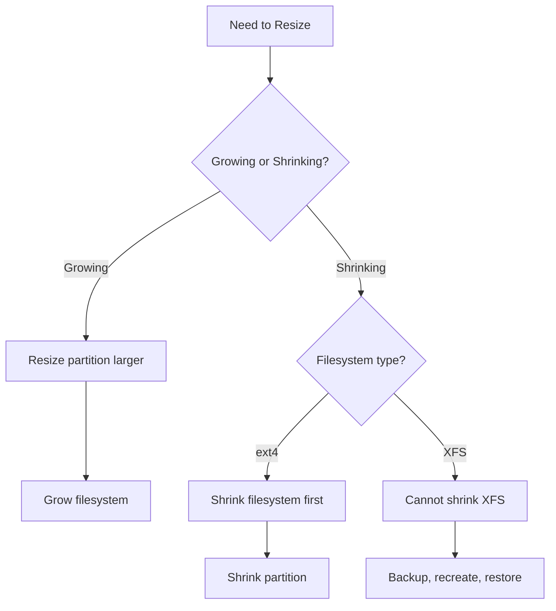

# How to Resize Partitions with parted on RHEL Without Data Loss

Author: [nawazdhandala](https://www.github.com/nawazdhandala)

Tags: RHEL, parted, Resize, Partitioning, Linux

Description: Learn how to safely resize partitions using parted on RHEL, covering both growing and shrinking operations while preserving your data.

---

## Understanding Partition Resizing

Resizing a partition involves two distinct steps: changing the partition boundary and then resizing the filesystem inside it. These are separate operations, and getting the order wrong can destroy data.

- **Growing**: Extend the partition first, then grow the filesystem
- **Shrinking**: Shrink the filesystem first, then reduce the partition

XFS does not support shrinking, so if you need to shrink an XFS partition, you must back up, recreate, and restore.

## Prerequisites

- RHEL with root access
- A backup of the partition you are resizing
- The partition must not be the currently running root filesystem (unless you are only growing)

## Growing a Partition

This is the safer and more common operation.

### Step 1 - Check Current Layout

```bash
# See the current partition table and free space
sudo parted /dev/sdb print free

# Check filesystem usage
df -h /mnt/data
```

### Step 2 - Unmount the Partition

For safety, unmount the partition before resizing. Growing XFS can be done online, but the partition itself should be resized while unmounted.

```bash
# Unmount the partition
sudo umount /mnt/data
```

### Step 3 - Resize the Partition with parted

```bash
# Resize partition 1 to use all available space
sudo parted /dev/sdb resizepart 1 100%

# Or resize to a specific size
sudo parted /dev/sdb resizepart 1 200GiB
```

parted will ask for confirmation if the partition contains a recognized filesystem.

### Step 4 - Grow the Filesystem

For XFS:

```bash
# Mount the partition first (XFS grows online)
sudo mount /dev/sdb1 /mnt/data

# Grow XFS to fill the partition
sudo xfs_growfs /mnt/data
```

For ext4:

```bash
# ext4 can be grown while unmounted or mounted
sudo resize2fs /dev/sdb1

# Then mount if it was unmounted
sudo mount /dev/sdb1 /mnt/data
```

### Step 5 - Verify

```bash
# Check the new size
df -h /mnt/data
lsblk /dev/sdb
```

## Shrinking a Partition (ext4 Only)

XFS cannot be shrunk. If you use ext4, shrinking is possible but requires care.

### Step 1 - Unmount

```bash
# Unmount the partition
sudo umount /mnt/data
```

### Step 2 - Check the Filesystem

```bash
# Run filesystem check (required before shrinking)
sudo e2fsck -f /dev/sdb1
```

### Step 3 - Shrink the Filesystem First

```bash
# Shrink the ext4 filesystem to 50 GB
sudo resize2fs /dev/sdb1 50G
```

### Step 4 - Shrink the Partition

```bash
# Now shrink the partition to match
# The partition must be at least as large as the filesystem
sudo parted /dev/sdb resizepart 1 50GiB
```

### Step 5 - Mount and Verify

```bash
# Mount and check
sudo mount /dev/sdb1 /mnt/data
df -h /mnt/data
```

## The Resize Workflow



## Growing the Last Partition on a Disk

This is the simplest case. If your partition is the last one on the disk and you have added physical space (expanded a virtual disk, for example):

```bash
# Rescan for the new disk size (for virtual disks)
echo 1 | sudo tee /sys/class/block/sdb/device/rescan

# Verify the new size
lsblk /dev/sdb

# Fix the GPT backup header (required after disk expansion)
sudo parted /dev/sdb print
# parted will offer to fix the GPT header - accept

# Grow the last partition
sudo parted /dev/sdb resizepart 3 100%

# Grow the filesystem
sudo xfs_growfs /mnt/data
```

## Growing a Partition That Is Not the Last One

This is trickier because you cannot extend a partition into space occupied by the next partition. Your options are:

1. Delete the next partition (if empty), resize, then recreate
2. Use LVM instead, which allows flexible volume management
3. Create a new partition in the free space and use it separately

## Safety Tips

1. **Always back up** before shrinking. Growing is much safer than shrinking.
2. **Check filesystems** with fsck before shrinking ext4.
3. **Never shrink a partition smaller than its filesystem**. This will corrupt data.
4. **Use exact sizes** when shrinking. Leave a small margin to be safe.
5. **Test mounts** after resizing to confirm everything works.

## Wrap-Up

Resizing partitions with parted on RHEL is straightforward for growing operations. Shrinking is more involved and only works with ext4 (not XFS). The golden rule is: when growing, resize the partition first then the filesystem. When shrinking, resize the filesystem first then the partition. And always have a backup before you start.
