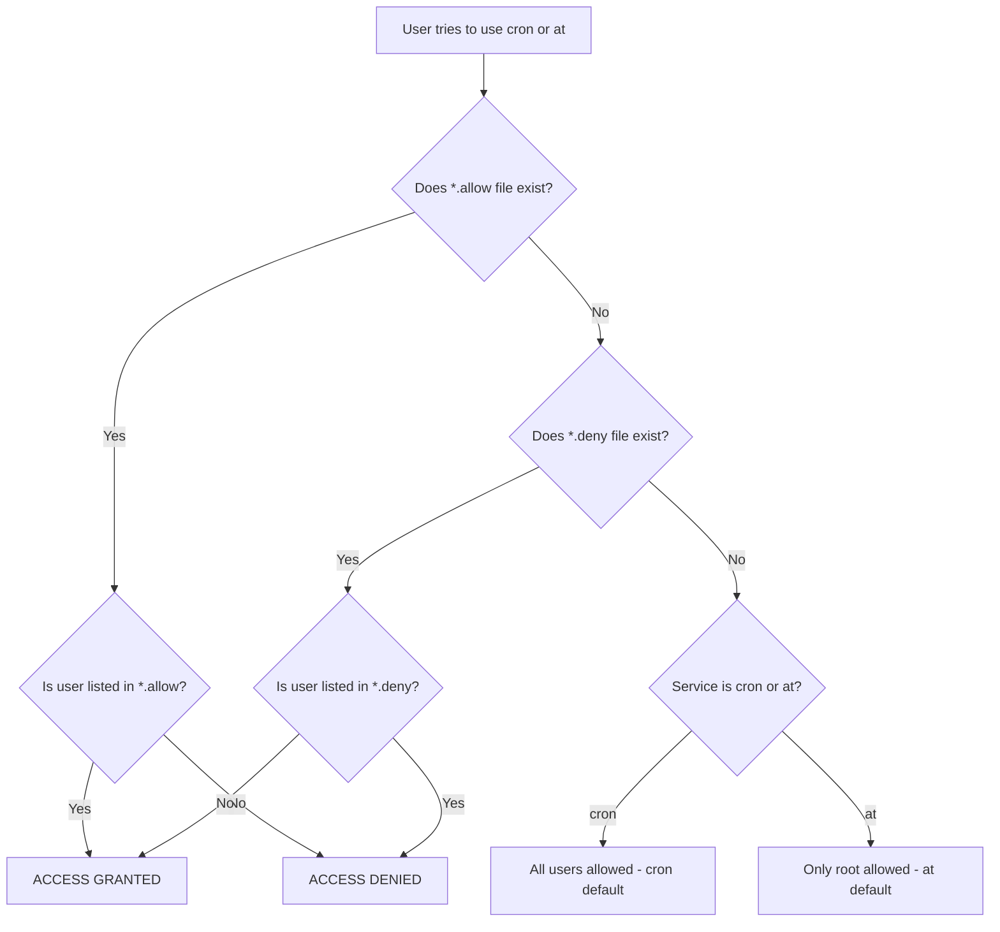

# How to Restrict Cron and At Access to Specific Users on RHEL

Author: [nawazdhandala](https://www.github.com/nawazdhandala)

Tags: RHEL, Cron, At, Access Control, Security, Linux

Description: Learn how to control which users can schedule cron and at jobs on RHEL using cron.allow, cron.deny, at.allow, and at.deny files, with clear precedence rules and practical examples.

---

## Why Restrict Scheduling Access?

On a shared RHEL system, every user can schedule cron and at jobs by default. That might sound harmless, but it creates real problems. Users can schedule resource-heavy tasks during peak hours, fill up disk with log output, or accidentally create fork bombs with badly written scripts. On production servers, you should control who can schedule jobs, period.

RHEL gives you fine-grained control over this through four simple files. Let us walk through exactly how they work.

## The Access Control Files

There are two pairs of files that control access:

**For cron:**
- `/etc/cron.allow` - whitelist of users who CAN use cron
- `/etc/cron.deny` - blacklist of users who CANNOT use cron

**For at:**
- `/etc/at.allow` - whitelist of users who CAN use at
- `/etc/at.deny` - blacklist of users who CANNOT use at

## Precedence Rules

The precedence logic is identical for both cron and at. Understanding this is critical because it is not purely intuitive.



The key points:

1. If the `.allow` file exists, **only** users listed in it can use the service. The `.deny` file is completely ignored.
2. If the `.allow` file does not exist but the `.deny` file does, everyone except the listed users can use the service.
3. If neither file exists, the behavior differs: all users can use cron, but only root can use at.
4. Root can always use both services regardless of what is in these files.

## Default State on RHEL

On a fresh RHEL installation, check what exists by default.

```bash
# Check which access control files exist
ls -la /etc/cron.allow /etc/cron.deny /etc/at.allow /etc/at.deny 2>&1
```

Typically on RHEL, you will find an empty `/etc/cron.deny` and an empty `/etc/at.deny`. This means all users can use both cron and at by default (since the deny files exist but are empty, nobody is denied).

## Setting Up Cron Access Control

### Approach 1: Allow Only Specific Users (Recommended for Production)

This is the most secure approach. Create `/etc/cron.allow` with just the users who need cron access.

```bash
# Create cron.allow with authorized users only
# One username per line
sudo tee /etc/cron.allow > /dev/null <<'EOF'
root
admin
deploy
monitoring
EOF

# Set proper ownership and permissions
sudo chown root:root /etc/cron.allow
sudo chmod 644 /etc/cron.allow
```

Once this file exists, nobody else can use `crontab`. They will get an error like:

```bash
You (someuser) are not allowed to use this program (crontab)
```

### Approach 2: Block Specific Users

If most users need cron and you just want to block a few, remove `/etc/cron.allow` (if it exists) and use `/etc/cron.deny`.

```bash
# Remove the allow file if it exists (deny won't work otherwise)
sudo rm -f /etc/cron.allow

# Add users to deny
sudo tee /etc/cron.deny > /dev/null <<'EOF'
tempuser
contractor
intern01
EOF

sudo chown root:root /etc/cron.deny
sudo chmod 644 /etc/cron.deny
```

## Setting Up At Access Control

The setup for `at` follows the exact same pattern.

```bash
# Allow only specific users to use at
sudo tee /etc/at.allow > /dev/null <<'EOF'
root
admin
deploy
EOF

sudo chown root:root /etc/at.allow
sudo chmod 644 /etc/at.allow
```

Or to deny specific users:

```bash
# Block specific users from at
sudo rm -f /etc/at.allow

sudo tee /etc/at.deny > /dev/null <<'EOF'
tempuser
contractor
EOF

sudo chown root:root /etc/at.deny
sudo chmod 644 /etc/at.deny
```

## Testing Access Control

After setting up the files, verify they work as expected.

```bash
# Test as a regular user (switch to a test user first)
sudo -u testuser crontab -l
```

If the user is denied, you will see:

```bash
You (testuser) are not allowed to use this program (crontab)
See crontab(1) for more information
```

For the at command:

```bash
# Test at access as a specific user
sudo -u testuser bash -c 'echo "test" | at now + 1 minute'
```

A denied user will see:

```bash
You do not have permission to use at.
```

## Managing Users Over Time

As your team changes, you need to keep these files updated.

```bash
# Add a new user to cron.allow
echo "newadmin" | sudo tee -a /etc/cron.allow

# Remove a user from cron.allow (remove the line containing just that username)
sudo sed -i '/^oldadmin$/d' /etc/cron.allow

# Verify the current list
cat /etc/cron.allow
```

When you remove a user's access, their existing crontab is not automatically deleted. You should clean that up manually.

```bash
# Remove an existing crontab for a user who should no longer have access
sudo crontab -r -u oldadmin

# Verify it is gone
sudo crontab -l -u oldadmin
```

## Audit Script

Here is a script that gives you a complete picture of scheduling access on your system.

```bash
#!/bin/bash
# audit-scheduling-access.sh
# Shows who can and cannot use cron and at

echo "========================================="
echo "Scheduling Access Audit - $(date)"
echo "========================================="

echo ""
echo "--- Cron Access ---"
if [ -f /etc/cron.allow ]; then
    echo "Mode: ALLOW LIST (only these users can use cron)"
    echo "Allowed users:"
    while IFS= read -r user; do
        [ -n "$user" ] && echo "  + $user"
    done < /etc/cron.allow
elif [ -f /etc/cron.deny ]; then
    echo "Mode: DENY LIST (all users except these can use cron)"
    if [ -s /etc/cron.deny ]; then
        echo "Denied users:"
        while IFS= read -r user; do
            [ -n "$user" ] && echo "  - $user"
        done < /etc/cron.deny
    else
        echo "  Deny file is empty - all users can use cron"
    fi
else
    echo "Mode: DEFAULT (all users can use cron)"
fi

echo ""
echo "--- At Access ---"
if [ -f /etc/at.allow ]; then
    echo "Mode: ALLOW LIST (only these users can use at)"
    echo "Allowed users:"
    while IFS= read -r user; do
        [ -n "$user" ] && echo "  + $user"
    done < /etc/at.allow
elif [ -f /etc/at.deny ]; then
    echo "Mode: DENY LIST (all users except these can use at)"
    if [ -s /etc/at.deny ]; then
        echo "Denied users:"
        while IFS= read -r user; do
            [ -n "$user" ] && echo "  - $user"
        done < /etc/at.deny
    else
        echo "  Deny file is empty - all users can use at"
    fi
else
    echo "Mode: DEFAULT (only root can use at)"
fi

echo ""
echo "--- Users with existing crontabs ---"
ls /var/spool/cron/ 2>/dev/null | while read -r user; do
    echo "  $user"
done

echo ""
echo "--- Pending at jobs ---"
atq 2>/dev/null || echo "  Could not query at queue"
```

## Common Mistakes to Avoid

**Mistake 1: Having both .allow and .deny files.**
When `.allow` exists, `.deny` is completely ignored. Pick one approach and stick with it. I recommend `.allow` for production systems because it is explicit about who has access.

**Mistake 2: Forgetting to add root to .allow.**
Root can always use cron and at regardless of these files, so technically you do not need to list root. But I always add root to `.allow` files anyway for documentation purposes.

**Mistake 3: Not cleaning up existing crontabs.**
When you remove a user from `.allow` (or add them to `.deny`), their existing crontab still sits in `/var/spool/cron/`. It will not run, but it is good practice to clean it up.

**Mistake 4: Using blank lines or spaces in the files.**
Each line should contain exactly one username with no leading or trailing spaces. Blank lines are usually harmless but can cause confusion.

```bash
# Verify no whitespace issues in your allow files
cat -A /etc/cron.allow
```

The `-A` flag shows invisible characters. Each line should end with just `$` (the newline marker), with no `^I` (tabs) or trailing spaces.

## Security Recommendations

For production RHEL servers, here is what I recommend:

1. Use `.allow` files, not `.deny` files. It is safer to explicitly list who has access than to try to keep up with who should not.
2. Limit cron access to service accounts and administrators. Regular users rarely need cron on a server.
3. Review these files regularly. Add it to your quarterly security review checklist.
4. Combine with proper sudo rules. Even if a user can schedule cron jobs, make sure they cannot escalate privileges through those jobs.

## Summary

Controlling cron and at access on RHEL is straightforward but important. The `.allow` files give you a whitelist approach, the `.deny` files give you a blacklist approach, and the precedence rules are simple: `.allow` always wins over `.deny`. For production systems, I strongly recommend using the `.allow` approach so you have an explicit, auditable list of who can schedule tasks on your servers.
