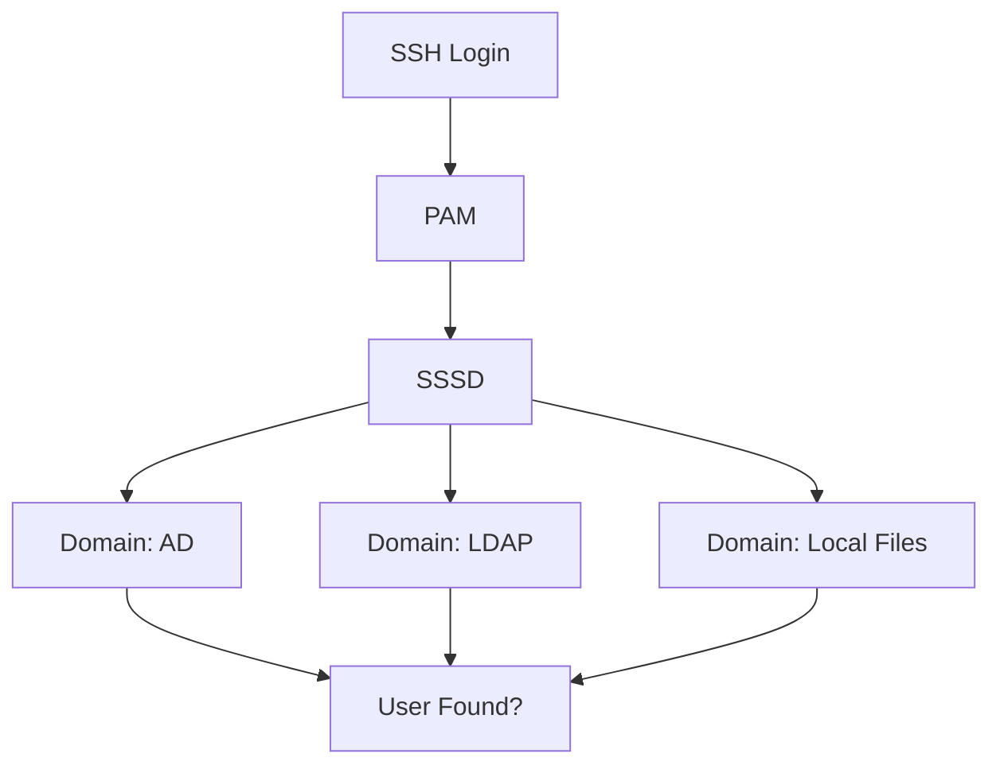
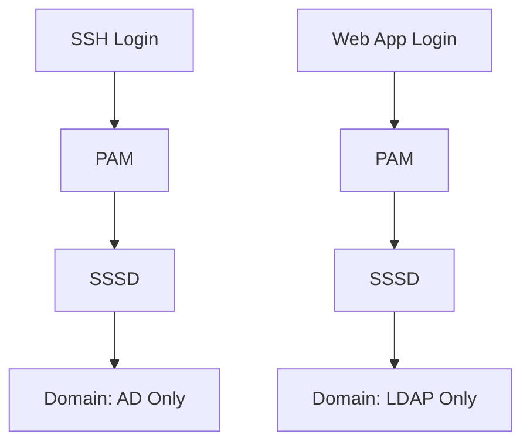

# How to Restrict PAM Services to Specific SSSD Domains on RHEL 9

Author: [nawazdhandala](https://www.github.com/nawazdhandala)

Tags: RHEL, PAM, SSSD, Security, Linux

Description: Configure RHEL 9 to restrict specific PAM services to authenticate against particular SSSD domains, allowing fine-grained control over which identity sources are used for each service.

---

When you have multiple identity sources configured in SSSD, say a local LDAP directory and Active Directory, you might not want every service to authenticate against every domain. Maybe SSH should only allow AD users, while a local application should only use the LDAP directory. SSSD on RHEL 9 lets you map PAM services to specific domains.

## The Problem

By default, when SSSD has multiple domains configured, a PAM authentication request is tried against each domain in order until one succeeds. This means users from any configured domain can authenticate to any PAM service.



What you want instead is targeted routing:



## SSSD Domain Configuration

First, let us look at a typical multi-domain SSSD configuration:

```bash
sudo vi /etc/sssd/sssd.conf
```

```ini
[sssd]
services = nss, pam
domains = ad.example.com, ldap.internal

[domain/ad.example.com]
id_provider = ad
access_provider = ad
ad_domain = ad.example.com
krb5_realm = AD.EXAMPLE.COM
realmd_tags = manages-system joined-with-samba

[domain/ldap.internal]
id_provider = ldap
auth_provider = ldap
ldap_uri = ldaps://ldap.internal.example.com
ldap_search_base = dc=internal,dc=example,dc=com
```

## Using pam_sss_gss or Domain Restrictions

### Method 1: Using the domains option in pam_sss

The `pam_sss.so` module accepts a `domains` parameter that restricts which SSSD domains are queried for that particular PAM stack.

Create a custom PAM configuration for a specific service:

```bash
sudo vi /etc/pam.d/my-web-app
```

```
# Only authenticate against the LDAP domain for this service
auth    required    pam_sss.so domains=ldap.internal
account required    pam_sss.so domains=ldap.internal
password required   pam_sss.so domains=ldap.internal
session required    pam_sss.so domains=ldap.internal
```

For SSH, restrict to the AD domain only:

```bash
sudo vi /etc/pam.d/sshd
```

Modify the relevant lines or create a custom include file:

```
auth       required     pam_sss.so domains=ad.example.com
auth       required     pam_env.so
account    required     pam_sss.so domains=ad.example.com
account    required     pam_nologin.so
password   include      password-auth
session    required     pam_selinux.so close
session    required     pam_loginuid.so
session    required     pam_selinux.so open env_params
session    required     pam_sss.so domains=ad.example.com
```

### Method 2: Using SSSD PAM Responder Configuration

SSSD itself supports mapping PAM services to domains in the `[pam]` section:

```bash
sudo vi /etc/sssd/sssd.conf
```

Add the `pam_allowed_auth_domains` option:

```ini
[sssd]
services = nss, pam
domains = ad.example.com, ldap.internal

[pam]
# Default: allow all domains for all PAM services
pam_allowed_auth_domains = all
```

For per-domain restrictions based on the service name, use the domain-level option:

```ini
[domain/ad.example.com]
id_provider = ad
access_provider = ad
# Only allow this domain to be used by these PAM services
pam_trusted_users = root
pam_public_domains = none

[domain/ldap.internal]
id_provider = ldap
auth_provider = ldap
ldap_uri = ldaps://ldap.internal.example.com
ldap_search_base = dc=internal,dc=example,dc=com
```

### Method 3: Using the access_provider for Domain-Level Control

Each SSSD domain can have its own access provider that controls who can log in:

```ini
[domain/ad.example.com]
id_provider = ad
access_provider = simple
simple_allow_groups = linux-admins, ssh-users
```

This does not restrict which PAM service triggers the lookup, but it does restrict who actually gets through.

## Practical Example: Separate SSH and Console Access

Let us say you want AD users for SSH but local LDAP users for console login.

### Configure SSSD

```ini
[sssd]
services = nss, pam
domains = ad.example.com, ldap.internal

[domain/ad.example.com]
id_provider = ad
access_provider = ad

[domain/ldap.internal]
id_provider = ldap
auth_provider = ldap
ldap_uri = ldaps://ldap.internal.example.com
ldap_search_base = dc=internal,dc=example,dc=com
```

### Configure PAM for SSH (AD only)

Create a drop-in file for the sshd PAM service:

```bash
sudo vi /etc/pam.d/sshd
```

Make sure the auth lines reference only the AD domain:

```
auth    substack    password-auth
auth    required    pam_sss.so domains=ad.example.com
```

### Configure PAM for console login (LDAP only)

```bash
sudo vi /etc/pam.d/login
```

```
auth    substack    password-auth
auth    required    pam_sss.so domains=ldap.internal
```

### Restart SSSD after changes

```bash
sudo systemctl restart sssd

# Clear the SSSD cache to pick up new configuration
sudo sss_cache -E
```

## Testing Domain Restrictions

### Verify SSSD domain configuration

```bash
# Check SSSD status for each domain
sudo sssctl domain-status ad.example.com
sudo sssctl domain-status ldap.internal

# Test user lookup from a specific domain
sudo sssctl user-checks aduser@ad.example.com
sudo sssctl user-checks ldapuser@ldap.internal
```

### Test PAM authentication

```bash
# Install pamtester for testing
sudo dnf install pamtester -y

# Test SSH service with an AD user (should succeed)
pamtester sshd aduser@ad.example.com authenticate

# Test SSH service with an LDAP user (should fail if restricted)
pamtester sshd ldapuser@ldap.internal authenticate
```

## Troubleshooting

### Enable debug logging for SSSD

```bash
sudo vi /etc/sssd/sssd.conf
```

Add debug levels:

```ini
[pam]
debug_level = 7

[domain/ad.example.com]
debug_level = 7
```

```bash
sudo systemctl restart sssd

# Check the PAM responder log
sudo tail -f /var/log/sssd/sssd_pam.log
```

### Common issues

1. **User not found in restricted domain** - Check that the user exists in the specified domain with `id user@domain`.
2. **Domain name mismatch** - The domain name in the `domains=` PAM parameter must exactly match the domain name in `sssd.conf`.
3. **Cache stale data** - Clear the cache with `sudo sss_cache -E` after configuration changes.

## Wrapping Up

Restricting PAM services to specific SSSD domains gives you precise control over which identity sources are used for each type of access. The simplest approach is using the `domains=` parameter in `pam_sss.so`, but for more complex setups, consider combining SSSD's access providers with PAM service-level restrictions. Always test with pamtester before going to production, and keep debug logging handy for troubleshooting.
