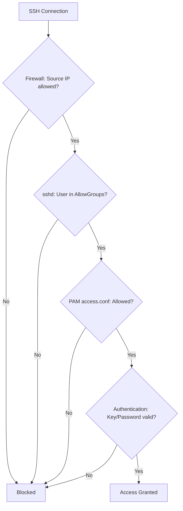

# How to Restrict SSH Access to Specific Users or Groups on RHEL 9

Author: [nawazdhandala](https://www.github.com/nawazdhandala)

Tags: RHEL, SSH, Access Control, Security, Linux

Description: Multiple methods to restrict SSH access on RHEL 9, including sshd directives, PAM access controls, firewall rules, and TCP wrappers for layered security.

---

Restricting who can SSH into a server is fundamental security hygiene. RHEL 9 gives you multiple layers to control this, from SSH configuration directives to PAM modules to firewall rules. Using more than one layer provides defense in depth.

## Layer 1: SSH Configuration Directives

The most direct approach uses AllowUsers and AllowGroups in sshd_config.

```bash
sudo vi /etc/ssh/sshd_config.d/20-access.conf
```

### Allow by group (recommended)

```
AllowGroups sshusers wheel
```

### Allow by username

```
AllowUsers admin jsmith jdoe
```

### Allow by username with source restriction

```
AllowUsers admin jsmith@10.0.0.0/24 deploy@10.0.100.50
```

### Deny specific users

```
DenyUsers nobody apache nginx postgres
DenyGroups nologin
```

```bash
sudo sshd -t && sudo systemctl restart sshd
```

## Layer 2: PAM Access Controls

PAM provides more flexible access control through `pam_access.so`.

### Enable pam_access via authselect

```bash
sudo authselect enable-feature with-pamaccess
```

### Configure access rules

```bash
sudo vi /etc/security/access.conf
```

```
# Allow admin group from anywhere
+ : @admins : ALL

# Allow developers only from the office network
+ : @developers : 10.0.0.0/24

# Allow monitoring from specific IPs
+ : nagios : 10.0.100.50 10.0.100.51

# Deny everyone else
- : ALL : ALL
```

Rules are processed top to bottom. The first match wins.

### Test without locking yourself out

Before adding the final deny-all rule, test that your access works:

```bash
# Temporarily add just the allow rules
echo "+ : @admins : ALL" | sudo tee -a /etc/security/access.conf

# Test SSH access
ssh admin@localhost
```

## Layer 3: Firewall Rules

Restrict SSH at the network level using firewalld:

```bash
# Remove the default SSH service (allows from anywhere)
sudo firewall-cmd --permanent --remove-service=ssh

# Allow SSH only from the management network
sudo firewall-cmd --permanent --add-rich-rule='
    rule family="ipv4"
    source address="10.0.0.0/24"
    service name="ssh"
    accept'

# Allow SSH from a specific IP
sudo firewall-cmd --permanent --add-rich-rule='
    rule family="ipv4"
    source address="10.0.100.50"
    service name="ssh"
    accept'

# Reload
sudo firewall-cmd --reload

# Verify
sudo firewall-cmd --list-all
```

## Layer 4: Match Blocks in SSH Config

Use Match blocks for conditional restrictions:

```bash
sudo vi /etc/ssh/sshd_config.d/20-access.conf
```

```
# Default: deny all
AllowGroups sshusers

# Exception: allow the deploy user only from the CI server
Match Address 10.0.100.50
    AllowUsers deploy

# Allow password auth from the management network
Match Address 10.0.0.0/24
    PasswordAuthentication yes

# Restrict SFTP-only users
Match Group sftponly
    ForceCommand internal-sftp
    ChrootDirectory /data/sftp/%u
    AllowTcpForwarding no
    X11Forwarding no
```

## Combining Layers

For maximum security, use multiple layers:



## Setting Up SFTP-Only Users

For users who only need file transfer access:

```bash
# Create the group
sudo groupadd sftponly

# Add a user
sudo usermod -aG sftponly fileuser

# Set up chroot directory
sudo mkdir -p /data/sftp/fileuser/uploads
sudo chown root:root /data/sftp/fileuser
sudo chmod 755 /data/sftp/fileuser
sudo chown fileuser:sftponly /data/sftp/fileuser/uploads
```

Configure SSH:

```
Match Group sftponly
    ForceCommand internal-sftp
    ChrootDirectory /data/sftp/%u
    AllowTcpForwarding no
    X11Forwarding no
    PermitTunnel no
```

## Auditing Access

### Check who is currently logged in

```bash
who
w
```

### Review SSH access logs

```bash
# Successful logins
sudo grep "Accepted" /var/log/secure | tail -20

# Rejected connections
sudo grep -E "refused|not allowed|denied" /var/log/secure | tail -20
```

## Wrapping Up

Do not rely on a single mechanism to control SSH access. Use AllowGroups in SSH config as the primary control, add PAM access.conf for source-based restrictions, and use firewalld to block traffic before it even reaches SSH. Each layer catches things the others might miss, and an attacker needs to bypass all of them to get in.
