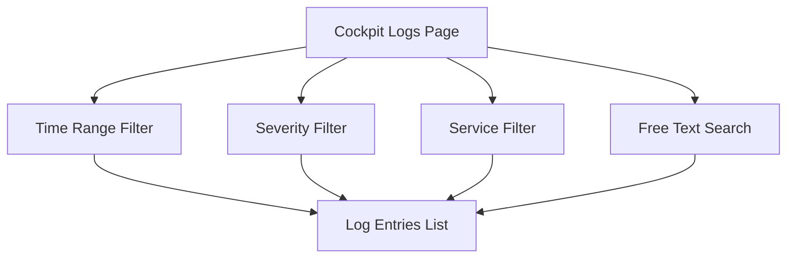
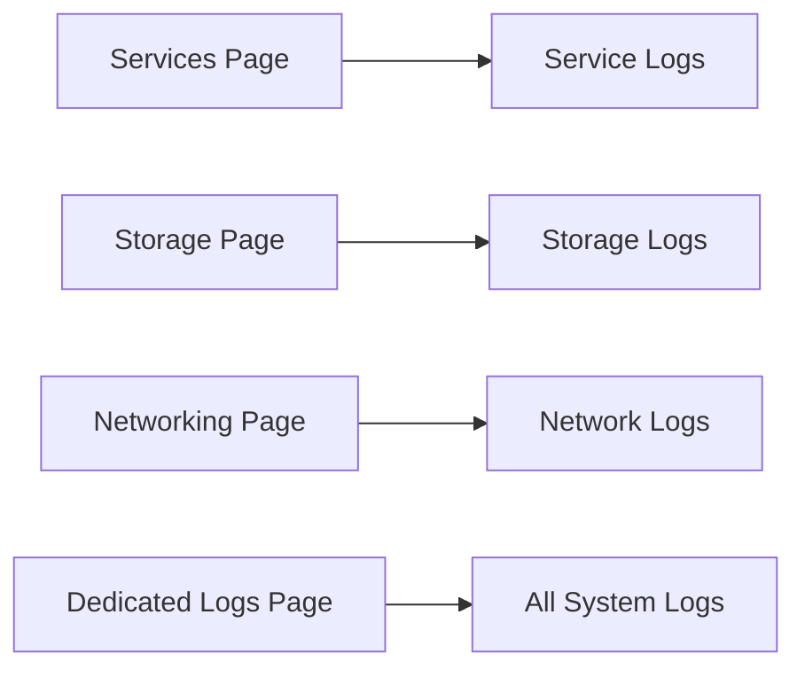

# How to Review and Filter System Logs Using the RHEL Web Console

Author: [nawazdhandala](https://www.github.com/nawazdhandala)

Tags: RHEL, Cockpit, Logs, journald, Linux

Description: Learn how to browse, filter, and analyze system logs through the Cockpit web console on RHEL, using severity levels, time ranges, and service-based filtering.

---

Digging through logs with journalctl is powerful, but sometimes you just want to scan through recent events visually, filter by severity, and click into specific entries for details. Cockpit's log viewer does exactly that. It's a front-end for journald that makes log review faster, especially when you're not sure what you're looking for.

## Accessing the Logs Page

Click "Logs" in Cockpit's sidebar. You'll see a reverse-chronological list of log entries from journald. Each entry shows:

- Timestamp
- Severity level (with color coding)
- Service or unit name
- The log message



## Severity Filtering

The most useful filter is severity. Cockpit lets you filter by standard syslog levels:

- **Emergency** - system is unusable
- **Alert** - action must be taken immediately
- **Critical** - critical conditions
- **Error** - error conditions
- **Warning** - warning conditions
- **Notice** - normal but significant
- **Info** - informational messages
- **Debug** - debug-level messages

Use the dropdown at the top of the logs page to select a minimum severity. Setting it to "Error" shows only errors and above, cutting out all the informational noise.

The journalctl equivalent:

```bash
# Show only error-level messages and above
journalctl -p err --no-pager -n 50

# Show only critical and above
journalctl -p crit --no-pager

# Show warnings and above
journalctl -p warning --no-pager -n 100
```

## Time Range Filtering

Cockpit provides time range options like:

- Current boot
- Previous boot
- Last 24 hours
- Last 7 days

This is handy when you know roughly when an issue occurred.

The CLI equivalents:

```bash
# Logs from the current boot only
journalctl -b --no-pager

# Logs from the previous boot
journalctl -b -1 --no-pager

# Logs from the last 24 hours
journalctl --since "24 hours ago" --no-pager

# Logs from a specific time range
journalctl --since "2026-03-03 14:00" --until "2026-03-03 16:00" --no-pager
```

## Filtering by Service

Click on any log entry to see its full details, including which systemd unit generated it. From there, you can filter to show only logs from that specific service.

Alternatively, use the search or filter options to type a unit name directly.

```bash
# Show logs for a specific service
journalctl -u sshd.service --no-pager -n 50

# Show logs for multiple services
journalctl -u httpd.service -u mariadb.service --no-pager
```

## Free Text Search

The search box at the top of the logs page lets you search for specific text across all log entries. This is the equivalent of piping journalctl through grep:

```bash
# Search for a specific string in all logs
journalctl --no-pager | grep "Failed password"

# Case-insensitive search
journalctl --no-pager | grep -i "out of memory"
```

The Cockpit search updates the list in real time as you type.

## Reading Log Entry Details

Click on any log entry to expand it and see the full metadata:

- The complete message (not truncated)
- The unit or process that generated it
- The PID of the process
- The syslog facility and severity
- Any structured data fields

This is the same information you'd get from:

```bash
# Show full details for a specific message
journalctl -o verbose --no-pager | less
```

## Practical Scenario: Investigating SSH Login Failures

Let's walk through a real use case. You suspect someone has been trying to brute-force SSH on your server.

1. Go to the Cockpit Logs page
2. Set severity to "Warning" or above
3. Search for "sshd" or "Failed password"
4. Set the time range to "Last 24 hours"

You'll see a filtered list of SSH-related warnings and errors. Each entry shows the source IP and username that was tried.

The CLI approach:

```bash
# Find failed SSH login attempts
journalctl -u sshd.service --since "24 hours ago" --no-pager | grep "Failed password"

# Count failures by IP address
journalctl -u sshd.service --since "24 hours ago" --no-pager | grep "Failed password" | awk '{print $(NF-3)}' | sort | uniq -c | sort -rn | head -10
```

## Practical Scenario: Finding Out of Memory Events

When the OOM killer fires, it writes to the kernel log. Here's how to find those events:

1. Set severity to "Warning" or higher
2. Search for "oom" or "Out of memory"
3. Check the time range around when the issue was reported

From the CLI:

```bash
# Find OOM killer events
journalctl -k --no-pager | grep -i "out of memory"

# Get more context around OOM events
journalctl -k --no-pager | grep -B 5 -A 10 "oom-kill"
```

## Practical Scenario: Checking Boot Problems

If your server had issues during the last boot, you can compare logs from the current and previous boots.

1. Set time range to "Previous boot"
2. Set severity to "Error" or above
3. Look for failed services or hardware errors

```bash
# List available boots
journalctl --list-boots

# Show errors from the previous boot
journalctl -b -1 -p err --no-pager
```

## Exporting Logs

Cockpit doesn't have a built-in export button, but you can use the terminal to export filtered logs:

```bash
# Export the last 24 hours of errors to a file
journalctl -p err --since "24 hours ago" --no-pager > /tmp/errors-report.txt

# Export in JSON format for further processing
journalctl -p err --since "24 hours ago" -o json --no-pager > /tmp/errors.json
```

## Configuring Journal Persistence

By default, RHEL stores journals persistently in `/var/log/journal/`. If journals are only in `/run/log/journal/`, they're volatile and lost on reboot.

Ensure persistent storage is configured:

```bash
# Check if persistent storage is in use
ls /var/log/journal/

# If the directory doesn't exist, create it and restart journald
sudo mkdir -p /var/log/journal
sudo systemd-tmpfiles --create --prefix /var/log/journal
sudo systemctl restart systemd-journald
```

## Managing Journal Size

Journals can grow large on busy systems. Control the size with journald configuration:

```bash
# Check current journal disk usage
journalctl --disk-usage

# Set maximum journal size
sudo tee /etc/systemd/journald.conf.d/size.conf << 'EOF'
[Journal]
SystemMaxUse=1G
SystemKeepFree=2G
SystemMaxFileSize=100M
EOF

# Restart journald to apply
sudo systemctl restart systemd-journald

# Manually clean up old journals
sudo journalctl --vacuum-size=500M
```

## Combining Cockpit Logs with Other Pages

One of Cockpit's strengths is that logs are integrated throughout the interface. When you're looking at a service on the Services page, you can see that service's logs right there. Same for storage and networking. This contextual log access is something you don't get from a standalone log viewer.



## Wrapping Up

Cockpit's log viewer makes the initial triage of log data much faster. The severity filters, time range options, and text search work together to help you narrow down problems quickly. It's backed by the same journald data you'd access with journalctl, so there's no separate log infrastructure to maintain. For detailed analysis and scripting, the CLI is still king, but for a quick look at what's going wrong, the visual approach saves time.
