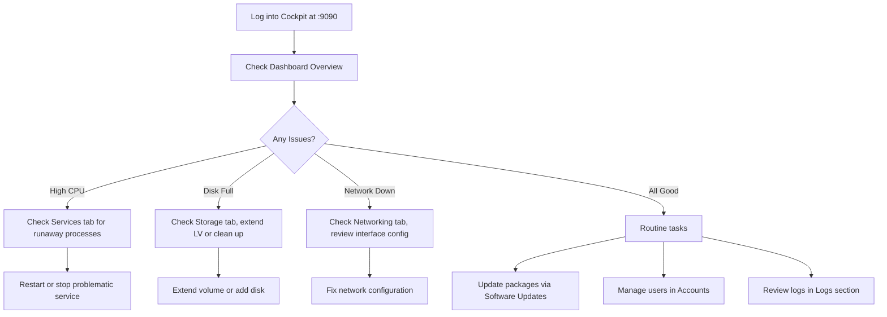

# How to Use the RHEL Web Console (Cockpit) for Day-to-Day System Administration

Author: [nawazdhandala](https://www.github.com/nawazdhandala)

Tags: RHEL, Cockpit, Web Console, System Administration, Linux

Description: A hands-on guide to using the RHEL Web Console (Cockpit) for everyday system administration tasks including service management, user accounts, storage, networking, and the built-in terminal.

---

## What Is Cockpit and Why Use It

Cockpit is a web-based system administration interface that ships with RHEL. It gives you a browser-based dashboard for managing your server without needing to remember every command-line flag. That said, it is not a replacement for the terminal. It is a complement, especially useful for quick checks, visual overviews, and tasks you do not perform often enough to memorize the syntax.

I have found it particularly handy when handing off basic server management to team members who are comfortable with Linux but not fluent in it. It also works well for managing multiple servers from a single browser tab.

## Installing and Enabling Cockpit

On RHEL minimal installations, Cockpit may not be installed by default. Here is how to get it running.

```bash
# Install the Cockpit web console
sudo dnf install cockpit

# Enable and start the Cockpit socket (it listens on demand)
sudo systemctl enable --now cockpit.socket

# Open the firewall for Cockpit (port 9090)
sudo firewall-cmd --permanent --add-service=cockpit
sudo firewall-cmd --reload
```

Now open a browser and navigate to `https://your-server-ip:9090`. Log in with any system account that has sudo privileges. You will see a self-signed certificate warning, which is normal for a fresh install.

## The Dashboard Overview

After logging in, you land on the overview page showing:

- Hostname and operating system version
- CPU and memory usage graphs
- System health indicators
- Recent performance data

This is your at-a-glance health check. If something looks off, you can drill down into specific areas.

## Managing Services

One of the most common sysadmin tasks is starting, stopping, and checking services. Cockpit makes this visual.

Navigate to **Services** in the left sidebar. You will see a list of all systemd units grouped by type: system services, sockets, timers, and paths.

From the command line, the equivalent operations look like this:

```bash
# List all active services
systemctl list-units --type=service --state=active

# Check the status of a specific service
systemctl status httpd

# Start a service
sudo systemctl start httpd

# Enable a service to start at boot
sudo systemctl enable httpd

# Stop and disable a service
sudo systemctl stop httpd
sudo systemctl disable httpd
```

In Cockpit, you click on a service name, see its logs, and toggle it on or off with a single click. The log output shown is the same as `journalctl -u servicename`.

## Managing User Accounts

Click **Accounts** in the sidebar to see all local user accounts. You can:

- Create new users
- Set passwords
- Lock and unlock accounts
- Add users to groups
- Manage SSH authorized keys

The command-line equivalents:

```bash
# Create a new user with a home directory
sudo useradd -m jdoe

# Set the user's password
sudo passwd jdoe

# Add the user to the wheel group for sudo access
sudo usermod -aG wheel jdoe

# Lock a user account
sudo usermod -L jdoe

# Unlock a user account
sudo usermod -U jdoe
```

Cockpit also shows when a user last logged in and whether their account is locked, which saves you from running separate commands to check.

## Storage Management

The **Storage** section gives you a visual layout of your disks, partitions, volume groups, and file systems.

You can:

- View disk health and SMART data
- Create and delete partitions
- Manage LVM volume groups and logical volumes
- Format file systems
- Configure NFS mounts
- Set up RAID

Here is what common storage tasks look like on the command line:

```bash
# List all block devices
lsblk

# Check disk usage on mounted file systems
df -h

# View LVM volume groups
sudo vgs

# View logical volumes
sudo lvs

# Extend a logical volume and resize the file system
sudo lvextend -L +10G /dev/vg_data/lv_app
sudo xfs_growfs /dev/vg_data/lv_app
```

For quick tasks like extending a volume or mounting an NFS share, Cockpit is genuinely faster than typing out the commands. For scripted or automated storage provisioning, stick with the CLI.

## Network Configuration

Under **Networking**, you get a real-time view of network interfaces, traffic graphs, and the ability to configure:

- IP addresses (static or DHCP)
- DNS settings
- Bonds, bridges, and VLANs
- Firewall zones and rules

The command-line equivalents using NetworkManager:

```bash
# Show all network connections
nmcli connection show

# Show device status
nmcli device status

# Set a static IP on an interface
sudo nmcli connection modify ens192 \
    ipv4.addresses 192.168.1.100/24 \
    ipv4.gateway 192.168.1.1 \
    ipv4.dns "8.8.8.8 8.8.4.4" \
    ipv4.method manual

# Bring the connection up with the new settings
sudo nmcli connection up ens192
```

For firewall management in Cockpit, you can visually add or remove services and ports from firewall zones. The CLI equivalent:

```bash
# List active firewall rules
sudo firewall-cmd --list-all

# Add a service to the default zone
sudo firewall-cmd --permanent --add-service=http
sudo firewall-cmd --reload
```

## Using the Built-in Terminal

Cockpit includes a full terminal emulator accessible from the **Terminal** tab in the sidebar. This means you can do everything you normally would via SSH, right from the browser.

This is useful when:

- You need to run a quick command while already looking at the dashboard
- Your SSH client is not available (for example, you are on a locked-down workstation)
- You want to copy-paste between the browser interface and the terminal

The terminal runs as whatever user you logged into Cockpit with. You can `sudo` as needed.

## System Administration Workflow in Cockpit

Here is a typical workflow showing how Cockpit fits into day-to-day operations:



## Software Updates

Cockpit shows available package updates and lets you apply them with a click. Navigate to **Software Updates** to see:

- Number of available updates
- Security vs. non-security updates
- Option to apply all updates or select specific ones

The CLI equivalent:

```bash
# Check for available updates
sudo dnf check-update

# Apply all updates
sudo dnf update -y

# Apply only security updates
sudo dnf update --security -y
```

After applying updates, Cockpit will indicate if a reboot is required (for example, after a kernel update).

## Managing Multiple Servers

Cockpit can manage multiple servers from a single dashboard. On the main server, click the hostname dropdown in the top left and select **Add new host**. The remote server needs Cockpit installed and the firewall open on port 9090.

This works over SSH, so the remote server does not even need Cockpit's web socket exposed to the public network. Your primary Cockpit instance connects to the others on your behalf.

## Practical Tips

- **Bookmark the overview page** for each server you manage. It becomes a quick health-check dashboard.
- **Use the Logs section** for troubleshooting. It provides the same filtering as `journalctl` but in a searchable, scrollable interface.
- **Do not expose port 9090 to the internet.** Use a VPN or SSH tunnel to access Cockpit remotely. You can set up a tunnel like this:

```bash
# Create an SSH tunnel to access Cockpit through localhost
ssh -L 9090:localhost:9090 user@your-server-ip
```

Then open `https://localhost:9090` in your browser.

- **Install extra modules** for additional functionality. For example, `cockpit-machines` adds virtual machine management, and `cockpit-podman` adds container management.

```bash
# Install Cockpit modules for VMs and containers
sudo dnf install cockpit-machines cockpit-podman
```

## Summary

Cockpit is a solid tool for everyday RHEL administration. It covers services, users, storage, networking, logs, and software updates through a clean browser interface. It does not try to replace the command line, and that is its strength. Use it for visual overviews, quick tasks, and situations where the GUI is genuinely faster than typing commands. For automation and scripting, the CLI remains king. The two approaches complement each other well, and having both available makes you a more effective sysadmin.
