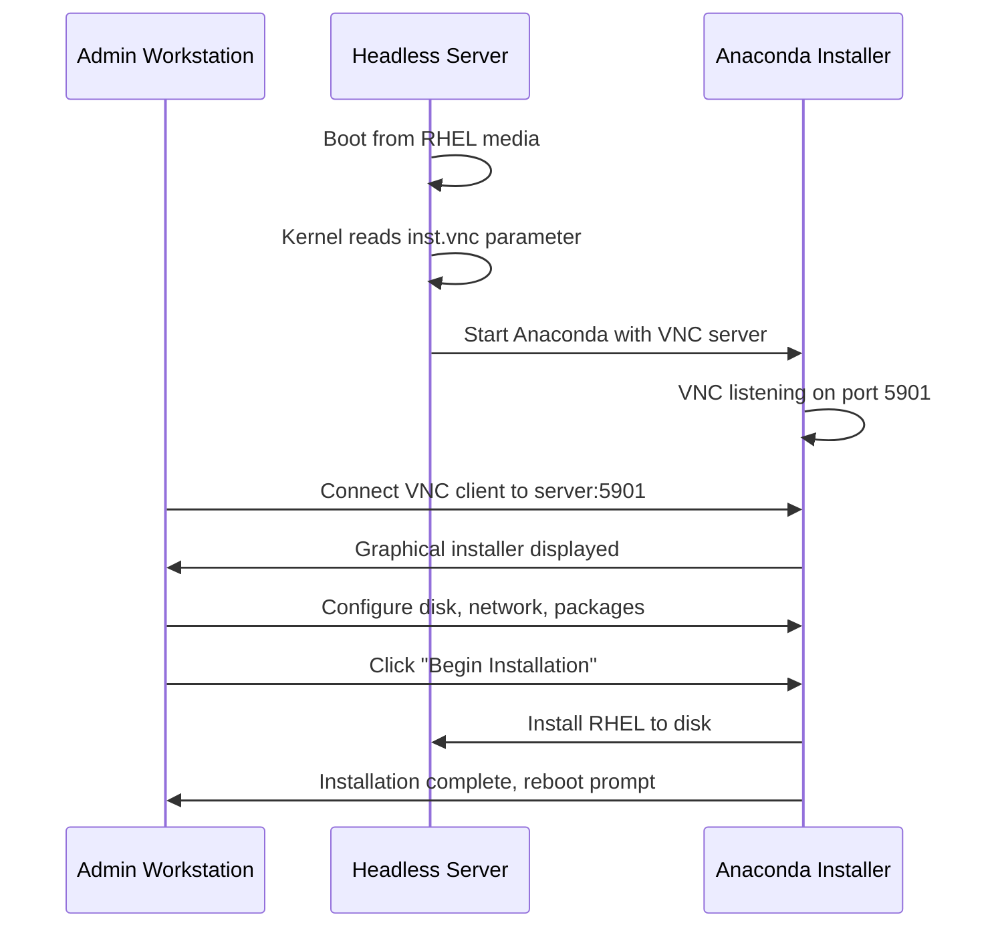

# How to Set Up RHEL on a Headless Server Using the VNC Graphical Installer

Author: [nawazdhandala](https://www.github.com/nawazdhandala)

Tags: RHEL, VNC, Headless Server, Installation, Linux

Description: Learn how to install RHEL on a headless server by enabling the VNC-based graphical installer through boot parameters, connecting remotely with a VNC client, and completing the full installation without a monitor or keyboard attached.

---

If you have ever tried to install RHEL on a rack-mounted server sitting in a data center with no monitor plugged in, you know the frustration. The Anaconda installer ships with a perfectly good graphical interface, but you need some way to see it. That is where VNC comes in. You can tell the installer to start a VNC server during boot, connect from your workstation, and run through the entire graphical installation remotely.

This guide walks through the full process on RHEL, from modifying boot parameters to finishing the install and rebooting into your new system.

## Why VNC Instead of a Text Installer?

The text-based installer works fine for basic setups, but it is limited. You cannot configure custom partitioning, select specific package groups easily, or set up network bonds through the text interface. The graphical installer gives you the complete Anaconda experience, and VNC lets you access it from anywhere on the network.

## Prerequisites

Before you start, make sure you have the following ready:

- A RHEL installation ISO (either burned to USB or mounted via IPMI/iLO/iDRAC virtual media)
- Network connectivity between your workstation and the target server
- A VNC client installed on your workstation (TigerVNC, RealVNC, or even the built-in macOS Screen Sharing app)
- Console access to the server's boot menu (via IPMI, serial, or a one-time keyboard/monitor hookup)

## Step 1: Boot from the Installation Media

Boot the server from your RHEL installation media. When the GRUB boot menu appears, you will see options like "Install Red Hat Enterprise Linux 9" and "Test this media & install." Do not press Enter yet.

Highlight the "Install Red Hat Enterprise Linux 9" entry and press `e` to edit the boot parameters. You will see the kernel command line, which typically ends with something like `quiet`.

## Step 2: Add VNC Boot Parameters

Navigate to the line that starts with `linuxefi` (or `linux` depending on your boot mode) and append the VNC parameters at the end of that line.

For a VNC server with no password (suitable for isolated install networks):

```bash
# Append to the kernel boot line - starts VNC on default port 5901
inst.vnc
```

For a VNC server with a password:

```bash
# Append to the kernel boot line - password must be 6-8 characters
inst.vnc inst.vncpassword=mypass1
```

If your server does not get a DHCP address automatically, you should also specify a static IP so the VNC server is reachable:

```bash
# Full example with static IP, VNC, and password
inst.vnc inst.vncpassword=mypass1 ip=192.168.1.50::192.168.1.1:255.255.255.0:rhel9-host:eno1:none nameserver=192.168.1.1
```

The `ip=` parameter follows this format: `ip=<client-ip>::<gateway>:<netmask>:<hostname>:<interface>:none`.

After editing, press `Ctrl+x` to boot with the modified parameters.

## Step 3: Watch for the VNC Ready Message

As the installer boots, it will eventually output a message on the console that looks like this:

```
Starting VNC...
The VNC server is now running.
Please connect to 192.168.1.50:1 to begin the installation...
```

The `:1` means display 1, which corresponds to TCP port 5901. Make a note of the IP address shown. If you configured a static IP, it will be the one you specified. Otherwise, it will be whatever address DHCP assigned.

## How the VNC Installation Flow Works



## Step 4: Connect with a VNC Client

From your workstation, open your VNC client and connect to the server's IP address on port 5901 (or display :1).

Using TigerVNC from the command line:

```bash
# Connect to the VNC installer - replace with your server's IP
vncviewer 192.168.1.50:1
```

If you set a password with `inst.vncpassword`, you will be prompted for it. Once connected, the full Anaconda graphical installer should appear in your VNC window.

## Step 5: Complete the Installation

From here, the installation proceeds exactly as it would on a machine with a monitor. You will see the Anaconda welcome screen with options for:

- **Localization** - language, keyboard, time zone
- **Software** - base environment and additional packages
- **System** - installation destination (disk layout), network, and KDUMP
- **User Settings** - root password and user creation

Walk through each section, configure to your requirements, and click "Begin Installation" when ready.

## Step 6: Connect VNC via SSH Tunnel (For Remote Networks)

If your workstation is not on the same network as the server, you can tunnel VNC over SSH. This requires that the installer's network is reachable from a jump host.

```bash
# Set up an SSH tunnel through a jump host
# This forwards local port 5901 to the installer's VNC port
ssh -L 5901:192.168.1.50:5901 user@jumphost.example.com
```

Then in another terminal, connect your VNC client to localhost:

```bash
# Connect through the tunnel
vncviewer localhost:1
```

## Step 7: VNC Connect Mode (Reverse Connection)

RHEL's installer also supports "connect mode," where the installer connects back to a VNC client listening on your workstation. This is useful when the server is behind a firewall that blocks incoming connections.

On your workstation, start a listening VNC client:

```bash
# Start TigerVNC in listening mode on port 5500
vncviewer -listen 5500
```

Then on the server's boot line, use `inst.vnc.connect` instead:

```bash
# Tell the installer to connect back to your workstation
inst.vnc inst.vncconnect=192.168.1.10:5500
```

Replace `192.168.1.10` with your workstation's IP. The installer will initiate the connection to you instead of waiting for you to connect.

## Post-Installation: Enable VNC for Ongoing Access

Once RHEL is installed and running, you might want ongoing remote graphical access. That is a separate setup from the installer VNC, but here is a quick way to get it running:

```bash
# Install the TigerVNC server package
sudo dnf install -y tigervnc-server

# Set a VNC password for your user
vncpasswd

# Start a VNC session
vncserver :1

# To verify it is running
ss -tlnp | grep 5901
```

For production servers, most sysadmins rely on SSH and Cockpit rather than VNC for day-to-day management. VNC is most valuable during that initial install phase.

## Troubleshooting

**VNC client cannot connect:** Check that port 5901 is not blocked by a firewall between your workstation and the server. On the server side, the installer's VNC server binds to all interfaces by default, so the issue is almost always network-level.

**Black screen after connecting:** Wait a moment. The Anaconda GUI takes some time to initialize, especially on servers with slower storage. If it stays black for more than a minute, there may be a driver issue with the installer.

**Wrong IP address:** If the server picked up an unexpected DHCP address, you may need to check your DHCP server's lease table or use `inst.ip` to force a known address.

**Password rejected:** The `inst.vncpassword` value must be between 6 and 8 characters. If you set something shorter or longer, the installer may not accept the password correctly.

## Wrapping Up

VNC installation is one of those techniques every sysadmin should have in their toolkit. It comes up constantly when you are provisioning bare-metal servers in data centers, working with IPMI interfaces that have poor Java-based KVM clients, or deploying to machines where the only console access is flaky. The RHEL Anaconda installer makes it straightforward with just a couple of boot parameters, and you get the full graphical experience without needing to be physically present.
