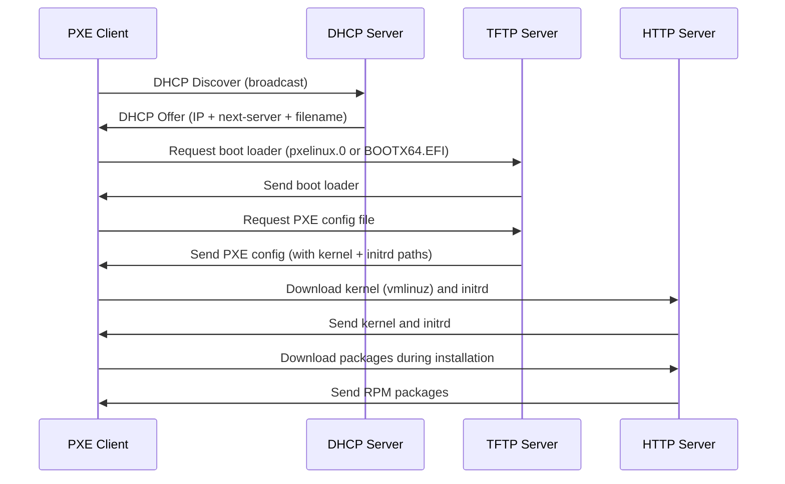

# How to Perform a Network-Based Installation of RHEL Using PXE Boot

Author: [nawazdhandala](https://github.com/nawazdhandala)

Tags: RHEL, PXE Boot, Network Installation, Linux, DHCP, TFTP

Description: Set up a PXE boot server for network-based RHEL installations, covering DHCP, TFTP, and HTTP server configuration along with client boot setup.

---

When you need to install RHEL on dozens or hundreds of machines, walking around with a USB drive is not going to cut it. PXE (Preboot Execution Environment) lets machines boot from the network, pull the installer, and kick off the installation without any local media. This is the foundation of large-scale deployments, and once you set it up, it saves a ridiculous amount of time.

## How PXE Boot Works

The PXE boot process involves several services working together. Here is the flow:



In short: DHCP tells the client where to find the boot loader, TFTP serves the boot loader and config, and HTTP hosts the installation tree (the extracted ISO contents).

## Prerequisites

You need a server on the same network (or with routing configured) as the machines you want to install. This guide uses a single RHEL server running all three services. You will also need:

- The RHEL DVD ISO
- A server with a static IP (we will use 192.168.1.10 in this guide)
- Root access on the PXE server

## Setting Up the HTTP Server

First, install Apache and set up the installation tree. The HTTP server hosts the full package repository that the installer pulls from.

```bash
# Install Apache web server
sudo dnf install -y httpd
```

Mount the ISO and copy its contents to the web server directory:

```bash
# Create a directory for the RHEL installation tree
sudo mkdir -p /var/www/html/rhel9

# Mount the ISO (loop mount)
sudo mount -o loop,ro rhel-9.4-x86_64-dvd.iso /mnt

# Copy everything from the ISO to the web directory
sudo cp -a /mnt/. /var/www/html/rhel9/

# Unmount the ISO
sudo umount /mnt
```

Start and enable Apache:

```bash
# Enable and start Apache
sudo systemctl enable --now httpd
```

Open the firewall for HTTP:

```bash
# Allow HTTP traffic through the firewall
sudo firewall-cmd --permanent --add-service=http
sudo firewall-cmd --reload
```

Verify by browsing to `http://192.168.1.10/rhel9/` - you should see the directory listing.

## Setting Up the TFTP Server

TFTP serves the boot loader and initial configuration files to PXE clients.

```bash
# Install TFTP server
sudo dnf install -y tftp-server
```

Enable and start the TFTP service:

```bash
# Enable and start TFTP
sudo systemctl enable --now tftp.socket
```

Open the firewall for TFTP:

```bash
# Allow TFTP traffic through the firewall
sudo firewall-cmd --permanent --add-service=tftp
sudo firewall-cmd --reload
```

The TFTP root directory is `/var/lib/tftpboot/` by default.

## Preparing Boot Files

You need to copy the PXE boot loader and the kernel/initrd from the installation tree. The approach differs depending on whether your clients use legacy BIOS or UEFI.

### For Legacy BIOS Clients

```bash
# Install the SYSLINUX package for the PXE boot loader
sudo dnf install -y syslinux-tftpboot

# The pxelinux.0 file should now be in /tftpboot/ - copy it
sudo cp /tftpboot/pxelinux.0 /var/lib/tftpboot/
sudo cp /tftpboot/ldlinux.c32 /var/lib/tftpboot/

# Copy kernel and initrd from the installation tree
sudo mkdir -p /var/lib/tftpboot/rhel9
sudo cp /var/www/html/rhel9/images/pxeboot/vmlinuz /var/lib/tftpboot/rhel9/
sudo cp /var/www/html/rhel9/images/pxeboot/initrd.img /var/lib/tftpboot/rhel9/

# Create the PXE configuration directory
sudo mkdir -p /var/lib/tftpboot/pxelinux.cfg
```

### For UEFI Clients

```bash
# Install the shim and GRUB EFI packages
sudo dnf install -y shim-x64 grub2-efi-x64

# Copy the EFI boot loader files
sudo mkdir -p /var/lib/tftpboot/uefi
sudo cp /boot/efi/EFI/redhat/shimx64.efi /var/lib/tftpboot/uefi/
sudo cp /boot/efi/EFI/redhat/grubx64.efi /var/lib/tftpboot/uefi/

# Copy kernel and initrd (same files, just accessible from the UEFI path)
sudo mkdir -p /var/lib/tftpboot/rhel9
sudo cp /var/www/html/rhel9/images/pxeboot/vmlinuz /var/lib/tftpboot/rhel9/
sudo cp /var/www/html/rhel9/images/pxeboot/initrd.img /var/lib/tftpboot/rhel9/
```

## Creating PXE Configuration Files

### BIOS PXE Config

Create the default configuration file that all BIOS PXE clients will use:

```bash
# Create the default PXE boot menu for BIOS clients
sudo tee /var/lib/tftpboot/pxelinux.cfg/default << 'EOF'
DEFAULT linux
PROMPT 0
TIMEOUT 100
LABEL linux
  KERNEL rhel9/vmlinuz
  APPEND initrd=rhel9/initrd.img inst.repo=http://192.168.1.10/rhel9/ ip=dhcp
EOF
```

### UEFI GRUB Config

For UEFI clients, create a GRUB configuration:

```bash
# Create the GRUB config for UEFI PXE clients
sudo tee /var/lib/tftpboot/uefi/grub.cfg << 'EOF'
set timeout=10
menuentry 'Install RHEL' {
  linuxefi rhel9/vmlinuz inst.repo=http://192.168.1.10/rhel9/ ip=dhcp
  initrdefi rhel9/initrd.img
}
EOF
```

## Setting Up the DHCP Server

The DHCP server tells clients where to find the PXE boot loader. Install and configure it:

```bash
# Install the DHCP server
sudo dnf install -y dhcp-server
```

Edit the DHCP configuration file:

```bash
# Configure DHCP with PXE boot options
sudo tee /etc/dhcp/dhcpd.conf << 'EOF'
option space pxelinux;
option pxelinux.magic code 208 = string;
option pxelinux.configfile code 209 = text;
option pxelinux.pathprefix code 210 = text;
option pxelinux.reboottime code 211 = unsigned integer 32;
option architecture-type code 93 = unsigned integer 16;

subnet 192.168.1.0 netmask 255.255.255.0 {
    range 192.168.1.100 192.168.1.200;
    option routers 192.168.1.1;
    option domain-name-servers 192.168.1.1;
    next-server 192.168.1.10;

    class "pxeclients" {
        match if substring (option vendor-class-identifier, 0, 9) = "PXEClient";

        # Serve the correct boot loader based on client architecture
        if option architecture-type = 00:07 {
            filename "uefi/shimx64.efi";
        } else if option architecture-type = 00:09 {
            filename "uefi/shimx64.efi";
        } else {
            filename "pxelinux.0";
        }
    }
}
EOF
```

The `architecture-type` check handles both BIOS and UEFI clients. Types 7 and 9 are x86-64 UEFI, and everything else falls back to the BIOS boot loader.

Start the DHCP server:

```bash
# Enable and start the DHCP server
sudo systemctl enable --now dhcpd
```

Open the firewall for DHCP:

```bash
# Allow DHCP traffic through the firewall
sudo firewall-cmd --permanent --add-service=dhcp
sudo firewall-cmd --reload
```

## Booting a Client

With all services running, boot a client machine and select network boot from the BIOS/UEFI boot menu (usually F12 or the PXE boot option in the boot order).

The client will:

1. Get an IP address from the DHCP server
2. Download the boot loader from TFTP
3. Load the kernel and initrd
4. Start the Anaconda installer, pulling packages from the HTTP server

From there, the installation proceeds just like a local media install, except all packages come over the network.

## Adding a Kickstart File for Full Automation

To make the installation fully unattended, add a Kickstart file reference to the boot configuration. Place your Kickstart file on the HTTP server:

```bash
# Copy your kickstart file to the web server
sudo cp ks.cfg /var/www/html/ks.cfg
```

Then update the PXE config to include it:

```bash
# Updated BIOS PXE config with kickstart
sudo tee /var/lib/tftpboot/pxelinux.cfg/default << 'EOF'
DEFAULT linux
PROMPT 0
TIMEOUT 100
LABEL linux
  KERNEL rhel9/vmlinuz
  APPEND initrd=rhel9/initrd.img inst.repo=http://192.168.1.10/rhel9/ inst.ks=http://192.168.1.10/ks.cfg ip=dhcp
EOF
```

## Troubleshooting Tips

- **Client does not get an IP**: Check that `dhcpd` is running and the firewall allows DHCP. Look at `/var/log/messages` or `journalctl -u dhcpd` for errors.
- **TFTP transfer fails**: Verify the files exist in `/var/lib/tftpboot/` and have correct permissions. SELinux contexts matter here, so run `restorecon -Rv /var/lib/tftpboot/` if you copied files manually.
- **Installer cannot find the repository**: Make sure Apache is running and the installation tree is accessible at the URL you specified. Test with `curl http://192.168.1.10/rhel9/.treeinfo` from another machine.
- **UEFI clients boot the wrong loader**: Double-check the `architecture-type` values in your DHCP config. Some vendors report different codes.

## SELinux Considerations

If you copied files into non-standard locations or the TFTP/HTTP directories, SELinux might block access. Fix the contexts:

```bash
# Restore SELinux contexts for TFTP directory
sudo restorecon -Rv /var/lib/tftpboot/

# Restore SELinux contexts for HTTP directory
sudo restorecon -Rv /var/www/html/rhel9/
```

PXE boot takes some effort to set up initially, but once it is running, you can deploy RHEL to bare-metal machines in minutes without touching a single USB drive.
