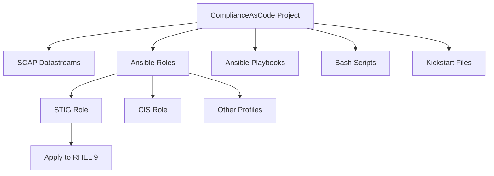

# How to Use the RHEL 9 STIG Ansible Role from ComplianceAsCode

Author: [nawazdhandala](https://www.github.com/nawazdhandala)

Tags: RHEL, STIG, Ansible, ComplianceAsCode, Linux

Description: Use the ComplianceAsCode project's STIG Ansible role to apply and maintain DISA STIG compliance on RHEL 9 servers at scale.

---

The ComplianceAsCode project (formerly known as SCAP Security Guide) is a community effort that produces security content for automated compliance. It includes Ansible roles that can be used directly to apply STIG controls to RHEL 9 systems. Unlike standalone playbooks, roles are modular and easier to integrate into your existing Ansible infrastructure.

## What Is ComplianceAsCode

ComplianceAsCode is the upstream project behind the scap-security-guide RPM. It produces SCAP content, Ansible playbooks, Ansible roles, bash scripts, and Kickstart files for multiple compliance profiles. The STIG role it produces is specifically designed to apply all DISA STIG controls to RHEL 9.



## Install the STIG Ansible Role

### From the RPM package

The easiest method on RHEL 9:

```bash
# Install scap-security-guide which includes the Ansible content
dnf install -y scap-security-guide ansible-core

# The role is installed to:
ls /usr/share/scap-security-guide/ansible/

# Find the STIG playbook that uses the role
cat /usr/share/scap-security-guide/ansible/rhel9-playbook-stig.yml | head -20
```

### From the ComplianceAsCode GitHub Repository

For the latest version:

```bash
# Clone the repository
git clone https://github.com/ComplianceAsCode/content.git /opt/complianceascode

# The Ansible roles are generated during the build process
cd /opt/complianceascode
dnf install -y cmake openscap-utils python3-pyyaml python3-jinja2

# Build the RHEL 9 content
mkdir build && cd build
cmake ..
make rhel9
```

## Using the Role in Your Playbooks

### Basic usage

```yaml
---
# Apply STIG controls using the ComplianceAsCode role
- name: Apply DISA STIG to RHEL 9
  hosts: rhel9_servers
  become: yes

  roles:
    - role: rhel9-role-stig
```

### Using the pre-built playbook

```bash
# Run the pre-built STIG playbook
ansible-playbook -i inventory.ini \
  /usr/share/scap-security-guide/ansible/rhel9-playbook-stig.yml

# Preview changes with check mode
ansible-playbook -i inventory.ini \
  --check --diff \
  /usr/share/scap-security-guide/ansible/rhel9-playbook-stig.yml
```

## Customize the Role with Variables

The STIG role uses variables to control which rules are applied. You can override these in your playbook:

```yaml
---
- name: Apply customized STIG controls
  hosts: rhel9_servers
  become: yes

  vars:
    # Override specific variables
    var_password_pam_minlen: 15
    var_password_pam_minclass: 4
    var_accounts_passwords_pam_faillock_deny: 3
    var_accounts_passwords_pam_faillock_unlock_time: 0
    var_sshd_set_keepalive: 0
    var_accounts_maximum_age_login_defs: 60

  roles:
    - role: rhel9-role-stig
```

## Selectively Apply STIG Controls Using Tags

The role uses tags that correspond to STIG rule IDs, so you can run specific controls:

```bash
# Apply only SSH-related STIG controls
ansible-playbook -i inventory.ini \
  /usr/share/scap-security-guide/ansible/rhel9-playbook-stig.yml \
  --tags "sshd_set_idle_timeout,sshd_disable_root_login,sshd_disable_empty_passwords"

# Skip specific controls that break your environment
ansible-playbook -i inventory.ini \
  /usr/share/scap-security-guide/ansible/rhel9-playbook-stig.yml \
  --skip-tags "enable_fips_mode"
```

## Integrate with Your Existing Ansible Structure

Add the STIG role to your server provisioning workflow:

```yaml
---
# site.yml - Main playbook for server provisioning
- name: Provision and harden RHEL 9 servers
  hosts: rhel9_servers
  become: yes

  pre_tasks:
    - name: Update all packages
      ansible.builtin.dnf:
        name: "*"
        state: latest

    - name: Install required packages
      ansible.builtin.dnf:
        name:
          - openscap-scanner
          - scap-security-guide
          - aide
          - audit
        state: present

  roles:
    # Apply your organization's base configuration first
    - role: base-config
    - role: monitoring-agent
    # Then apply STIG hardening
    - role: rhel9-role-stig

  post_tasks:
    - name: Run STIG compliance scan
      ansible.builtin.command:
        cmd: >
          oscap xccdf eval
          --profile xccdf_org.ssgproject.content_profile_stig
          --results /var/log/compliance/stig-results.xml
          --report /var/log/compliance/stig-report.html
          /usr/share/xml/scap/ssg/content/ssg-rhel9-ds.xml
      register: stig_scan
      changed_when: false
      failed_when: false

    - name: Report compliance status
      ansible.builtin.debug:
        msg: "STIG scan exit code: {{ stig_scan.rc }}"
```

## Keep the Role Updated

The ComplianceAsCode project releases updates regularly:

```bash
# Update the RPM to get the latest role
dnf update -y scap-security-guide

# Check the installed version
rpm -qi scap-security-guide

# After updating, test in a staging environment before production
ansible-playbook -i staging-inventory.ini \
  --check --diff \
  /usr/share/scap-security-guide/ansible/rhel9-playbook-stig.yml
```

## Verify Compliance After Applying the Role

```bash
# Run a compliance scan on all servers
ansible all -i inventory.ini -b -m command -a \
  "oscap xccdf eval \
    --profile xccdf_org.ssgproject.content_profile_stig \
    --results /var/log/compliance/stig-latest.xml \
    /usr/share/xml/scap/ssg/content/ssg-rhel9-ds.xml" || true

# Collect results from all servers
ansible all -i inventory.ini -b -m fetch -a \
  "src=/var/log/compliance/stig-latest.xml dest=/tmp/compliance-results/ flat=no"
```

## Troubleshooting Common Issues

### Role fails on a specific task

```bash
# Run with verbose output to see what failed
ansible-playbook -i inventory.ini \
  /usr/share/scap-security-guide/ansible/rhel9-playbook-stig.yml \
  -vvv
```

### Conflicting configurations

Some STIG settings may conflict with your application requirements. Identify these early by running in check mode and reviewing the diff output. Document any exceptions and create compensating controls.

The ComplianceAsCode STIG role is the most efficient way to get STIG compliance on RHEL 9 at scale. It is maintained by a large community that includes Red Hat engineers, government security professionals, and independent contributors. Use it as your foundation, customize it for your environment, and keep it updated.
