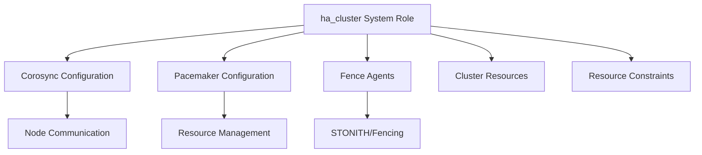

# How to Use RHEL System Roles for HA Cluster Setup

Author: [nawazdhandala](https://www.github.com/nawazdhandala)

Tags: RHEL, System Roles, HA Cluster, Pacemaker, Corosync, Ansible, Linux

Description: Set up a high-availability cluster on RHEL using the ha_cluster system role, automating Pacemaker and Corosync configuration with Ansible.

---

Setting up a Pacemaker/Corosync HA cluster by hand involves a lot of steps that are easy to get wrong. The `rhel-system-roles.ha_cluster` role automates the entire process, from installing packages to configuring fencing devices and cluster resources.

## What the HA Cluster Role Manages



The role handles:
- Installing pacemaker, corosync, and fence-agents packages
- Configuring cluster authentication
- Setting up corosync communication
- Defining resources and fencing devices
- Configuring resource constraints and ordering

## Prerequisites

```bash
# Install system roles on the control node
sudo dnf install rhel-system-roles

# Ensure the HA add-on repository is enabled on target nodes
sudo subscription-manager repos --enable=rhel-9-for-x86_64-highavailability-rpms
```

## Basic Two-Node Cluster

Here is a playbook that sets up a basic two-node cluster:

```yaml
# playbook-ha-basic.yml
# Set up a basic two-node HA cluster
---
- name: Configure HA cluster
  hosts: ha_cluster
  become: true
  vars:
    # Cluster password for hacluster user
    ha_cluster_cluster_name: my-cluster
    ha_cluster_hacluster_password: "ChangeMe123!"

    # Enable the cluster to start on boot
    ha_cluster_start_on_boot: true

    # Define the cluster members
    ha_cluster_node_options:
      - node_name: node1.example.com
        pcs_address: node1.example.com
      - node_name: node2.example.com
        pcs_address: node2.example.com

    # Configure fencing (required for production)
    ha_cluster_fence_agent_packages:
      - fence-agents-all

    ha_cluster_resource_primitives:
      # Fencing device
      - id: fence-node1
        agent: "stonith:fence_ipmilan"
        instance_attrs:
          - attrs:
              - name: ipaddr
                value: "10.0.0.101"
              - name: login
                value: "admin"
              - name: passwd
                value: "password"
              - name: pcmk_host_list
                value: "node1.example.com"
      - id: fence-node2
        agent: "stonith:fence_ipmilan"
        instance_attrs:
          - attrs:
              - name: ipaddr
                value: "10.0.0.102"
              - name: login
                value: "admin"
              - name: passwd
                value: "password"
              - name: pcmk_host_list
                value: "node2.example.com"

  roles:
    - rhel-system-roles.ha_cluster
```

## Inventory for HA Cluster

```ini
# inventory
[ha_cluster]
node1.example.com
node2.example.com
```

Run the playbook:

```bash
# Set up the HA cluster
ansible-playbook -i inventory playbook-ha-basic.yml
```

## Adding Cluster Resources

Here is a more complete example with a virtual IP and an Apache resource:

```yaml
# playbook-ha-resources.yml
# HA cluster with virtual IP and Apache resource
---
- name: Configure HA cluster with resources
  hosts: ha_cluster
  become: true
  vars:
    ha_cluster_cluster_name: web-cluster
    ha_cluster_hacluster_password: "ChangeMe123!"
    ha_cluster_start_on_boot: true

    ha_cluster_node_options:
      - node_name: node1.example.com
        pcs_address: node1.example.com
      - node_name: node2.example.com
        pcs_address: node2.example.com

    ha_cluster_resource_primitives:
      # Virtual IP resource
      - id: cluster-vip
        agent: "ocf:heartbeat:IPaddr2"
        instance_attrs:
          - attrs:
              - name: ip
                value: "192.168.1.100"
              - name: cidr_netmask
                value: "24"
        operations:
          - action: monitor
            attrs:
              - name: interval
                value: "10s"

      # Apache resource
      - id: web-server
        agent: "ocf:heartbeat:apache"
        instance_attrs:
          - attrs:
              - name: configfile
                value: "/etc/httpd/conf/httpd.conf"
              - name: statusurl
                value: "http://127.0.0.1/server-status"
        operations:
          - action: monitor
            attrs:
              - name: interval
                value: "30s"

    # Group the VIP and Apache together
    ha_cluster_resource_groups:
      - id: web-group
        resource_ids:
          - cluster-vip
          - web-server

    # Ordering constraint: VIP starts before Apache
    ha_cluster_constraints_order:
      - resource_first:
          id: cluster-vip
        resource_then:
          id: web-server

  roles:
    - rhel-system-roles.ha_cluster
```

## Configuring Quorum for Two-Node Clusters

Two-node clusters need special quorum handling:

```yaml
# playbook-ha-quorum.yml
# Two-node cluster with proper quorum settings
---
- name: Configure two-node HA cluster
  hosts: ha_cluster
  become: true
  vars:
    ha_cluster_cluster_name: two-node-cluster
    ha_cluster_hacluster_password: "ChangeMe123!"

    # Quorum settings for two-node clusters
    ha_cluster_quorum:
      options:
        - name: two_node
          value: 1
        - name: wait_for_all
          value: 1

    ha_cluster_cluster_properties:
      - attrs:
          # Do not stop all resources if quorum is lost
          - name: no-quorum-policy
            value: ignore
          # Enable STONITH
          - name: stonith-enabled
            value: "true"

    ha_cluster_node_options:
      - node_name: node1.example.com
        pcs_address: node1.example.com
      - node_name: node2.example.com
        pcs_address: node2.example.com

  roles:
    - rhel-system-roles.ha_cluster
```

## Verifying the Cluster

After the playbook runs, verify the cluster on any node:

```bash
# Check cluster status
sudo pcs status

# Verify cluster membership
sudo pcs status corosync

# List all configured resources
sudo pcs resource status

# Check fencing devices
sudo pcs stonith status

# Test fencing (be careful - this will actually fence a node)
# sudo pcs stonith fence node2.example.com
```

## Wrapping Up

The HA cluster system role takes the most complex RHEL configuration task and makes it reproducible. Instead of running dozens of `pcs` commands in the right order, you declare what you want and the role figures out how to get there. The main thing to remember is that STONITH/fencing is mandatory for a supported production cluster. Never set `stonith-enabled: false` in production, even though many tutorials suggest it for testing.
