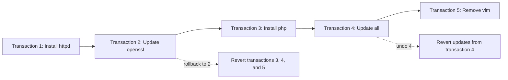
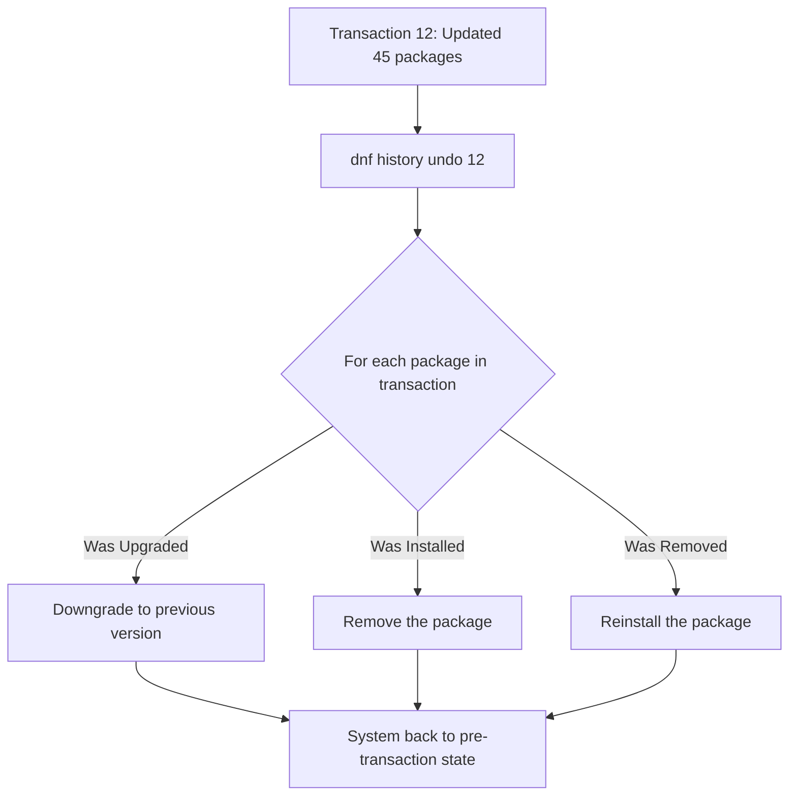

# How to Roll Back Package Updates Using DNF History on RHEL 9

Author: [nawazdhandala](https://www.github.com/nawazdhandala)

Tags: RHEL, DNF, Rollback, Package Management, Linux

Description: Learn how to use DNF history to review, undo, and roll back package transactions on RHEL 9, giving you a safety net when updates cause problems.

---

You patched a system during a maintenance window, restarted the service, and now it is broken. It happens. The good news is that DNF keeps a full history of every package transaction, and you can undo individual changes or roll back to a previous state. This is one of those features that you do not appreciate until you desperately need it at 2 AM.

## How DNF History Works

Every time you install, update, or remove packages with DNF, it records the transaction in a SQLite database at `/var/lib/dnf/history/`. Each transaction gets a unique ID, and DNF stores exactly what changed: which packages were installed, updated, downgraded, or removed, along with the old and new versions.

This gives you two powerful capabilities:

- **Undo** - Reverse a single transaction
- **Rollback** - Revert everything back to the state before a specific transaction



## Viewing Transaction History

### List All Transactions

```bash
# Show the transaction history
dnf history list
```

This displays a table with the transaction ID, date, user who ran it, the action (install/update/remove), and how many packages were affected.

Example output:

```
ID     | Command line             | Date and time    | Action(s)      | Altered
-----------------------------------------------------------------------------------
    12 | update -y                | 2026-03-01 14:30 | Upgrade         |   45
    11 | install php              | 2026-02-28 09:15 | Install         |    8
    10 | install httpd            | 2026-02-28 09:10 | Install         |    4
     9 | update openssl           | 2026-02-27 16:00 | Upgrade         |    2
```

### Filter History by Date Range

```bash
# Show transactions from the last 7 days
dnf history list --since="7 days ago"
```

### Filter History for a Specific Package

```bash
# Show all transactions that affected httpd
dnf history list httpd
```

## Inspecting a Specific Transaction

### Get Transaction Details

```bash
# Show full details of transaction 12
dnf history info 12
```

This shows every package that was part of the transaction, including old and new versions. For an update transaction, you see exactly what got upgraded and from which version to which version.

### View the Exact Packages Changed

```bash
# Detailed view with package versions
dnf history info 12
```

Sample output:

```
Transaction ID : 12
Begin time     : Sat 01 Mar 2026 02:30:00 PM
End time       : Sat 01 Mar 2026 02:32:15 PM
User           : root <root>
Return-Code    : Success
Command Line   : update -y
Packages Altered:
    Upgrade  openssl-3.0.7-24.el9.x86_64  @rhel-9-for-x86_64-baseos-rpms
    Upgraded openssl-3.0.7-20.el9.x86_64  @@System
    Upgrade  kernel-5.14.0-362.el9.x86_64 @rhel-9-for-x86_64-baseos-rpms
    Install  kernel-5.14.0-362.el9.x86_64 @rhel-9-for-x86_64-baseos-rpms
```

## Undoing a Transaction

The `undo` command reverses a single transaction. If the transaction installed packages, they get removed. If it updated packages, they get downgraded to the previous version. If it removed packages, they get reinstalled.

### Undo the Last Transaction

```bash
# Undo the most recent transaction
sudo dnf history undo last
```

### Undo a Specific Transaction by ID

```bash
# Undo transaction 12
sudo dnf history undo 12
```

DNF will show you what it plans to do and ask for confirmation. Always review this carefully, especially for large transactions.

### What Happens During an Undo?



## Rolling Back to a Previous State

While `undo` reverses one transaction, `rollback` reverses everything after a given transaction ID. If you run `dnf history rollback 10`, it undoes transactions 11 and 12 (everything that happened after transaction 10).

```bash
# Roll back to the state after transaction 10 completed
sudo dnf history rollback 10
```

This is powerful but also risky. If transactions 11 and 12 involved a lot of packages, the rollback will be complex. Always review the transaction summary before confirming.

### When to Use Undo vs Rollback

| Scenario | Use |
|----------|-----|
| A single update broke something | `undo` that transaction |
| Multiple recent changes caused issues | `rollback` to the last known good state |
| Need to revert one specific change from 5 transactions ago | `undo` that specific transaction |
| Want to completely reset the system to a snapshot in time | `rollback` to the point before things went wrong |

## Practical Scenarios

### Scenario 1: A Full System Update Broke an Application

You ran `dnf update -y` and your Java application stopped starting.

```bash
# Find the update transaction
dnf history list

# Inspect it to see what changed
dnf history info last

# Undo the entire update
sudo dnf history undo last -y
```

After the undo completes, restart the application and verify it works. Then you can investigate which specific package caused the issue and update selectively.

### Scenario 2: A Package Removal Had Unintended Side Effects

You removed a package and it took out dependencies that something else needed.

```bash
# Find the remove transaction
dnf history list

# Undo the removal (this reinstalls everything that was removed)
sudo dnf history undo 15
```

### Scenario 3: Rolling Back Multiple Changes

You made several changes over the week, and somewhere along the way things broke. You know the system was fine last Monday after transaction 8.

```bash
# Roll everything back to the state after transaction 8
sudo dnf history rollback 8
```

## Handling Rollback Failures

Sometimes an undo or rollback fails because the old package versions are no longer available in the repositories. This can happen if:

- The repo has been updated and only carries the latest versions
- You are using `--newest-only` in a local mirror
- The package was from a repository that has been disabled

In these cases, you have a few options:

```bash
# Check if the needed version is available
dnf list --showduplicates package-name

# If the old version is not in repos, download it manually
# and install from the RPM file
sudo dnf downgrade /path/to/old-version.rpm
```

For critical systems, maintain a local repository mirror that keeps older package versions. This ensures rollbacks always work.

## DNF History and System Snapshots

DNF history works well alongside filesystem snapshots. If your root filesystem is on LVM or Btrfs, consider this workflow:

1. Take an LVM snapshot before major updates
2. Apply updates
3. Test the system
4. If something breaks, choose between DNF rollback (for package-level issues) or snapshot restore (for everything else)

```bash
# Create an LVM snapshot before updating
sudo lvcreate --size 10G --snapshot --name pre-update /dev/rootvg/rootlv

# Now run updates safely
sudo dnf update -y

# If things go sideways, you have both dnf history and the snapshot
```

## Tips for Using DNF History Effectively

1. **Check history before maintenance windows.** Know your current transaction ID so you have a clear rollback point.

2. **Keep old package versions available.** If you run a local mirror, do not use `--newest-only` unless you also have a separate archive.

3. **Be cautious with kernel rollbacks.** Kernel updates install new packages rather than upgrading existing ones. Rolling back a kernel transaction removes the new kernel. Make sure you have a working older kernel in your boot menu.

4. **Document the transaction ID in your change management system.** When you make changes during a maintenance window, record the transaction IDs. If a problem surfaces days later, you have the exact reference.

5. **Do not rely on history alone for disaster recovery.** DNF history is great for package-level rollbacks, but it does not cover configuration file changes, database migrations, or application state. Use it as one tool in your recovery toolkit, not the only one.

6. **Clean up old history periodically.** The history database grows over time. While it is not usually a space concern, very old transactions are rarely useful:

```bash
# View the oldest transactions in history
dnf history list | tail -20
```

DNF history turns package management into a reversible operation. That alone makes it one of the most valuable features in your sysadmin toolkit. The commands are simple, the safety net is real, and when that 2 AM call comes, you will be glad you know how to use it.
