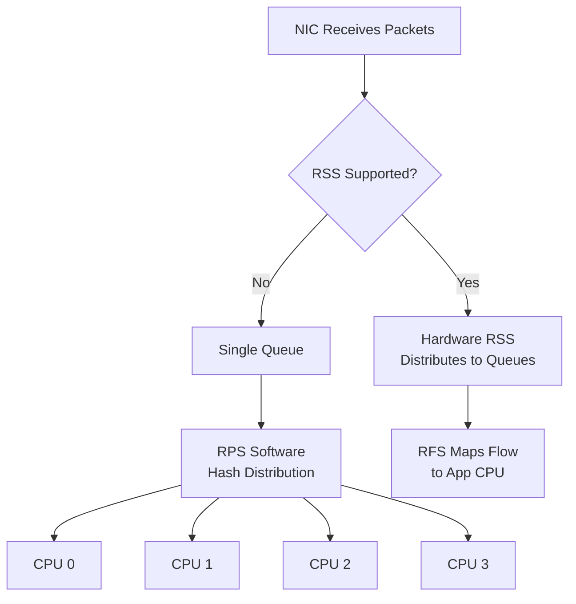

# How to Configure Receive Packet Steering (RPS) and RFS on RHEL

Author: [nawazdhandala](https://www.github.com/nawazdhandala)

Tags: RHEL, RPS, RFS, Networking, Performance Tuning, Linux

Description: Learn how to configure RPS and RFS on RHEL to distribute network packet processing across multiple CPU cores for improved throughput.

---

Receive Packet Steering (RPS) and Receive Flow Steering (RFS) are kernel features that distribute incoming network packet processing across multiple CPU cores. RPS distributes based on packet hash, while RFS ensures packets are processed on the same CPU core where the application is running, improving cache locality.

## How RPS and RFS Work



## Prerequisites

- RHEL with a multi-core CPU
- Root or sudo access

## Step 1: Check Current NIC Queue Configuration

```bash
# Check how many hardware queues the NIC supports
ethtool -l ens3

# Check the current interrupt affinity
cat /proc/interrupts | grep ens3

# Check if RSS (Receive Side Scaling) is available
ethtool -x ens3
```

## Step 2: Configure RPS

```bash
# Find the RX queue directories for your interface
ls /sys/class/net/ens3/queues/

# Enable RPS on all RX queues, distributing to all CPU cores
# The bitmask represents which CPUs to use (ff = cores 0-7)
NCPUS=$(nproc)
MASK=$(printf '%x' $((2**NCPUS - 1)))

# Apply the CPU mask to each RX queue
for rxq in /sys/class/net/ens3/queues/rx-*/rps_cpus; do
    echo $MASK | sudo tee $rxq
done

# Verify the setting
cat /sys/class/net/ens3/queues/rx-0/rps_cpus
```

## Step 3: Configure RFS

```bash
# Set the global RFS flow table size
# Recommended: 32768 or higher for busy servers
echo 32768 | sudo tee /proc/sys/net/core/rps_sock_flow_entries

# Set per-queue flow table size
# Divide the global value by the number of RX queues
QUEUES=$(ls -d /sys/class/net/ens3/queues/rx-* | wc -l)
FLOW_CNT=$((32768 / QUEUES))

for rxq in /sys/class/net/ens3/queues/rx-*/rps_flow_cnt; do
    echo $FLOW_CNT | sudo tee $rxq
done

# Verify
cat /sys/class/net/ens3/queues/rx-0/rps_flow_cnt
```

## Step 4: Make Settings Persistent

```bash
# Create a udev rule to apply RPS/RFS settings on boot
cat << 'UDEVEOF' | sudo tee /etc/udev/rules.d/99-rps-rfs.rules
# Apply RPS to all RX queues of ens3
ACTION=="add", SUBSYSTEM=="net", KERNEL=="ens3", \
    RUN+="/bin/bash -c 'for q in /sys/class/net/ens3/queues/rx-*/rps_cpus; do echo ff > $q; done'"
UDEVEOF

# Create a sysctl configuration for RFS
echo "net.core.rps_sock_flow_entries=32768" | sudo tee /etc/sysctl.d/rfs.conf
sudo sysctl --system
```

## Step 5: Tune the Backlog Queue

```bash
# Increase the per-CPU packet processing backlog
# Default is 1000, increase for high-traffic servers
echo 5000 | sudo tee /proc/sys/net/core/netdev_budget

# Also increase the backlog queue length
echo "net.core.netdev_max_backlog=5000" | sudo tee -a /etc/sysctl.d/rfs.conf
sudo sysctl --system
```

## Step 6: Monitor RPS/RFS Performance

```bash
# Check softirq distribution across CPUs
cat /proc/softirqs | grep NET_RX

# Watch the distribution in real time
watch -n 1 'cat /proc/softirqs | grep NET_RX'

# Check for RPS flow hash collisions
cat /proc/net/softnet_stat

# Monitor per-queue statistics
ethtool -S ens3 | grep rx_queue
```

## Using tuned for Automatic Configuration

```bash
# Install and enable tuned
sudo dnf install -y tuned
sudo systemctl enable --now tuned

# The network-throughput profile automatically configures RPS/RFS
sudo tuned-adm profile network-throughput

# Verify the active profile
tuned-adm active
```

## Summary

You have configured RPS and RFS on RHEL to distribute network packet processing across multiple CPU cores. RPS provides software-based packet distribution when hardware RSS is not available, and RFS ensures packets are processed on the CPU where the receiving application runs, improving cache locality and reducing latency. For high-traffic servers, combine these settings with proper interrupt affinity and the tuned network-throughput profile.
